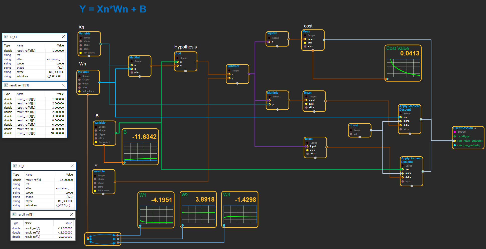

enuSpace-tensorflow github Hompage : https://expnuni.github.io/enuspace_tensorflow_doc/

# enuSpace-Tensorflow Overview

enuSpaceTensorflow는 enuSpace에서 외부 external plugin 모듈 tensorflow를 로직 블럭\(block\)형태로 플로우 프로그래밍을 제공합니다.

enuSpaceTensorflow github : [https://github.com/EXPNUNI/enuSpaceTensorflow](https://github.com/EXPNUNI/enuSpaceTensorflow)

enuSpace blog : [http://enuspace.tistory.com/](http://enuspace.tistory.com/)

enuSpace github-pages \(guide\) : [https://expnuni.github.io/enuspace_doc/](https://expnuni.github.io/enuspace_doc/)

tensorflow의 C++ 코드. [Tensorflow C++ API Guide](https://www.tensorflow.org/api_guides/cc/guide)
