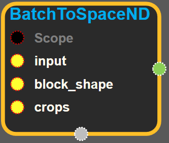
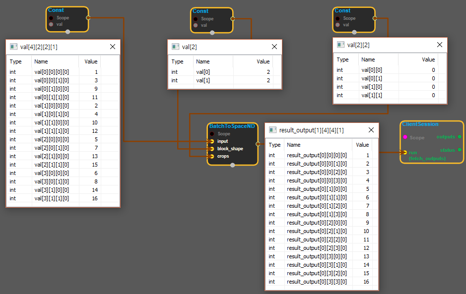

--- 
layout: default 
title: BatchToSpaceNd 
parent: array_ops 
grand_parent: enuSpace-Tensorflow API 
last_modified_date: now 
--- 

# BatchToSpaceND {#abs}

---

## tensorflow C++ API {#tensorflow-c-api}

[tensorflow::ops::BatchToSpaceND](https://www.tensorflow.org/api_docs/cc/class/tensorflow/ops/batch-to-space-n-d.html)

[BatchToSpace](https://www.tensorflow.org/api_docs/cc/class/tensorflow/ops/batch-to-space.html#classtensorflow_1_1ops_1_1_batch_to_space) for N-D tensors of type T.

---

## Summary {#summary}

This operation reshapes the "batch" dimension 0 into `M + 1` dimensions of shape `block_shape + [batch]` , interleaves these blocks back into the grid defined by the spatial dimensions `[1, ..., M]` , to obtain a result with the same rank as the input. The spatial dimensions of this intermediate result are then optionally cropped according to `crops` to produce the output. This is the reverse of [SpaceToBatch](https://www.tensorflow.org/api_docs/cc/class/tensorflow/ops/space-to-batch.html#classtensorflow_1_1ops_1_1_space_to_batch). See below for a precise description.

Arguments:

* scope: A [Scope](https://www.tensorflow.org/api_docs/cc/class/tensorflow/scope.html#classtensorflow_1_1_scope) object
* input: N-D with shape `input_shape = [batch] + spatial_shape + remaining_shape` , where spatial\_shape has M dimensions.
* block\_shape: 1-D with shape `[M]` , all values must be &gt;= 1.
* crops: 2-D with shape `[M, 2]` , all values must be &gt;= 0. `crops[i] = [crop_start, crop_end]` specifies the amount to crop from input dimension `i + 1` , which corresponds to spatial dimension `i` . It is required that 
  `crop_start[i] + crop_end[i] <= block_shape[i] * input_shape[i + 1]`.

This operation is equivalent to the following steps:

1. [Reshape](https://www.tensorflow.org/api_docs/cc/class/tensorflow/ops/reshape.html#classtensorflow_1_1ops_1_1_reshape) `input` to `reshaped` of shape: \[block\_shape\[0\], ..., block\_shape\[M-1\], batch / prod\(block\_shape\), input\_shape\[1\], ..., input\_shape\[N-1\]\]
2. Permute dimensions of `reshaped` to produce `permuted` of shape \[batch / prod\(block\_shape\),input\_shape\[1\], block\_shape\[0\], ..., input\_shape\[M\], block\_shape\[M-1\],input\_shape\[M+1\], ..., input\_shape\[N-1\]\]
3. [Reshape](https://www.tensorflow.org/api_docs/cc/class/tensorflow/ops/reshape.html#classtensorflow_1_1ops_1_1_reshape) `permuted` to produce `reshaped_permuted` of shape \[batch / prod\(block\_shape\),input\_shape\[1\] \* block\_shape\[0\], ..., input\_shape\[M\] \* block\_shape\[M-1\],input\_shape\[M+1\], ..., input\_shape\[N-1\]\]
4. Crop the start and end of dimensions `[1, ..., M]` of `reshaped_permuted` according to `crops` to produce the output of shape: \[batch / prod\(block\_shape\),input\_shape\[1\] \* block\_shape\[0\] - crops\[0,0\] - crops\[0,1\], ..., input\_shape\[M\] \* block\_shape\[M-1\] - crops\[M-1,0\] - crops\[M-1,1\],input\_shape\[M+1\], ..., input\_shape\[N-1\]\]

Some examples:

\(1\) For the following input of shape`[4, 1, 1, 1]`,`block_shape = [2, 2]`, and`crops = [[0, 0], [0, 0]]`:

\`\`\` \[\[\[\[1\]\]\], \[\[\[2\]\]\], \[\[\[3\]\]\], \[\[\[4\]\]\]\] \`\`\`

The output tensor has shape`[1, 2, 2, 1]`and value:

\`\`\` x = \[\[\[\[1\], \[2\]\], \[\[3\], \[4\]\]\]\] \`\`\`

\(2\) For the following input of shape`[4, 1, 1, 3]`,`block_shape = [2, 2]`, and`crops = [[0, 0], [0, 0]]`:

\`\`\` \[\[\[1, 2, 3\]\], \[\[4, 5, 6\]\], \[\[7, 8, 9\]\], \[\[10, 11, 12\]\]\] \`\`\`

The output tensor has shape`[1, 2, 2, 3]`and value:

\`\`\` x = \[\[\[\[1, 2, 3\], \[4, 5, 6\]\], \[\[7, 8, 9\], \[10, 11, 12\]\]\]\] \`\`\`

\(3\) For the following input of shape`[4, 2, 2, 1]`,`block_shape = [2, 2]`, and`crops = [[0, 0], [0, 0]]`:

\`\`\` x = \[\[\[\[1\], \[3\]\], \[\[9\], \[11\]\]\], \[\[\[2\], \[4\]\], \[\[10\], \[12\]\]\], \[\[\[5\], \[7\]\], \[\[13\], \[15\]\]\], \[\[\[6\], \[8\]\], \[\[14\], \[16\]\]\]\] \`\`\`

The output tensor has shape`[1, 4, 4, 1]`and value:

\`\`\` x = \[\[\[1\], \[2\], \[3\], \[4\]\], \[\[5\], \[6\], \[7\], \[8\]\], \[\[9\], \[10\], \[11\], \[12\]\], \[\[13\], \[14\], \[15\], \[16\]\]\] \`\`\`

\(4\) For the following input of shape`[8, 1, 3, 1]`,`block_shape = [2, 2]`, and`crops = [[0, 0], [2, 0]]`:

\`\`\` x = \[\[\[\[0\], \[1\], \[3\]\]\], \[\[\[0\], \[9\], \[11\]\]\], \[\[\[0\], \[2\], \[4\]\]\], \[\[\[0\], \[10\], \[12\]\]\], \[\[\[0\], \[5\], \[7\]\]\], \[\[\[0\], \[13\], \[15\]\]\], \[\[\[0\], \[6\], \[8\]\]\], \[\[\[0\], \[14\], \[16\]\]\]\] \`\`\`

The output tensor has shape`[2, 2, 4, 1]`and value:

\`\`\` x = \[\[\[\[1\], \[2\], \[3\], \[4\]\], \[\[5\], \[6\], \[7\], \[8\]\]\], \[\[\[9\], \[10\], \[11\], \[12\]\], \[\[13\], \[14\], \[15\], \[16\]\]\]\] \`\`\`

Returns:

* [`Output`](https://www.tensorflow.org/api_docs/cc/class/tensorflow/output.html#classtensorflow_1_1_output): The output tensor.

---

## BatchToSpaceND block {#abs-block}

Source link :[https://github.com/EXPNUNI/enuSpaceTensorflow/blob/master/enuSpaceTensorflow/tf\_array\_ops.cpp](https://github.com/EXPNUNI/enuSpaceTensorflow/blob/master/enuSpaceTensorflow/tf_math.cpp)

Argument:

* Scope scope : A Scope object \(A scope is generated automatically each page. A scope is not connected.\)
* Input input : connect Input or const shape node. \(N-D tensor with shape\)
* Input block\_shape: connect Input or const shape node. \(1-D tensor with shape\)
* Input crops : connect Input or const shape node. \(2-D tensor with shape\)

Return:

* Output output : Output object of BatchToSpaceND class object. 

Result:

* std::vector\(Tensor\) result\_output : Returned object of executed result by calling session. \(N-D tensor with shape\)

---

## Using Method {#using-method}

※ N차원의 input 을 재배치하는 기능을 한다. [BatchToSpace](https://www.gitbook.com/book/expnuni/enuspacetensorflow/edit#)와 다른점은 crops로 input을 잘라낼 수 있다.

