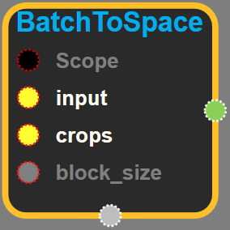
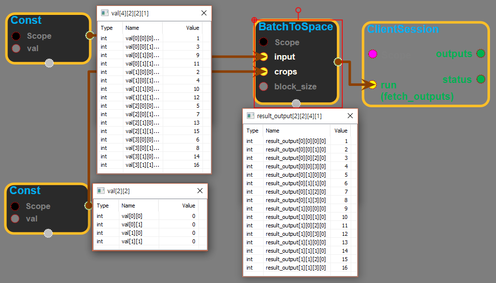

--- 
layout: default 
title: BatchToSpace 
parent: array_ops 
grand_parent: enuSpace-Tensorflow API 
last_modified_date: now 
--- 

# BatchToSpace {#abs}

---

## tensorflow C++ API {#tensorflow-c-api}

[tensorflow::ops::BatchToSpace](https://www.tensorflow.org/api_docs/cc/class/tensorflow/ops/batch-to-space.html)

[BatchToSpace](https://www.tensorflow.org/api_docs/cc/class/tensorflow/ops/batch-to-space.html#classtensorflow_1_1ops_1_1_batch_to_space) for 4-D tensors of type T.

---

## Summary {#summary}

This is a legacy version of the more general [BatchToSpaceND](https://www.tensorflow.org/api_docs/cc/class/tensorflow/ops/batch-to-space-n-d.html#classtensorflow_1_1ops_1_1_batch_to_space_n_d).

Rearranges \(permutes\) data from batch into blocks of spatial data, followed by cropping. This is the reverse transformation of  [SpaceToBatch](https://www.tensorflow.org/api_docs/cc/class/tensorflow/ops/space-to-batch.html#classtensorflow_1_1ops_1_1_space_to_batch). More specifically, this op outputs a copy of the input tensor where values from the batch dimension are moved in spatial blocks to the height and width dimensions, followed by cropping along the height and width dimensions.

Arguments:

* scope: A [Scope](https://www.tensorflow.org/api_docs/cc/class/tensorflow/scope.html#classtensorflow_1_1_scope) object
* input: 4-D tensor with shape**\(shape must be integer type\)** `[batch*block_size*block_size, height_pad/block_size, width_pad/block_size, depth]`  Note that the batch size of the input tensor must be divisible by `block_size * block_size`
* crops: 2-D tensor of non-negative integers with shape**\(shape must be integer type\)** `[2, 2]`. It specifies how many elements to crop from the intermediate result across the spatial dimensions as follows:
  ```
  crops = [[crop_top, crop_bottom],[crop_left, crop_right]]
  ```

Returns:

* [`Output`](https://www.tensorflow.org/api_docs/cc/class/tensorflow/output.html#classtensorflow_1_1_output): 4-D with shape `[batch, height, width, depth]`  , where:

  height = height\_pad - crop\_top - crop\_bottom  
  width = width\_pad - crop\_left - crop\_right

The attr block\_size must be greater than one\( block\_size &gt; 1 \). It indicates the block size.

Some examples:

\(1\) For the following input of shape \`\[4, 1, 1, 1\]\` and block\_size of 2:

\[\[\[\[1\]\]\], \[\[\[2\]\]\], \[\[\[3\]\]\], \[\[\[4\]\]\]\]

The output tensor has shape \`\[1, 2, 2, 1\]\` and value:

x = \[\[\[\[1\], \[2\]\], \[\[3\], \[4\]\]\]\]

\(2\) For the following input of shape \`\[4, 1, 1, 3\]\` and block\_size of 2:

\[\[\[1, 2, 3\]\], \[\[4, 5, 6\]\], \[\[7, 8, 9\]\], \[\[10, 11, 12\]\]\]

The output tensor has shape \`\[1, 2, 2, 3\]\` and value:

x = \[\[\[\[1, 2, 3\], \[4, 5, 6\]\],  
        \[\[7, 8, 9\], \[10, 11, 12\]\]\]\]

\(3\) For the following input of shape \`\[4, 2, 2, 1\]\` and block\_size of 2:

x = \[\[\[\[1\], \[3\]\], \[\[9\], \[11\]\]\],

```
  \[\[\[2\], \[4\]\], \[\[10\], \[12\]\]\],

  \[\[\[5\], \[7\]\], \[\[13\], \[15\]\]\],

  \[\[\[6\], \[8\]\], \[\[14\], \[16\]\]\]\]
```

The output tensor has shape \`\[1, 4, 4, 1\]\` and value:

x = \[\[\[1\],   \[2\],  \[3\],  \[4\]\],

```
  \[\[5\],   \[6\],  \[7\],  \[8\]\],

  \[\[9\],  \[10\], \[11\],  \[12\]\],

  \[\[13\], \[14\], \[15\],  \[16\]\]\]
```

---

## BatchToSpace block {#abs-block}

Source link :[https://github.com/EXPNUNI/enuSpaceTensorflow/blob/master/enuSpaceTensorflow/tf\_array\_ops.cpp](https://github.com/EXPNUNI/enuSpaceTensorflow/blob/master/enuSpaceTensorflow/tf_math.cpp)



Argument:

* Scope scope : A Scope object \(A scope is generated automatically each page. A scope is not connected.\)
* Input `input` : 4-D tensor with shape**\(shape must be integer type\)** `[batch*block_size*block_size, height_pad/block_size, width_pad/block_size, depth]`  Note that the batch size of the input tensor must be divisible by `block_size * block_size`
* Input crops : 2-D tensor of non-negative integers with shape\(shape must be integer type\) \[2, 2\]. It specifies how many elements to crop from the intermediate result across the spatial dimensions as follows:

  ```
  crops = [[crop_top, crop_bottom],[crop_left, crop_right]]
  ```

* Int64 `block_size`: determines the size of the image block.

Return:

* Output output : Output object of BatchToSpace class object. 

Result:

* std::vector\(Tensor\) result\_output : 4-D with shape \[batch, height, width, depth\] , where: 
  height = height\_pad - crop\_top - crop\_bottom,
  width = width\_pad - crop\_left - crop\_right

---

## Using Method {#using-method}

※ input을 재배치할때 쓰는 기능이다. 위의 공식대로 shape가 결정되며 depth는 input과 output이 동일하다.

