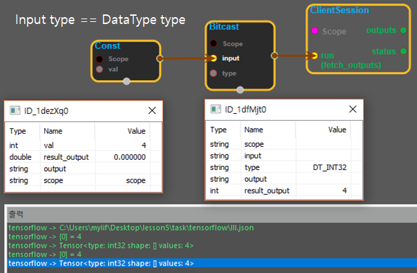
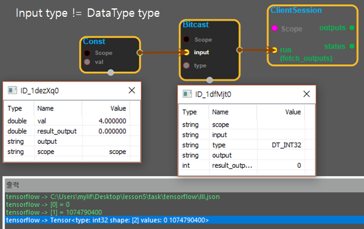

--- 
layout: default 
title: BitCast 
parent: array_ops 
grand_parent: enuSpace-Tensorflow API 
last_modified_date: now 
--- 

# Bitcast {#abs}

---

## tensorflow C++ API {#tensorflow-c-api}

[tensorflow::ops::Bitcast](https://www.tensorflow.org/api_docs/cc/class/tensorflow/ops/bitcast.html)

Bitcasts a tensor from one type to another without copying data.

---

## Summary {#summary}

Given a tensor`input`, this operation returns a tensor that has the same buffer data as`input`with datatype`type`. If the input datatype`T`is larger than the output datatype`type`then the shape changes from \[...\] to \[..., sizeof\(`T`\)/sizeof\(`type`\)\]. If`T`is smaller than`type`, the operator requires that the rightmost dimension be equal to sizeof\(`type`\)/sizeof\(`T`\). The shape then goes from \[..., sizeof\(`type`\)/sizeof\(`T`\)\] to \[...\].

NOTE : [Bitcast](https://www.tensorflow.org/api_docs/cc/class/tensorflow/ops/bitcast.html#classtensorflow_1_1ops_1_1_bitcast) is implemented as a low-level cast, so machines with different endian orderings will give different results.

Arguments:

* scope: A [Scope](https://www.tensorflow.org/api_docs/cc/class/tensorflow/scope.html#classtensorflow_1_1_scope) object

Returns:

* [`Output`](https://www.tensorflow.org/api_docs/cc/class/tensorflow/output.html#classtensorflow_1_1_output): The output tensor.

---

## Bitcast block {#abs-block}

Source link :[https://github.com/EXPNUNI/enuSpaceTensorflow/blob/master/enuSpaceTensorflow/tf\_array\_ops.cpp](https://github.com/EXPNUNI/enuSpaceTensorflow/blob/master/enuSpaceTensorflow/tf_math.cpp)

Argument:

* Scope `scope` : A Scope object \(A scope is generated automatically each page. A scope is not connected.\)
* Input `input` : connect Input or const shape node. \(tensor object\)
* DataType `type` : input string type name \(DT\_INT32, DT\_UINT8, DT\_UINT16, DT\_INT16, DT\_INT8, DT\_COMPLEX64, DT\_QINT8, DT\_QUINT8, DT\_QINT32, DT\_HALF .etc\)

Return:

* Output output : Output object of Bitcast class object. 

Result:

* std::vector\(Tensor\) result\_output : A `Tensor` of type `type`  \(If the input type and `type` are the same, it will have the value of `input`\)

---

## Using Method {#using-method}

  
※ input tensor의 타입을 변경해주는 역할을 한다. 다만 다른 타입으로 변경할 때 데이터는 복사 되지 않는다. 같은 타입일 경우는 데이터까지 복사된다\(이럴경우 이기능이 의미가없다.\).

