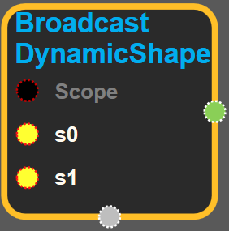
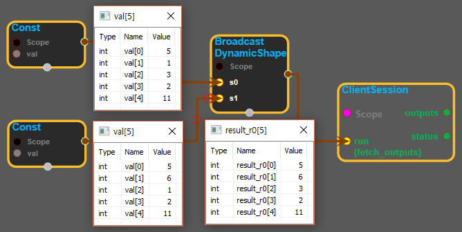

--- 
layout: default 
title: BroadcastDynamicShape 
parent: array_ops 
grand_parent: enuSpace-Tensorflow API 
last_modified_date: now 
--- 

# BroadcastDynamicShape

[tensorflow::ops::BroadcastDynamicShape](https://www.tensorflow.org/api_docs/cc/class/tensorflow/ops/broadcast-dynamic-shape.html)

Return the shape of s0 op s1 with broadcast.

---

## Summary {#summary}

Given`s0`and`s1`, tensors that represent shapes, compute`r0`, the [broadcasted](https://www.tensorflow.org/performance/xla/broadcasting) shape.`s0`,`s1`and`r0`are all integer vectors.

Arguments:

* scope: A [Scope](https://www.tensorflow.org/api_docs/cc/class/tensorflow/scope.html#classtensorflow_1_1_scope) object

Returns:

* [`Output`](https://www.tensorflow.org/api_docs/cc/class/tensorflow/output.html#classtensorflow_1_1_output): The r0 tensor.

---

## BroadcastDynamicShape block {#abs-block}

Source link :[https://github.com/EXPNUNI/enuSpaceTensorflow/blob/master/enuSpaceTensorflow/tf\_array\_ops.cpp](https://github.com/EXPNUNI/enuSpaceTensorflow/blob/master/enuSpaceTensorflow/tf_math.cpp)

Argument:

* Scope `scope` : A Scope object \(A scope is generated automatically each page. A scope is not connected.\)
* Input `s0` : connect Input or const shape node. \(rank 1 integer `Tensor`\)
* Input `s1` : connect Input or const shape node. \(rank 1 integer `Tensor`\)

Return:

* Output r0 : Output object of BroadcastDynamicShape class object. 

Result:

* std::vector\(Tensor\) result\_output : Returned object of executed result by calling session. \(A rank 1 integer Tensor representing the broadcasted shape\)

---

## Using Method {#using-method}

※ broadcast를 이용하는 기능으로 shape를 재구성 하는 역할을 한다. Array\_ops의 Shape 기능에서 shape를 뽑아낸 후 같은 차원인 두 개의 shape를 동일 하게 만들고, Array\_ops의 ReShape 기능으로 shape를 조정하는 방식으로 쓰인다.

