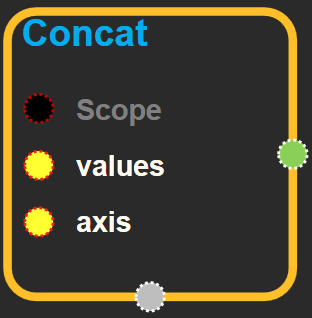
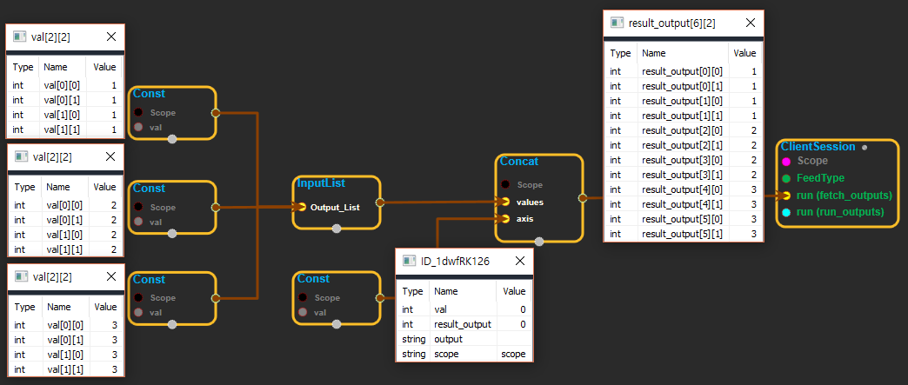

--- 
layout: default 
title: Concat 
parent: array_ops 
grand_parent: enuSpace-Tensorflow API 
last_modified_date: now 
--- 

# Concat

[tensorflow::ops::Concat](https://www.tensorflow.org/api_docs/cc/class/tensorflow/ops/concat.html)

Concatenates tensors along one dimension.

---

## Summary {#summary}

Arguments:

* scope: A [Scope](https://www.tensorflow.org/api_docs/cc/class/tensorflow/scope.html#classtensorflow_1_1_scope) object
* values: List of `N` Tensors to concatenate. Their ranks and types must match, and their sizes must match in all dimensions except `concat_dim` .
* axis: 0-D. The dimension along which to concatenate. Must be in the range \[-rank\(values\), rank\(values\)\).

Returns:

* [`Output`](https://www.tensorflow.org/api_docs/cc/class/tensorflow/output.html#classtensorflow_1_1_output): A [`Tensor`](https://www.tensorflow.org/api_docs/cc/class/tensorflow/tensor.html#classtensorflow_1_1_tensor) with the concatenation of values stacked along the `concat_dim` dimension. This tensor's shape matches that of `values` except in `concat_dim` where it has the sum of the sizes.

---

## Concat block {#abs-block}

Source link :[https://github.com/EXPNUNI/enuSpaceTensorflow/blob/master/enuSpaceTensorflow/tf\_array\_ops.cpp](https://github.com/EXPNUNI/enuSpaceTensorflow/blob/master/enuSpaceTensorflow/tf_math.cpp)

Argument:

* Scope `scope` : A Scope object \(A scope is generated automatically each page. A scope is not connected.\)
* Input `values`: List of `N` Tensors to concatenate. Their ranks and types must match, and their sizes must match in all dimensions except `concat_dim` .
* StringPiece axis: 0-D. The dimension along which to concatenate. Must be in the range \[-rank\(values\), rank\(values\)\).

Return:

* Output output : Output object of Concat class object. 

Result:

* std::vector\(Tensor\) result\_output : The output tensor.

---

## Using Method {#using-method}

※ values에 shape와 type이 모두 같은 tensor리스트가 들어오고, axis에는 리스트의 tensor를 통합할 차원을 선택한다. 위 화면의 예시 처럼 {2,2}의 shape를 가진 3개의 tensor를 리스트에 모으고, axis에 첫번째 차원을 합치기 위해 0\(index번호로 0은 첫번째라는 의미\)이라는 값을 입력한다. 이렇게 하면 결과 값은 {6,2}의 shape를 가진 tensor가 나온다.

