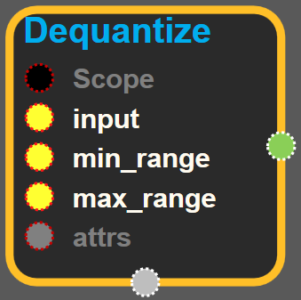

--- 
layout: default 
title: Dequantize 
parent: array_ops 
grand_parent: enuSpace-Tensorflow API 
last_modified_date: now 
--- 

# Dequantize {#abs}

---

## tensorflow C++ API {#tensorflow-c-api}

[tensorflow::ops::Dequantize](https://www.tensorflow.org/versions/r1.2/api_docs/cc/class/tensorflow/ops/dequantize)

[Dequantize](https://www.tensorflow.org/versions/r1.2/api_docs/cc/class/tensorflow/ops/dequantize.html#classtensorflow_1_1ops_1_1_dequantize) the 'input' tensor into a float [Tensor](https://www.tensorflow.org/versions/r1.2/api_docs/cc/class/tensorflow/tensor.html#classtensorflow_1_1_tensor).

---

## Summary {#summary}

\[min\_range, max\_range\] are scalar floats that specify the range for the 'input' data. The 'mode' attribute controls exactly which calculations are used to convert the float values to their quantized equivalents.

In 'MIN\_COMBINED' mode, each value of the tensor will undergo the following:

\`\`\` if T == qint8, in\[i\] += \(range\(T\) + 1\)/ 2.0 out\[i\] = min\_range + \(in\[i\]\* \(max\_range - min\_range\) / range\(T\)\) \`\``here`range\(T\) = numeric\_limits::max\(\) - numeric\_limits::min\(\)\`

MIN\_COMBINED Mode Example

If the input comes from a[QuantizedRelu6](https://www.tensorflow.org/versions/r1.2/api_docs/cc/class/tensorflow/ops/quantized-relu6.html#classtensorflow_1_1ops_1_1_quantized_relu6), the output type is quint8 \(range of 0-255\) but the possible range of[QuantizedRelu6](https://www.tensorflow.org/versions/r1.2/api_docs/cc/class/tensorflow/ops/quantized-relu6.html#classtensorflow_1_1ops_1_1_quantized_relu6)is 0-6. The min\_range and max\_range values are therefore 0.0 and 6.0.[Dequantize](https://www.tensorflow.org/versions/r1.2/api_docs/cc/class/tensorflow/ops/dequantize.html#classtensorflow_1_1ops_1_1_dequantize)on quint8 will take each value, cast to float, and multiply by 6 / 255. Note that if quantizedtype is qint8, the operation will additionally add each value by 128 prior to casting.

If the mode is 'MIN\_FIRST', then this approach is used:

\`\`\`c++ number\_of\_steps = 1 &lt;&lt; \(\# of bits in T\) range\_adjust = number\_of\_steps / \(number\_of\_steps - 1\) range = \(range\_max - range\_min\) \* range\_adjust range\_scale = range / number\_of\_steps const double offset\_input = static\_cast\(input\) - lowest\_quantized; result = range\_min + \(\(input - numeric\_limits::min\(\)\) \* range\_scale\) \`\`\`

Arguments:

* scope: A [Scope](https://www.tensorflow.org/versions/r1.2/api_docs/cc/class/tensorflow/scope.html#classtensorflow_1_1_scope) object
* min\_range: The minimum scalar value possibly produced for the input.
* max\_range: The maximum scalar value possibly produced for the input.

Returns:

* [`Output`](https://www.tensorflow.org/versions/r1.2/api_docs/cc/class/tensorflow/output.html#classtensorflow_1_1_output) : The output tensor.

---

## Dequantize block {#abs-block}

Source link :[https://github.com/EXPNUNI/enuSpaceTensorflow/blob/master/enuSpaceTensorflow/tf\_array\_ops.cpp](https://github.com/EXPNUNI/enuSpaceTensorflow/blob/master/enuSpaceTensorflow/tf_math.cpp)

Argument:

* Scope scope : A Scope object \(A scope is generated automatically each page. A scope is not connected.\)
* Input `input`: A `Tensor` . Must be one of the following types: `qint8` , `quint8` , `qint16` , `quint16` , `qint32` .
* Input `min_range` : A `Tensor` of type `float32` . The minimum scalar value possibly produced for the input.
* Input `max_range` : A `Tensor` of type `float32` . The maximum scalar value possibly produced for the input.
* Attr `attrs` : An optional StringPiece mode  from: "MIN\_COMBINED", "MIN\_FIRST" . Defaults to "MIN\_COMBINED" .

Return:

* Output output : Output object of Dequantize class object. 

Result:

* std::vector\(Tensor\) result\_output : 

---

## Using Method {#using-method}

※ tensorflow 1.3 does not support Windows

