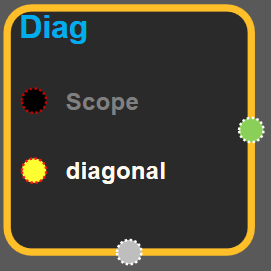
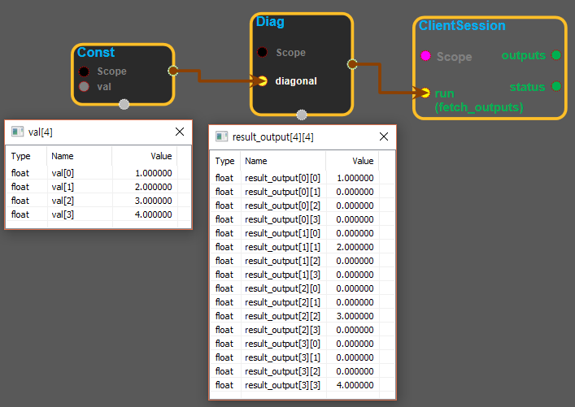

--- 
layout: default 
title: Diag 
parent: array_ops 
grand_parent: enuSpace-Tensorflow API 
last_modified_date: now 
--- 

# Diag {#abs}

---

## tensorflow C++ API {#tensorflow-c-api}

[tensorflow::ops::Diag](https://www.tensorflow.org/versions/r1.2/api_docs/cc/class/tensorflow/ops/diag)

Returns a diagonal tensor with a given diagonal values.

---

## Summary {#summary}

Given a`diagonal`, this operation returns a tensor with the`diagonal`and everything else padded with zeros. The diagonal is computed as follows:

Assume`diagonal`has dimensions \[D1,..., Dk\], then the output is a tensor of rank 2k with dimensions \[D1,..., Dk, D1,..., Dk\] where:

`output[i1,..., ik, i1,..., ik] = diagonal[i1, ..., ik]`and 0 everywhere else.

For example:

\`\`\` 'diagonal' is \[1, 2, 3, 4\]

tf.diag\(diagonal\) ==&gt; \[\[1, 0, 0, 0\] \[0, 2, 0, 0\] \[0, 0, 3, 0\] \[0, 0, 0, 4\]\] \`\`\`

Arguments:

* scope: A [Scope](https://www.tensorflow.org/versions/r1.2/api_docs/cc/class/tensorflow/scope.html#classtensorflow_1_1_scope) object
* diagonal: [Rank](https://www.tensorflow.org/versions/r1.2/api_docs/cc/class/tensorflow/ops/rank.html#classtensorflow_1_1ops_1_1_rank) k tensor where k is at most 3.

Returns:

* [`Output`](https://www.tensorflow.org/versions/r1.2/api_docs/cc/class/tensorflow/output.html#classtensorflow_1_1_output): The output tensor.

---

## Diag block {#abs-block}

Source link :[https://github.com/EXPNUNI/enuSpaceTensorflow/blob/master/enuSpaceTensorflow/tf\_array\_ops.cpp](https://github.com/EXPNUNI/enuSpaceTensorflow/blob/master/enuSpaceTensorflow/tf_math.cpp)

Argument:

* Scope scope : A Scope object \(A scope is generated automatically each page. A scope is not connected.\)
* Input diagonal : A Tensor. Must be one of the following types: float32, float64, int32, int64, complex64, complex128. Rank k tensor where k is at most 3.

Return:

* Output output : Output object of Diag class object. 

Result:

* std::vector\(Tensor\) result\_output : Assume`diagonal`has dimensions \[D1,..., Dk\], then the output is a tensor of rank 2k with dimensions \[D1,..., Dk, D1,..., Dk\] where: `output[i1,..., ik, i1,..., ik] = diagonal[i1, ..., ik]`and 0 everywhere else.

---

## Using Method {#using-method}

##### 

※ Rank를 늘려주는 역할을 한다.

