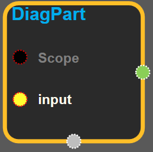
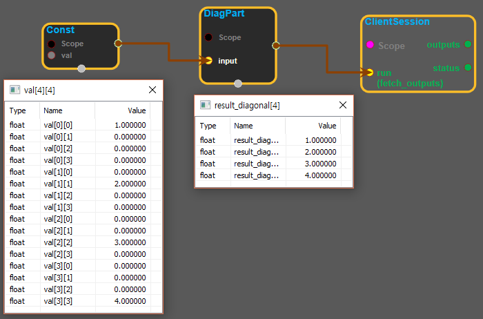

--- 
layout: default 
title: DiagPart 
parent: array_ops 
grand_parent: enuSpace-Tensorflow API 
last_modified_date: now 
--- 

# DiagPart {#abs}

---

## tensorflow C++ API {#tensorflow-c-api}

[tensorflow::ops::DiagPart](https://www.tensorflow.org/versions/r1.2/api_docs/cc/class/tensorflow/ops/diag-part)

Returns the diagonal part of the tensor.

---

## Summary {#summary}

This operation returns a tensor with the`diagonal`part of the`input`. The`diagonal`part is computed as follows:

Assume`input`has dimensions`[D1,..., Dk, D1,..., Dk]`, then the output is a tensor of rank`k`with dimensions`[D1,..., Dk]`where:

`diagonal[i1,..., ik] = input[i1, ..., ik, i1,..., ik]`.

For example:

\`\`\` 'input' is \[\[1, 0, 0, 0\]

\[0, 2, 0, 0\] \[0, 0, 3, 0\] \[0, 0, 0, 4\]\]

tf.diag\_part\(input\) ==&gt; \[1, 2, 3, 4\] \`\`\`

Arguments:

* scope: A [Scope](https://www.tensorflow.org/versions/r1.2/api_docs/cc/class/tensorflow/scope.html#classtensorflow_1_1_scope) object
* input: [Rank](https://www.tensorflow.org/versions/r1.2/api_docs/cc/class/tensorflow/ops/rank.html#classtensorflow_1_1ops_1_1_rank) k tensor where k is 2, 4, or 6.

Returns:

* [`Output`](https://www.tensorflow.org/versions/r1.2/api_docs/cc/class/tensorflow/output.html#classtensorflow_1_1_output): The extracted diagonal.

---

## DiagPart block {#abs-block}

Source link :[https://github.com/EXPNUNI/enuSpaceTensorflow/blob/master/enuSpaceTensorflow/tf\_array\_ops.cpp](https://github.com/EXPNUNI/enuSpaceTensorflow/blob/master/enuSpaceTensorflow/tf_math.cpp)

Argument:

* Scope scope : A Scope object \(A scope is generated automatically each page. A scope is not connected.\)
* Input `input`: A`Tensor` . Must be one of the following types: `float32` ,`float64` ,`int32` ,`int64` ,`complex64` ,`complex128` . Rank k tensor where k is 2, 4, or 6.

Return:

* Output output : Output object of Diag class object. 

Result:

* std::vector\(Tensor\) result\_output : Assume `input`has dimensions `[D1,..., Dk, D1,..., Dk]` , then the output is a tensor of rank `k` with dimensions `[D1,..., Dk]`

---

## Using Method {#using-method}

##### 

※ Rank를 줄여주는 역할을 한다.

