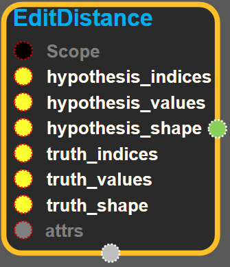
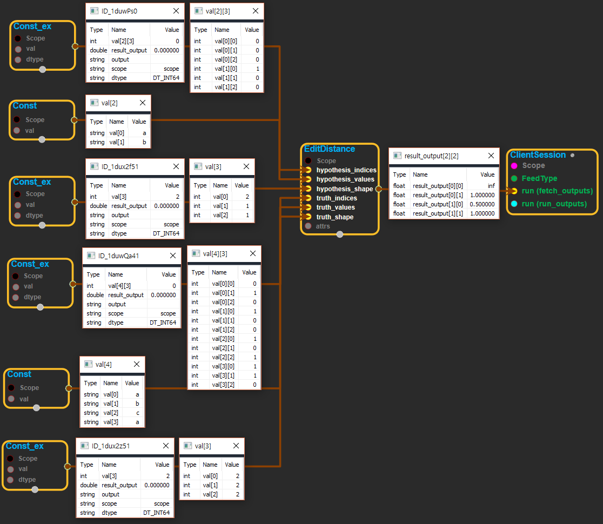

--- 
layout: default 
title: EditDistance 
parent: array_ops 
grand_parent: enuSpace-Tensorflow API 
last_modified_date: now 
--- 

# EditDistance {#abs}

---

## tensorflow C++ API {#tensorflow-c-api}

[tensorflow::ops::EditDistance](https://www.tensorflow.org/versions/r1.2/api_docs/cc/class/tensorflow/ops/edit-distance.html)

Computes the \(possibly normalized\) Levenshtein Edit Distance.

---

## Summary {#summary}

The inputs are variable-length sequences provided by SparseTensors \(hypothesis\_indices, hypothesis\_values, hypothesis\_shape\) and \(truth\_indices, truth\_values, truth\_shape\).

The inputs are:

Arguments:

* scope: A [Scope](https://www.tensorflow.org/versions/r1.2/api_docs/cc/class/tensorflow/scope.html#classtensorflow_1_1_scope) object
* hypothesis\_indices: The indices of the hypothesis list SparseTensor. This is an N x R int64 matrix.
* hypothesis\_values: The values of the hypothesis list SparseTensor. This is an N-length vector.
* hypothesis\_shape: The shape of the hypothesis list SparseTensor. This is an R-length vector.
* truth\_indices: The indices of the truth list SparseTensor. This is an M x R int64 matrix.
* truth\_values: The values of the truth list SparseTensor. This is an M-length vector.
* truth\_shape: truth indices, vector.

Optional attributes \(see[`Attrs`](https://www.tensorflow.org/versions/r1.2/api_docs/cc/struct/tensorflow/ops/edit-distance/attrs.html#structtensorflow_1_1ops_1_1_edit_distance_1_1_attrs)\):

* normalize: boolean \(if true, edit distances are normalized by length of truth\).

The output is:

Returns:

* [`Output`](https://www.tensorflow.org/versions/r1.2/api_docs/cc/class/tensorflow/output.html#classtensorflow_1_1_output): A dense float tensor with rank R - 1.

For the example input:

```
// hypothesis represents a 2x1 matrix with variable-length values:
//   (0,0) = ["a"]
//   (1,0) = ["b"]
hypothesis_indices=[[0,0,0],
                    [1,0,0]]
hypothesis_values=["a","b"]
hypothesis_shape=[2,1,1]

// truth represents a 2x2 matrix with variable-length values:
//   (0,0) = []
//   (0,1) = ["a"]
//   (1,0) = ["b", "c"]
//   (1,1) = ["a"]
truth_indices=[[0,1,0],
               [1,0,0],
               [1,0,1],
               [1,1,0]]
truth_values=["a","b","c","a"]
truth_shape=[2,2,2]
normalize=true
```

The output will be:

```
// output is a 2x2 matrix with edit distances normalized by truth lengths.
output=[[inf,1.0], // (0,0): no truth, (0,1): no hypothesis
        [0.5,1.0]] // (1,0): addition, (1,1): no hypothesis
```

---

## EditDistance block {#abs-block}

Source link :[https://github.com/EXPNUNI/enuSpaceTensorflow/blob/master/enuSpaceTensorflow/tf\_array\_ops.cpp](https://github.com/EXPNUNI/enuSpaceTensorflow/blob/master/enuSpaceTensorflow/tf_math.cpp)



Argument:

* Scope scope : A Scope object \(A scope is generated automatically each page. A scope is not connected.\)
* Input hypothesis\_indices: The indices of the hypothesis list SparseTensor. This is an N x R int64 matrix.
* hypothesis\_values: The values of the hypothesis list SparseTensor. This is an N-length vector.
* hypothesis\_shape: The shape of the hypothesis list SparseTensor. This is an int64 & R-length vector.
* truth\_indices: The indices of the truth list SparseTensor. This is an M x R int64 matrix.
* truth\_values: The values of the truth list SparseTensor. This is an M-length vector.
* truth\_shape: truth indices, int64 vector.

Return:

* Output output : Output object of Diag class object. 

Result:

* std::vector\(Tensor\) result\_output : Assume `input`has dimensions `[D1,..., Dk, D1,..., Dk]` , then the output is a tensor of rank `k` with dimensions `[D1,..., Dk]`

---

## Using Method {#using-method}

※ 


