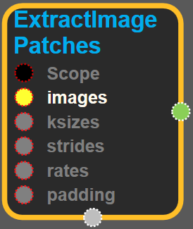
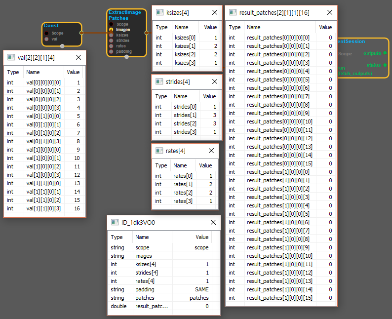

--- 
layout: default 
title: ExtractImagePatches 
parent: array_ops 
grand_parent: enuSpace-Tensorflow API 
last_modified_date: now 
--- 

# ExtractImagePatches {#abs}

---

## tensorflow C++ API {#tensorflow-c-api}

[tensorflow::ops::ExtractImagePatches](https://www.tensorflow.org/versions/r1.2/api_docs/cc/class/tensorflow/ops/extract-image-patches.html)

Extract `patches` from `images` and put them in the "depth" output dimension.

---

## Summary {#summary}

Arguments:

* scope: A [Scope](https://www.tensorflow.org/versions/r1.2/api_docs/cc/class/tensorflow/scope.html#classtensorflow_1_1_scope) object
* images: 4-D [Tensor](https://www.tensorflow.org/versions/r1.2/api_docs/cc/class/tensorflow/tensor.html#classtensorflow_1_1_tensor) with shape `[batch, in_rows, in_cols, depth]` .
* ksizes: The size of the sliding window for each dimension of `images` .
* strides: 1-D of length 4. How far the centers of two consecutive patches are in the images. Must be: `[1, stride_rows, stride_cols, 1]` .
* rates: 1-D of length 4. Must be: `[1, rate_rows, rate_cols, 1]` . This is the input stride, specifying how far two consecutive patch samples are in the input. Equivalent to extracting patches with `patch_sizes_eff = patch_sizes + (patch_sizes - 1) * (rates - 1)` , followed by subsampling them spatially by a factor of `rates` .
* padding: The type of padding algorithm to use.

We specify the size-related attributes as:

\`\`\`python ksizes = \[1, ksize\_rows, ksize\_cols, 1\] strides = \[1, strides\_rows, strides\_cols, 1\] rates = \[1, rates\_rows, rates\_cols, 1\] \`\`\`

Returns:

* [`Output`](https://www.tensorflow.org/versions/r1.2/api_docs/cc/class/tensorflow/output.html#classtensorflow_1_1_output) : 4-D [Tensor](https://www.tensorflow.org/versions/r1.2/api_docs/cc/class/tensorflow/tensor.html#classtensorflow_1_1_tensor) with shape `[batch, out_rows, out_cols, ksize_rows * ksize_cols * depth]` containing image patches with size `ksize_rows x ksize_cols x depth` vectorized in the "depth" dimension.

---

## ExtractImagePatches block {#abs-block}

Source link :[https://github.com/EXPNUNI/enuSpaceTensorflow/blob/master/enuSpaceTensorflow/tf\_array\_ops.cpp](https://github.com/EXPNUNI/enuSpaceTensorflow/blob/master/enuSpaceTensorflow/tf_math.cpp)

Argument:

* Scope scope : A Scope object \(A scope is generated automatically each page. A scope is not connected.\)
* Input `images`** **: A `Tensor` . Must be one of the following types: `float` , `int32`, `int64` , `uint8` , `int16` , `int8` , `uint16` , `half` . 4-D Tensor with shape `[batch, in_rows, in_cols, depth]` .
* gtl::ArraySlice&lt;int&gt; `ksizes` : A list of `ints` that has length `>= 4` . The size of the sliding window for each dimension of `images` .
* gtl::ArraySlice&lt;int&gt; `strides` : A list of `ints` that has length `>= 4` . 1-D of length 4. How far the centers of two consecutive patches are in the images. Must be: `[1, stride_rows, stride_cols, 1]` .
* gtl::ArraySlice&lt;int&gt; `rates` : A list of `ints` that has length `>= 4` . 1-D of length 4. Must be: `[1, rate_rows, rate_cols, 1]` . This is the input stride, specifying how far two consecutive patch samples are in the input. Equivalent to extracting patches with `patch_sizes_eff = patch_sizes + (patch_sizes - 1) * (rates - 1)` , followed by subsampling them spatially by a factor of `rates` .
* StringPiece `padding`: A`string`from:`"SAME", "VALID"`. The type of padding algorithm to use.

Return:

* Output output : Output object of ExtractImagePatches class object. 

Result:

* std::vector\(Tensor\) result\_output : A `Tensor` . Has the same type as `images`. 4-D Tensor with shape `[batch, out_rows, out_cols, ksize_rows * ksize_cols * depth]` containing image patches with size `ksize_rows x ksize_cols x depth` vectorized in the "depth" dimension.

---

## Using Method {#using-method}

##### 

