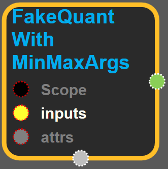
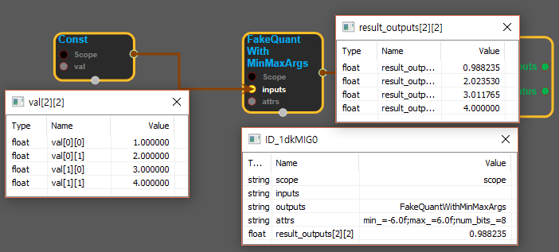

--- 
layout: default 
title: FakeQuantWithMinMaxArgs 
parent: array_ops 
grand_parent: enuSpace-Tensorflow API 
last_modified_date: now 
--- 

# FakeQuantWithMinMaxArgs {#abs}

---

## tensorflow C++ API {#tensorflow-c-api}

[tensorflow::ops::FakeQuantWithMinMaxArgs](https://www.tensorflow.org/versions/r1.2/api_docs/cc/class/tensorflow/ops/fake-quant-with-min-max-args.html)

Fake-quantize the 'inputs' tensor, type float to 'outputs' tensor of same type.

---

## Summary {#summary}

Attributes \[min; max\] define the clamping range for the 'inputs' data. Op divides this range into 255 steps \(total of 256 values\), then replaces each 'inputs' value with the closest of the quantized step values. 'num\_bits' is the bitwidth of the quantization; between 2 and 8, inclusive.

Quantization is called fake since the output is still in floating point.

Arguments:

* scope: A [Scope](https://www.tensorflow.org/versions/r1.2/api_docs/cc/class/tensorflow/scope.html#classtensorflow_1_1_scope) object

Returns:

* [`Output`](https://www.tensorflow.org/versions/r1.2/api_docs/cc/class/tensorflow/output.html#classtensorflow_1_1_output) : The outputs tensor.

---

## FakeQuantWithMinMaxArgs block {#abs-block}

Source link :[https://github.com/EXPNUNI/enuSpaceTensorflow/blob/master/enuSpaceTensorflow/tf\_array\_ops.cpp](https://github.com/EXPNUNI/enuSpaceTensorflow/blob/master/enuSpaceTensorflow/tf_math.cpp)

Argument:

* Scope scope : A Scope object \(A scope is generated automatically each page. A scope is not connected.\)
* Input `inputs`: A Tensor of type `float`.
* Attr `attrs` : An optional attribute value
  * min : An optional float. Defaults to -6.
  * max : An optional float. Defaults to 6.
  * num\_bits : An optional int. Defaults to 8.

Attrs use ex\)

Output:

* output : Output object of FakeQuantWithMinMaxArgs class object.

Result:

* std::vector\(Tensor\) result\_output : A `Tensor` of type `float`
  .

---

## Using Method {#using-method}

##### 

