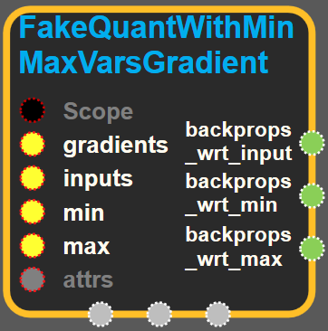
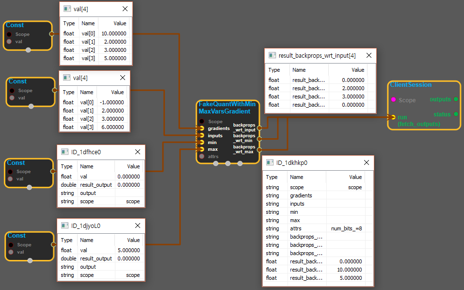

--- 
layout: default 
title: FakeQuantWithMinMaxVarsGradient 
parent: array_ops 
grand_parent: enuSpace-Tensorflow API 
last_modified_date: now 
--- 

# FakeQuantWithMinMaxVarsGradient {#abs}

---

## tensorflow C++ API {#tensorflow-c-api}

[tensorflow::ops::FakeQuantWithMinMaxVarsGradient](https://www.tensorflow.org/versions/r1.2/api_docs/cc/class/tensorflow/ops/fake-quant-with-min-max-vars-gradient.html)

Compute gradients for a [FakeQuantWithMinMaxVars](https://www.tensorflow.org/versions/r1.2/api_docs/cc/class/tensorflow/ops/fake-quant-with-min-max-vars.html#classtensorflow_1_1ops_1_1_fake_quant_with_min_max_vars) operation.

---

## Summary {#summary}

Arguments:

* scope: A [Scope](https://www.tensorflow.org/versions/r1.2/api_docs/cc/class/tensorflow/scope.html#classtensorflow_1_1_scope) object
* gradients: Backpropagated gradients above the [FakeQuantWithMinMaxVars](https://www.tensorflow.org/versions/r1.2/api_docs/cc/class/tensorflow/ops/fake-quant-with-min-max-vars.html#classtensorflow_1_1ops_1_1_fake_quant_with_min_max_vars) operation.
* inputs: Values passed as inputs to the [FakeQuantWithMinMaxVars](https://www.tensorflow.org/versions/r1.2/api_docs/cc/class/tensorflow/ops/fake-quant-with-min-max-vars.html#classtensorflow_1_1ops_1_1_fake_quant_with_min_max_vars) operation. min, max: Quantization interval, scalar floats.

Optional attributes \(see[`Attrs`](https://www.tensorflow.org/versions/r1.2/api_docs/cc/struct/tensorflow/ops/fake-quant-with-min-max-vars-gradient/attrs.html#structtensorflow_1_1ops_1_1_fake_quant_with_min_max_vars_gradient_1_1_attrs)\):

* num\_bits: The bitwidth of the quantization; between 2 and 8, inclusive.

Returns:

* [`Output`](https://www.tensorflow.org/versions/r1.2/api_docs/cc/class/tensorflow/output.html#classtensorflow_1_1_output) backprops\_wrt\_input: Backpropagated gradients w.r.t. inputs: `gradients * (inputs >= min && inputs <= max)`.
* [`Output`](https://www.tensorflow.org/versions/r1.2/api_docs/cc/class/tensorflow/output.html#classtensorflow_1_1_output) backprop\_wrt\_min: Backpropagated gradients w.r.t. min parameter: `sum(gradients * (inputs < min))`.
* [`Output`](https://www.tensorflow.org/versions/r1.2/api_docs/cc/class/tensorflow/output.html#classtensorflow_1_1_output) backprop\_wrt\_max: Backpropagated gradients w.r.t. max parameter: `sum(gradients * (inputs > max))`.

---

## FakeQuantWithMinMaxVarsGradient block {#abs-block}

Source link :[https://github.com/EXPNUNI/enuSpaceTensorflow/blob/master/enuSpaceTensorflow/tf\_array\_ops.cpp](https://github.com/EXPNUNI/enuSpaceTensorflow/blob/master/enuSpaceTensorflow/tf_math.cpp)

Argument:

* Scope scope : A Scope object \(A scope is generated automatically each page. A scope is not connected.\)
* Input `inputs`: A Tensor of type `float`.
* Input min : A Tensor of type `float`.
* Input max : A Tensor of type `float`.
* Attr `attrs` : An optional attribute value
  * num\_bits : An optional int. Defaults to 8.

Attrs use ex\)

Output:

* output : Output object of FakeQuantWithMinMaxVarsGradient class object.

Result:

* std::vector\(Tensor\) `backprops_wrt_input`: A `Tensor`of type `float32`. Backpropagated gradients w.r.t. inputs:`gradients * inputs >= min && inputs <= max)`.
* std::vector\(Tensor\) `backprop_wrt_min` : A `Tensor`of type `float32` . Backpropagated gradients w.r.t. min parameter: `sum(gradients * (inputs < min))`.
* std::vector\(Tensor\) `backprop_wrt_max` : A `Tensor` of type `float32` . Backpropagated gradients w.r.t. max parameter: `sum(gradients * (inputs > max))`.

---

## Using Method {#using-method}

