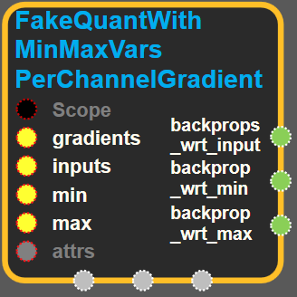
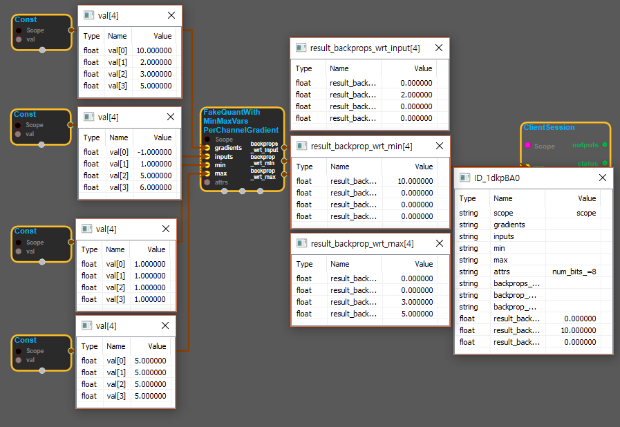

--- 
layout: default 
title: FakeQuantWithMinMaxVarsPerChannelGradient 
parent: array_ops 
grand_parent: enuSpace-Tensorflow API 
last_modified_date: now 
--- 

# FakeQuantWithMinMaxVarsPerChannelGradient {#abs}

---

## tensorflow C++ API {#tensorflow-c-api}

[tensorflow::ops::FakeQuantWithMinMaxVarsPerChannelGradient](https://www.tensorflow.org/api_docs/cc/class/tensorflow/ops/fake-quant-with-min-max-vars-per-channel-gradient.html)

Compute gradients for a [FakeQuantWithMinMaxVarsPerChannel](https://www.tensorflow.org/api_docs/cc/class/tensorflow/ops/fake-quant-with-min-max-vars-per-channel.html#classtensorflow_1_1ops_1_1_fake_quant_with_min_max_vars_per_channel) operation.

---

## Summary {#summary}

Arguments:

* scope: A [Scope](https://www.tensorflow.org/api_docs/cc/class/tensorflow/scope.html#classtensorflow_1_1_scope) object
* gradients: Backpropagated gradients above the [FakeQuantWithMinMaxVars](https://www.tensorflow.org/api_docs/cc/class/tensorflow/ops/fake-quant-with-min-max-vars.html#classtensorflow_1_1ops_1_1_fake_quant_with_min_max_vars) operation, shape one of: `[d]`, `[b, d]`, `[b, h, w, d]` .
* inputs: Values passed as inputs to the [FakeQuantWithMinMaxVars](https://www.tensorflow.org/api_docs/cc/class/tensorflow/ops/fake-quant-with-min-max-vars.html#classtensorflow_1_1ops_1_1_fake_quant_with_min_max_vars) operation, shape same as `gradients` Quantization interval, floats of shape `[d]` .

Optional attributes \(see[`Attrs`](https://www.tensorflow.org/api_docs/cc/struct/tensorflow/ops/fake-quant-with-min-max-vars-per-channel-gradient/attrs.html#structtensorflow_1_1ops_1_1_fake_quant_with_min_max_vars_per_channel_gradient_1_1_attrs)\):

* num\_bits: The bitwidth of the quantization; between 2 and 8, inclusive.
* narrow\_range: Whether to quantize into 2^num\_bits - 1 distinct values.

Returns:

* [`Output`](https://www.tensorflow.org/api_docs/cc/class/tensorflow/output.html#classtensorflow_1_1_output)backprops\_wrt\_input: Backpropagated gradients w.r.t. inputs, shape same as `inputs` : `gradients * (inputs >= min && inputs <= max)`.
* [`Output`](https://www.tensorflow.org/api_docs/cc/class/tensorflow/output.html#classtensorflow_1_1_output) backprop\_wrt\_min: Backpropagated gradients w.r.t. min parameter, shape `[d]` : `sum_per_d(gradients * (inputs < min))` .
* [`Output`](https://www.tensorflow.org/api_docs/cc/class/tensorflow/output.html#classtensorflow_1_1_output) backprop\_wrt\_max: Backpropagated gradients w.r.t. max parameter, shape `[d]` : `sum_per_d(gradients * (inputs > max))`.

---

## FakeQuantWithMinMaxVarsPerChannelGradient block {#abs-block}

Source link :[https://github.com/EXPNUNI/enuSpaceTensorflow/blob/master/enuSpaceTensorflow/tf\_array\_ops.cpp](https://github.com/EXPNUNI/enuSpaceTensorflow/blob/master/enuSpaceTensorflow/tf_math.cpp)

Argument:

* Scope scope : A Scope object \(A scope is generated automatically each page. A scope is not connected.\)
* Input `inputs`: A Tensor of type `float`.
* Input min : A Tensor of type `float`.
* Input max : A Tensor of type `float`.
* Attr `attrs` : An optional attribute value
  * num\_bits : An optional int. Defaults to 8.

Attrs use ex\)

Output:

* output : Output object of FakeQuantWithMinMaxVarsPerChannelGradient class object.

Result:

* std::vector\(Tensor\) `result_output`: A `Tensor` of type `float`. This operation has a gradient and thus allows for training `min` and `max` values.

---

## Using Method {#using-method}

