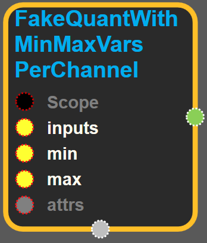
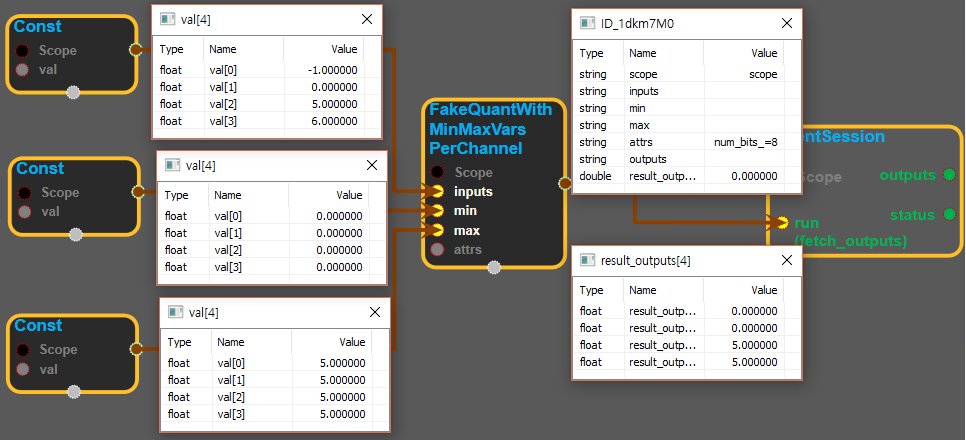

--- 
layout: default 
title: FakeQuantWithMinMaxVarsPerChannel 
parent: array_ops 
grand_parent: enuSpace-Tensorflow API 
last_modified_date: now 
--- 

# FakeQuantWithMinMaxVarsPerChannel {#abs}

---

## tensorflow C++ API {#tensorflow-c-api}

[tensorflow::ops::FakeQuantWithMinMaxVarsPerChannel](https://www.tensorflow.org/versions/r1.2/api_docs/cc/class/tensorflow/ops/fake-quant-with-min-max-vars-per-channel.html)

Fake-quantize the 'inputs' tensor of type float and one of the shapes: `[d]`,.

---

## Summary {#summary}

`[b, d][b, h, w, d]`via per-channel floats`min`and`max`of shape`[d]`to 'outputs' tensor of same shape as`inputs`.

\[min; max\] is the clamping range for the 'inputs' data in the corresponding depth channel. Op divides this range into 255 steps \(total of 256 values\), then replaces each 'inputs' value with the closest of the quantized step values. 'num\_bits' is the bitwidth of the quantization; between 2 and 8, inclusive.

This operation has a gradient and thus allows for training`min`and`max`values.

Arguments:

* scope: A [Scope](https://www.tensorflow.org/versions/r1.2/api_docs/cc/class/tensorflow/scope.html#classtensorflow_1_1_scope) object

Returns:

* [`Output`](https://www.tensorflow.org/versions/r1.2/api_docs/cc/class/tensorflow/output.html#classtensorflow_1_1_output): The outputs tensor.

---

## FakeQuantWithMinMaxVarsPerChannel block {#abs-block}

Source link :[https://github.com/EXPNUNI/enuSpaceTensorflow/blob/master/enuSpaceTensorflow/tf\_array\_ops.cpp](https://github.com/EXPNUNI/enuSpaceTensorflow/blob/master/enuSpaceTensorflow/tf_math.cpp)

Argument:

* Scope scope : A Scope object \(A scope is generated automatically each page. A scope is not connected.\)
* Input `inputs`: A Tensor of type `float`.
* Input min : A Tensor of type `float`.
* Input max : A Tensor of type `float`.
* Attr `attrs` : An optional attribute value
  * num\_bits : An optional int. Defaults to 8.

Attrs use ex\)

Output:

* output : Output object of FakeQuantWithMinMaxVarsPerChannel class object.

Result:

* std::vector\(Tensor\) `result_output`: A `Tensor` of type `float`. This operation has a gradient and thus allows for training `min` and `max` values.

---

## Using Method {#using-method}

