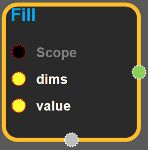
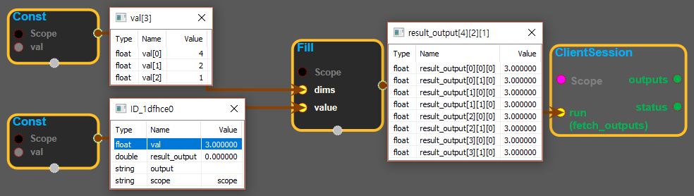

--- 
layout: default 
title: Fill 
parent: array_ops 
grand_parent: enuSpace-Tensorflow API 
last_modified_date: now 
--- 

# Fill {#abs}

---

## tensorflow C++ API {#tensorflow-c-api}

[tensorflow::ops::Fill](https://www.tensorflow.org/api_docs/cc/class/tensorflow/ops/fill.html)

Creates a tensor filled with a scalar value.

---

## Summary {#summary}

This operation creates a tensor of shape`dims`and fills it with`value`.

For example:

\`\`\`[Output](https://www.tensorflow.org/api_docs/cc/class/tensorflow/output.html#classtensorflow_1_1_output)tensor has shape \[2, 3\].

fill\(\[2, 3\], 9\) ==&gt; \[\[9, 9, 9\] \[9, 9, 9\]\] \`\`\`

Arguments:

* scope: A [Scope](https://www.tensorflow.org/api_docs/cc/class/tensorflow/scope.html#classtensorflow_1_1_scope) object
* dims: 1-D. Represents the shape of the output tensor.
* value: 0-D \(scalar\). Value to fill the returned tensor.

\(numpy\) Equivalent to np.full

Returns:

* [`Output`](https://www.tensorflow.org/api_docs/cc/class/tensorflow/output.html#classtensorflow_1_1_output) : The output tensor.

---

## Fill block {#abs-block}

Source link :[https://github.com/EXPNUNI/enuSpaceTensorflow/blob/master/enuSpaceTensorflow/tf\_array\_ops.cpp](https://github.com/EXPNUNI/enuSpaceTensorflow/blob/master/enuSpaceTensorflow/tf_math.cpp)

Argument:

* Scope scope : A Scope object \(A scope is generated automatically each page. A scope is not connected.\)
* Input `dims` : A `Tensor` of type `int32`. 1-D. Represents the shape of the output tensor.
* Input `value`: A`Tensor`. 0-D \(scalar\). Value to fill the returned tensor.

Output:

* output : Output object of Fill class object.

Result:

* std::vector\(Tensor\) `result_output`: A `tensor` filled with a scalar value. \( `tensor`shape -&gt; `dims`, `tensor` value -&gt; `value`\)

---

## Using Method {#using-method}

※ dims의 shape에 value의 값을 넣어서 tensor를 만든다. output의 모든 값은 value의 값으로 채워진다.

