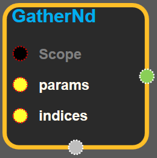
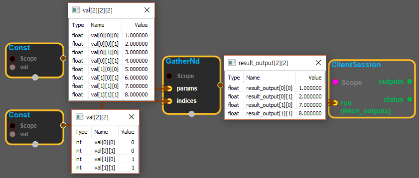
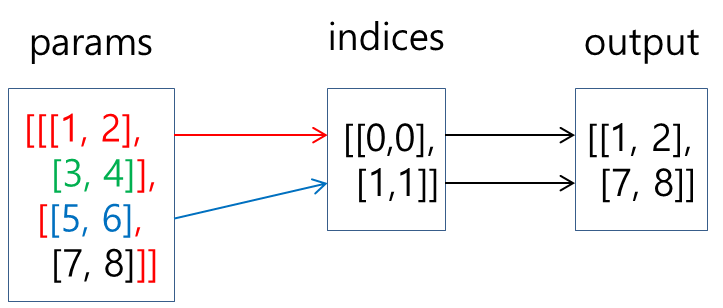

--- 
layout: default 
title: GatherNd 
parent: array_ops 
grand_parent: enuSpace-Tensorflow API 
last_modified_date: now 
--- 

# GatherND {#abs}

---

## tensorflow C++ API {#tensorflow-c-api}

[tensorflow::ops::GatherNd](https://www.tensorflow.org/api_docs/cc/class/tensorflow/ops/gather-nd.html)

[G](https://www.tensorflow.org/api_docs/cc/class/tensorflow/ops/gather.html#classtensorflow_1_1ops_1_1_gather)[Gather](https://www.tensorflow.org/api_docs/cc/class/tensorflow/ops/gather.html#classtensorflow_1_1ops_1_1_gather) slices from `params` into a [Tensor](https://www.tensorflow.org/api_docs/cc/class/tensorflow/tensor.html#classtensorflow_1_1_tensor) with shape specified by `indices`.

---

## Summary {#summary}

`indices`is an K-dimensional integer tensor, best thought of as a \(K-1\)-dimensional tensor of indices into`params`, where each element defines a slice of`params`:

```
output[i_0,..., i_{K-2}]=params[indices[i0,..., i_{K-2}]]
```

Whereas in tf.gather`indices`defines slices into the first dimension of`params`, in`tf.gather_nd`,`indices`defines slices into the first`N`dimensions of`params`, where`N = indices.shape[-1]`.

The last dimension of`indices`can be at most the rank of`params`:

```
indices.shape[-1]<=params.rank
```

The last dimension of`indices`corresponds to elements \(if`indices.shape[-1] == params.rank`\) or slices \(if`indices.shape[-1] < params.rank`\) along dimension`indices.shape[-1]`of`params`. The output tensor has shape

```
indices.shape[:-1]+params.shape[indices.shape[-1]:]
```

Some examples below.

Simple indexing into a matrix:

\`\`\`python indices = \[\[0, 0\], \[1, 1\]\] params = \[\['a', 'b'\], \['c', 'd'\]\] output = \['a', 'd'\] \`\`\`

[Slice](https://www.tensorflow.org/api_docs/cc/class/tensorflow/ops/slice.html#classtensorflow_1_1ops_1_1_slice)indexing into a matrix:

\`\`\`python indices = \[\[1\], \[0\]\] params = \[\['a', 'b'\], \['c', 'd'\]\] output = \[\['c', 'd'\], \['a', 'b'\]\] \`\`\`

Indexing into a 3-tensor:

\`\`\`python indices = \[\[1\]\] params = \[\[\['a0', 'b0'\], \['c0', 'd0'\]\], \[\['a1', 'b1'\], \['c1', 'd1'\]\]\] output = \[\[\['a1', 'b1'\], \['c1', 'd1'\]\]\]

```
indices = [[0,1],[1,0]]
params = [[['a0','b0'],['c0','d0']],[['a1','b1'],['c1','d1']]]
output = [['c0','d0'],['a1','b1']]

indices = [[0,0,1],[1,0,1]]
params = [[['a0','b0'],['c0','d0']],[['a1','b1'],['c1','d1']]]
output = ['b0','b1']
```

\`\`\`

Batched indexing into a matrix:

\`\`\`python indices = \[\[\[0, 0\]\], \[\[0, 1\]\]\] params = \[\['a', 'b'\], \['c', 'd'\]\] output = \[\['a'\], \['b'\]\] \`\`\`

Batched slice indexing into a matrix:

\`\`\`python indices = \[\[\[1\]\], \[\[0\]\]\] params = \[\['a', 'b'\], \['c', 'd'\]\] output = \[\[\['c', 'd'\]\], \[\['a', 'b'\]\]\] \`\`\`

Batched indexing into a 3-tensor:

\`\`\`python indices = \[\[\[1\]\], \[\[0\]\]\] params = \[\[\['a0', 'b0'\], \['c0', 'd0'\]\], \[\['a1', 'b1'\], \['c1', 'd1'\]\]\] output = \[\[\[\['a1', 'b1'\], \['c1', 'd1'\]\]\], \[\[\['a0', 'b0'\], \['c0', 'd0'\]\]\]\]

indices = \[\[\[0, 1\], \[1, 0\]\], \[\[0, 0\], \[1, 1\]\]\] params = \[\[\['a0', 'b0'\], \['c0', 'd0'\]\], \[\['a1', 'b1'\], \['c1', 'd1'\]\]\] output = \[\[\['c0', 'd0'\], \['a1', 'b1'\]\], \[\['a0', 'b0'\], \['c1', 'd1'\]\]\]

```
indices = [[[0,0,1],[1,0,1]],[[0,1,1],[1,1,0]]]
params = [[['a0','b0'],['c0','d0']],[['a1','b1'],['c1','d1']]]
output = [['b0','b1'],['d0','c1']]
```

\`\`\`

Arguments:

* scope: A [Scope](https://www.tensorflow.org/api_docs/cc/class/tensorflow/scope.html#classtensorflow_1_1_scope) object
* params: The N-D tensor from which to gather values.
* indices: Index tensor.

Returns:

* [`Output`](https://www.tensorflow.org/api_docs/cc/class/tensorflow/output.html#classtensorflow_1_1_output): Values from `params`gathered from indices given by `indices`, with shape `indices.shape[:-1] + params.shape[indices.shape[-1]:]`.

---

## GatherND block {#abs-block}

Source link :[https://github.com/EXPNUNI/enuSpaceTensorflow/blob/master/enuSpaceTensorflow/tf\_array\_ops.cpp](https://github.com/EXPNUNI/enuSpaceTensorflow/blob/master/enuSpaceTensorflow/tf_math.cpp)



Argument:

* Scope scope : A Scope object \(A scope is generated automatically each page. A scope is not connected.\)
* Input `params` : A `Tensor`. The N-D tensor from which to gather values.
* Input `indices`:A `Tensor`. must be an integer tensor of any dimension. In the value of params index num.

Output:

* output : Output object of GatherND class object.

Result:

* std::vector\(Tensor\) `result_output`: A `Tensor`. Has the same type as `params`. Values from `params`gathered from indices given by `indices`.

---

## Using Method

  
※ 위의 그림처럼 params가 다 차원 일때 indices의 index에 따라 params의 값을 가져온다. 

