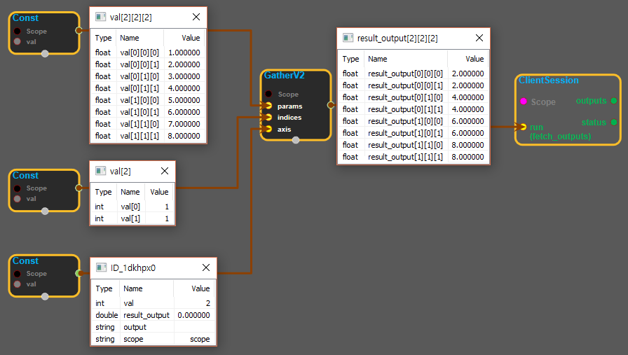
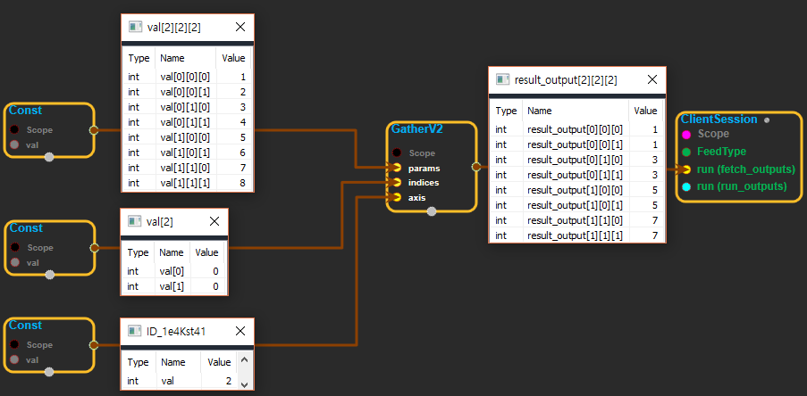

--- 
layout: default 
title: GatherV2 
parent: array_ops 
grand_parent: enuSpace-Tensorflow API 
last_modified_date: now 
--- 

# GatherV2 {#abs}

---

## tensorflow C++ API {#tensorflow-c-api}

[tensorflow::ops::GatherV2](https://www.tensorflow.org/api_docs/cc/class/tensorflow/ops/gather-v2.html)

[Gather](https://www.tensorflow.org/api_docs/cc/class/tensorflow/ops/gather.html#classtensorflow_1_1ops_1_1_gather) slices from `params` axis `axis` according to `indices`.

---

## Summary {#summary}

`indices` must be an integer tensor of any dimension \(usually 0-D or 1-D\). Produces an output tensor with shape `params.shape[:axis] + indices.shape + params.shape[axis + 1:]`where:

\`\`\`python Scalar indices \(output is rank\(params\) - 1\).

output\[a\_0, ..., a\_n, b\_0, ..., b\_n\] = params\[a\_0, ..., a\_n, indices, b\_0, ..., b\_n\]

Vector indices \(output is rank\(params\)\).

output\[a\_0, ..., a\_n, i, b\_0, ..., b\_n\] = params\[a\_0, ..., a\_n, indices\[i\], b\_0, ..., b\_n\]

Higher rank indices \(output is rank\(params\) + rank\(indices\) - 1\).

output\[a\_0, ..., a\_n, i, ..., j, b\_0, ... b\_n\] = params\[a\_0, ..., a\_n, indices\[i, ..., j\], b\_0, ..., b\_n\] \`\`\`

Arguments:

* scope: A [Scope](https://www.tensorflow.org/api_docs/cc/class/tensorflow/scope.html#classtensorflow_1_1_scope) object
* params: The tensor from which to gather values. Must be at least rank `axis + 1`.
* indices: Index tensor. Must be in range `[0, params.shape[axis])`.
* axis: The axis in `params` to gather `indices` from. Defaults to the first dimension. Supports negative indexes.

Returns:

* [`Output`](https://www.tensorflow.org/api_docs/cc/class/tensorflow/output.html#classtensorflow_1_1_output): Values from `params` gathered from indices given by `indices` , with shape `params.shape[:axis] + indices.shape + params.shape[axis + 1:]`.

---

## GatherV2 block {#abs-block}

Source link :[https://github.com/EXPNUNI/enuSpaceTensorflow/blob/master/enuSpaceTensorflow/tf\_array\_ops.cpp](https://github.com/EXPNUNI/enuSpaceTensorflow/blob/master/enuSpaceTensorflow/tf_math.cpp)

Argument:

* Scope scope : A Scope object \(A scope is generated automatically each page. A scope is not connected.\)
* params: The tensor from which to gather values. Must be at least rank `axis + 1`.
* indices: Index tensor. Must be in range `[0, params.shape[axis])`.
* axis: The axis in `params` to gather `indices` from. Defaults to the first dimension. Supports negative indexes.

Output:

* output : Output object of GatherV2 class object.

Result:

* std::vector\(Tensor\) `result_output`: A `Tensor`. Values from `params` gathered from indices given by `indices`, with shape `params.shape[:axis] + indices.shape + params.shape[axis + 1:]`.

---

## Using Method

  
※ axis로 차원을 선택하고, indices의 index값으로 해당하는 값을 가져오는 방식은 비슷하다. axis값의 차원에 indices의 인덱스 값에 해당하는 값을 가져온다.

※ 위와 동일한 환경에서 indices의 값만 \[0,0\] 으로 바꾸면 위와 같은 그림이 나온다.

