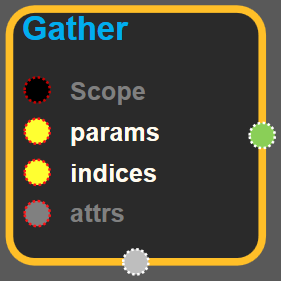

--- 
layout: default 
title: Gather 
parent: array_ops 
grand_parent: enuSpace-Tensorflow API 
last_modified_date: now 
--- 

# Gather {#abs}

---

## tensorflow C++ API {#tensorflow-c-api}

[tensorflow::ops::Gather](https://www.tensorflow.org/api_docs/cc/class/tensorflow/ops/gather.html)

[Gather](https://www.tensorflow.org/api_docs/cc/class/tensorflow/ops/gather.html#classtensorflow_1_1ops_1_1_gather) slices from `params`according to `indices`.

---

## Summary {#summary}

`indices`must be an integer tensor of any dimension \(usually 0-D or 1-D\). Produces an output tensor with shape`indices.shape + params.shape[1:]`where:

\`\`\`  
python Scalar indices  
output\[:, ..., :\] = params\[indices, :, ... :\]

Vector indices  
output\[i, :, ..., :\] = params\[indices\[i\], :, ... :\]

Higher rank indices  
output\[i, ..., j, :, ... :\] = params\[indices\[i, ..., j\], :, ..., :\]

\`\`\`

If`indices`is a permutation and`len(indices) == params.shape[0]`then this operation will permute`params`accordingly.

`validate_indices`: DEPRECATED. If this operation is assigned to CPU, values in`indices`are always validated to be within range. If assigned to GPU, out-of-bound indices result in safe but unspecified behavior, which may include raising an error.

Arguments:

* scope: A [Scope](https://www.tensorflow.org/api_docs/cc/class/tensorflow/scope.html#classtensorflow_1_1_scope) object

Returns:

* [`Output`](https://www.tensorflow.org/api_docs/cc/class/tensorflow/output.html#classtensorflow_1_1_output): The output tensor.

---

## Gather block {#abs-block}

Source link :[https://github.com/EXPNUNI/enuSpaceTensorflow/blob/master/enuSpaceTensorflow/tf\_array\_ops.cpp](https://github.com/EXPNUNI/enuSpaceTensorflow/blob/master/enuSpaceTensorflow/tf_math.cpp)

Argument:

* Scope scope : A Scope object \(A scope is generated automatically each page. A scope is not connected.\)
* Input `params` : A `Tensor`. The tensor from which to gather values. 
* Input `indices`:A `Tensor`. must be an integer tensor of any dimension \(usually 0-D or 1-D\). In the value of params index num.

Output:

* output : Output object of Gather class object.

Result:

* std::vector\(Tensor\) `result_output`: A `Tensor`. Has the same type as `params`. Values from `params`gathered from indices given by `indices`.

---

## Using Method {#using-method}

   
  
※ 위 그림에서 설명하듯 params의 값을 indices의 index값에 맞도록 가져온다.

