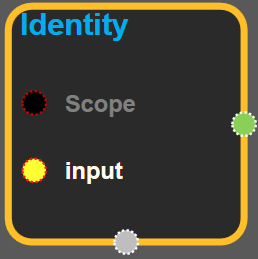
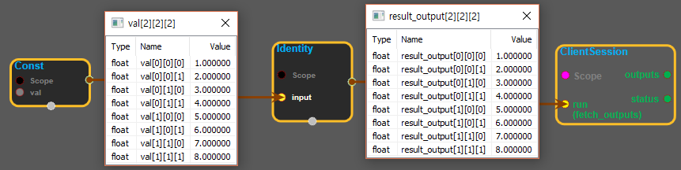

--- 
layout: default 
title: Identity 
parent: array_ops 
grand_parent: enuSpace-Tensorflow API 
last_modified_date: now 
--- 

# Identity {#abs}

---

## tensorflow C++ API {#tensorflow-c-api}

[tensorflow::ops::Identity](https://www.tensorflow.org/api_docs/cc/class/tensorflow/ops/identity.html)

Return a tensor with the same shape and contents as the input tensor or value.

---

## Summary {#summary}

Arguments:

* scope: A [Scope](https://www.tensorflow.org/api_docs/cc/class/tensorflow/scope.html#classtensorflow_1_1_scope) object

Returns:

* [`Output`](https://www.tensorflow.org/api_docs/cc/class/tensorflow/output.html#classtensorflow_1_1_output): The output tensor.

---

## Identity block {#abs-block}

Source link :[https://github.com/EXPNUNI/enuSpaceTensorflow/blob/master/enuSpaceTensorflow/tf\_array\_ops.cpp](https://github.com/EXPNUNI/enuSpaceTensorflow/blob/master/enuSpaceTensorflow/tf_math.cpp)

Argument:

* Scope scope : A Scope object \(A scope is generated automatically each page. A scope is not connected.\)
* Input `input` : A `Tensor`.

Output:

* output : Output object of Identity class object.

Result:

* std::vector\(Tensor\) `result_output`: A `Tensor`. Has the same type as `input`.

---

## Using Method

※ input에 입력한 tensor와 동일한 tensor를 output으로 내보낸다.

