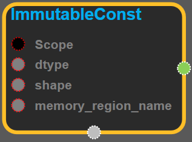

--- 
layout: default 
title: ImmutableConst 
parent: array_ops 
grand_parent: enuSpace-Tensorflow API 
last_modified_date: now 
--- 

# ImmutableConst {#abs}

---

## tensorflow C++ API {#tensorflow-c-api}

[tensorflow::ops::ImmutableConst](https://www.tensorflow.org/api_docs/cc/class/tensorflow/ops/immutable-const.html)

Returns immutable tensor from memory region.

---

## Summary {#summary}

The current implementation memmaps the tensor from a file.

Arguments:

* scope: A [Scope](https://www.tensorflow.org/api_docs/cc/class/tensorflow/scope.html#classtensorflow_1_1_scope) object
* dtype: Type of the returned tensor.
* shape: [Shape](https://www.tensorflow.org/api_docs/cc/class/tensorflow/ops/shape.html#classtensorflow_1_1ops_1_1_shape) of the returned tensor.
* memory\_region\_name: Name of readonly memory region used by the tensor, see NewReadOnlyMemoryRegionFromFile in tensorflow::Env.

Returns:

* [`Output`](https://www.tensorflow.org/api_docs/cc/class/tensorflow/output.html#classtensorflow_1_1_output): The tensor tensor.

---

## ImmutableConst block {#abs-block}

Source link :[https://github.com/EXPNUNI/enuSpaceTensorflow/blob/master/enuSpaceTensorflow/tf\_array\_ops.cpp](https://github.com/EXPNUNI/enuSpaceTensorflow/blob/master/enuSpaceTensorflow/tf_math.cpp)

Argument:

* Scope scope : A Scope object \(A scope is generated automatically each page. A scope is not connected.\)
* DataType dtype: Type of the returned tensor.
* PartialTensorShape shape: [Shape](https://www.tensorflow.org/api_docs/cc/class/tensorflow/ops/shape.html#classtensorflow_1_1ops_1_1_shape) of the returned tensor.
* StringPiece memory\_region\_name: Name of readonly memory region used by the tensor, see NewReadOnlyMemoryRegionFromFile in tensorflow::Env.

Output:

* output : Output object of ImmutableConst class object.

Result:

* std::vector\(Tensor\) `result_output`: A `Tensor` .

---

## Using Method

