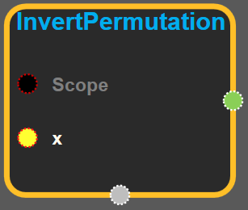
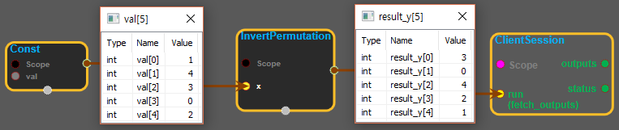

--- 
layout: default 
title: InvertPermutation 
parent: array_ops 
grand_parent: enuSpace-Tensorflow API 
last_modified_date: now 
--- 

# InvertPermutation {#abs}

---

## tensorflow C++ API {#tensorflow-c-api}

[tensorflow::ops::InvertPermutation](https://www.tensorflow.org/api_docs/cc/class/tensorflow/ops/invert-permutation.html)

Computes the inverse permutation of a tensor.

---

## Summary {#summary}

This operation computes the inverse of an index permutation. It takes a 1-D integer tensor`x`, which represents the indices of a zero-based array, and swaps each value with its index position. In other words, for an output tensor`y`and an input tensor`x`, this operation computes the following:

`y[x[i]] = i for i in [0, 1, ..., len(x) - 1]`

The values must include 0. There can be no duplicate values or negative values.

For example:

\`\`\`  
`tensor`x\` is \[3, 4, 0, 2, 1\]

invert\_permutation\(x\) ==&gt; \[2, 4, 3, 0, 1\]  
\`\`\`

Arguments:

* scope: A [Scope](https://www.tensorflow.org/api_docs/cc/class/tensorflow/scope.html#classtensorflow_1_1_scope) object
* x: A `Tensor`. Must be one of the following types: `int32`, `int64`. 1-D.

Returns:

* [`Output`](https://www.tensorflow.org/api_docs/cc/class/tensorflow/output.html#classtensorflow_1_1_output): A `Tensor`. Has the same type as `x` . 1-D.

---

## InvertPermutation block {#abs-block}

Source link :[https://github.com/EXPNUNI/enuSpaceTensorflow/blob/master/enuSpaceTensorflow/tf\_array\_ops.cpp](https://github.com/EXPNUNI/enuSpaceTensorflow/blob/master/enuSpaceTensorflow/tf_math.cpp)

Argument:

* Scope scope : A Scope object \(A scope is generated automatically each page. A scope is not connected.\)
* Input x : A 1-D `Tensor` type of `int32`,`int64`\(Must be one integer type\).

Output:

* y : Output object of InvertPermutation class object.

Result:

* std::vector\(Tensor\) `result_y`: A `Tensor` . invert x and y \(x &lt;--&gt; y\)

---

## Using Method

* X에 들어있는 값과 인덱스를 서로 바꾸어서 표현한다. x = \[1, 4, 3, 0, 2\]  --&gt; y = \[3, 0, 4, 2, 1\]. 인덱스: x = \[0, 1, 2, 3, 4\] y = \[0, 1, 2, 3, 4\]

