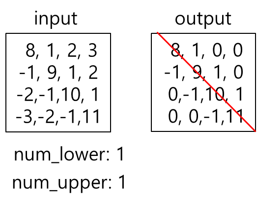

--- 
layout: default 
title: MatrixBandPart 
parent: array_ops 
grand_parent: enuSpace-Tensorflow API 
last_modified_date: now 
--- 

# MatrixBandPart {#abs}

---

## tensorflow C++ API {#tensorflow-c-api}

[tensorflow::ops::MatrixBandPart](https://www.tensorflow.org/api_docs/cc/class/tensorflow/ops/matrix-band-part.html)

Copy a tensor setting everything outside a central band in each innermost matrix.

---

## Summary {#summary}

to zero.

The`band`part is computed as follows: Assume`input`has`k`dimensions`[I, J, K, ..., M, N]`, then the output is a tensor with the same shape where

`band[i, j, k, ..., m, n] = in_band(m, n) * input[i, j, k, ..., m, n]`.

The indicator function

`in_band(m, n) = (num_lower < 0 || (m-n) <= num_lower)) && (num_upper < 0 || (n-m) <= num_upper)`.

For example:

\`\`\` if 'input' is \[\[ 0, 1, 2, 3\] \[-1, 0, 1, 2\] \[-2, -1, 0, 1\] \[-3, -2, -1, 0\]\],

tf.matrix\_band\_part\(input, 1, -1\) ==&gt; \[\[ 0, 1, 2, 3\] \[-1, 0, 1, 2\] \[ 0, -1, 0, 1\] \[ 0, 0, -1, 0\]\],

tf.matrix\_band\_part\(input, 2, 1\) ==&gt; \[\[ 0, 1, 0, 0\] \[-1, 0, 1, 0\] \[-2, -1, 0, 1\] \[ 0, -2, -1, 0\]\] \`\`\`

Useful special cases:

\`\`\` tf.matrix\_band\_part\(input, 0, -1\) ==&gt; Upper triangular part. tf.matrix\_band\_part\(input, -1, 0\) ==&gt; Lower triangular part. tf.matrix\_band\_part\(input, 0, 0\) ==&gt; Diagonal. \`\`\`

Arguments:

* scope: A [Scope](https://www.tensorflow.org/api_docs/cc/class/tensorflow/scope.html#classtensorflow_1_1_scope) object 
* input: [Rank](https://www.tensorflow.org/api_docs/cc/class/tensorflow/ops/rank.html#classtensorflow_1_1ops_1_1_rank) `k` tensor.
* num\_lower: 0-D tensor. Number of subdiagonals to keep. If negative, keep entire lower triangle.
* num\_upper: 0-D tensor. Number of superdiagonals to keep. If negative, keep entire upper triangle.

Returns:

* [`Output`](https://www.tensorflow.org/api_docs/cc/class/tensorflow/output.html#classtensorflow_1_1_output): [Rank](https://www.tensorflow.org/api_docs/cc/class/tensorflow/ops/rank.html#classtensorflow_1_1ops_1_1_rank) `k` tensor of the same shape as input. The extracted banded tensor.

---

## MatrixBandPart block {#abs-block}

Source link :[https://github.com/EXPNUNI/enuSpaceTensorflow/blob/master/enuSpaceTensorflow/tf\_array\_ops.cpp](https://github.com/EXPNUNI/enuSpaceTensorflow/blob/master/enuSpaceTensorflow/tf_math.cpp)

Argument:

* Scope scope : A Scope object \(A scope is generated automatically each page. A scope is not connected.\)
* Input x : A 1-D `Tensor` type of `int32`,`int64`\(Must be one integer type\).

Output:

* y : Output object of MatrixBandPart class object.

Result:

* std::vector\(Tensor\) `result_y`: A `Tensor`.

---

## Using Method

  
※ 위의 그림과 같이 output에 그어놓은 빨간색 선을 기준으로 위쪽 줄\(num\_upper\)을 또는 아래쪽 줄\(num\_lower\)을 몇번째 까지 표시 할지 정하는 기능을 한다.

※ 위 그림을 표현하면  8   1   0   0  이 된다. 즉 아래로 2줄 위로 1줄을 남기고 나머지는 0으로 만든다는 뜻  
                                      -1  9   1   0  
                                      -2 -1  10  0  
                                       0 -2  -1  11

