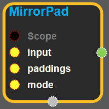
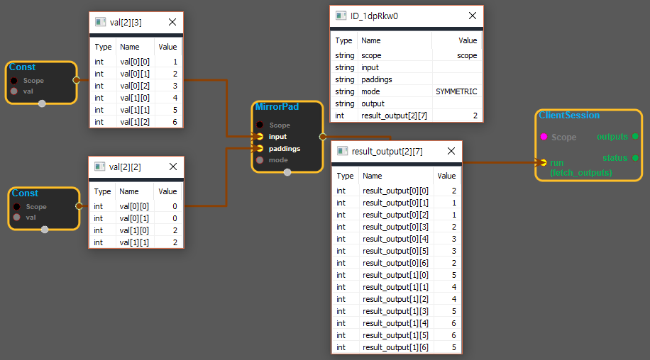

--- 
layout: default 
title: MirrorPad 
parent: array_ops 
grand_parent: enuSpace-Tensorflow API 
last_modified_date: now 
--- 

# MirrorPad {#abs}

---

## tensorflow C++ API {#tensorflow-c-api}

[tensorflow::ops::MirrorPad](https://www.tensorflow.org/api_docs/cc/class/tensorflow/ops/mirror-pad.html)

Pads a tensor with mirrored values.

---

## Summary {#summary}

This operation pads a`input`with mirrored values according to the`paddings`you specify.`paddings`is an integer tensor with shape`[n, 2]`, where n is the rank of`input`. For each dimension D of`input`,`paddings[D, 0]`indicates how many values to add before the contents of`input`in that dimension, and`paddings[D, 1]`indicates how many values to add after the contents of`input`in that dimension. Both`paddings[D, 0]`and`paddings[D, 1]`must be no greater than`input.dim_size(D)`\(or`input.dim_size(D) - 1`\) if`copy_border`is true \(if false, respectively\).

The padded size of each dimension D of the output is:

`paddings(D, 0) + input.dim_size(D) + paddings(D, 1)`

For example:

\`\`\` 't' is \[\[1, 2, 3\], \[4, 5, 6\]\].

'paddings' is \[\[1, 1\]\], \[2, 2\]\].

'mode' is SYMMETRIC.

rank of 't' is 2.

pad\(t, paddings\) ==&gt; \[\[2, 1, 1, 2, 3, 3, 2\] \[2, 1, 1, 2, 3, 3, 2\] \[5, 4, 4, 5, 6, 6, 5\] \[5, 4, 4, 5, 6, 6, 5\]\] \`\`\`

Arguments:

* scope: A [Scope](https://www.tensorflow.org/api_docs/cc/class/tensorflow/scope.html#classtensorflow_1_1_scope) object
* input: The input tensor to be padded.
* paddings: A two-column matrix specifying the padding sizes. The number of rows must be the same as the rank of `input`.
* mode: Either `REFLECT` or `SYMMETRIC` . In reflect mode the padded regions do not include the borders, while in symmetric mode the padded regions do include the borders. For example, if `input` is `[1, 2, 3]` and `paddings` is `[0, 2]` , then the output is `[1, 2, 3, 2, 1]` in reflect mode, and it is `[1, 2, 3, 3, 2]` in symmetric mode.

Returns:

* [`Output`](https://www.tensorflow.org/api_docs/cc/class/tensorflow/output.html#classtensorflow_1_1_output) : The padded tensor.

---

## MirrorPad block {#abs-block}

Source link :[https://github.com/EXPNUNI/enuSpaceTensorflow/blob/master/enuSpaceTensorflow/tf\_array\_ops.cpp](https://github.com/EXPNUNI/enuSpaceTensorflow/blob/master/enuSpaceTensorflow/tf_math.cpp)

Argument:

* Scope scope : A Scope object \(A scope is generated automatically each page. A scope is not connected.\)
* Input `input` : A N-D `Tensor`.
* Input `paddings` : A `Tensor` type of `int32`,`int64`\(Must be one integer type\). A two-column matrix specifying the padding sizes. The number of rows must be the same as the rank of `input`. ex\) input shape -&gt; \[3\]\[3\]\[3\], paddings shape -&gt; \[3\]\[2\]
* StringPiece `mode` : Either `REFLECT` or `SYMMETRIC` . In reflect mode the padded regions do not include the borders, while in symmetric mode the padded regions do include the borders. For example, if `input` is `[1, 2, 3]` and `paddings` is `[0, 2]` , then the output is `[1, 2, 3, 2, 1]` in reflect mode, and it is `[1, 2, 3, 3, 2]` in symmetric mode.

Output:

* Output output : Output object of MirrorPad class object.

Result:

* std::vector\(Tensor\) `result_output`: A `Tensor` . `paddings(D, 0) + input.dim_size(D) + paddings(D, 1)`

---

## Using Method

※input의 shape가 \[2\]\[3\], 값이 \[\[1,2,3\]\[4,5,6\]\]이고, paddings가 \[2\]\[2\]에 \[\[0,0\]\[2,2\]\], mode가 "SYMMETRIC"일 때 결과는 \[\[2,1,1,2,3,3,2\]\[5,4,4,5,6,6,5\]\]이다. mode가 "REFLECT"일 때 결과는 \[\[3,2,1,2,3,2,1\]\[6,5,4,5,6,5,4\]\] 이다.

※paddings에 들어가는 값은 \[D\]\[0\]은 input에 들어있는 값의 앞에 들어가는 padding값 이고\(input이 \[1,2,3\]이고, padding이 \[2,0\], mode 가 SYMMETRIC일 때 값은 \[2,1,1,2,3\]이다. mode가 REFLECT라면 \[3,2,1,2,3\]이다.\), \[D\]\[1\]은 input에 들어있는 값의 뒤에 들어가는 padding값이다\(input이 \[1,2,3\]이고, padding이 \[0,2\], mode 가 SYMMETRIC일 때 값은 \[1,2,3,3,2\]이다. mode가 REFLECT라면 \[1,2,3,2,1\]이다.\).

