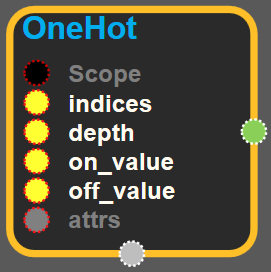

--- 
layout: default 
title: OneHot 
parent: array_ops 
grand_parent: enuSpace-Tensorflow API 
last_modified_date: now 
--- 

# OneHot {#abs}

---

## tensorflow C++ API {#tensorflow-c-api}

[tensorflow::ops::OneHot](https://www.tensorflow.org/api_docs/cc/class/tensorflow/ops/one-hot.html)

Returns a one-hot tensor.

---

## Summary {#summary}

The locations represented by indices in`indices`take value`on_value`, while all other locations take value`off_value`.

If the input`indices`is rank`N`, the output will have rank`N+1`, The new axis is created at dimension`axis`\(default: the new axis is appended at the end\).

If`indices`is a scalar the output shape will be a vector of length`depth`.

If`indices`is a vector of length`features`, the output shape will be: \`\`\` features x depth if axis == -1 depth x features if axis == 0 \`\`\`

If`indices`is a matrix \(batch\) with shape`[batch, features]`, the output shape will be: \`\`\` batch x features x depth if axis == -1 batch x depth x features if axis == 1 depth x batch x features if axis == 0 \`\`\`

Examples

Suppose that

\`\`\` indices = \[0, 2, -1, 1\] depth = 3 on\_value = 5.0 off\_value = 0.0 axis = -1 \`\`\`

Then output is`[4 x 3]`:

    ```output =
      [5.0 0.0 0.0]  // one_hot(0)
      [0.0 0.0 5.0]  // one_hot(2)
      [0.0 0.0 0.0]  // one_hot(-1)
      [0.0 5.0 0.0]  // one_hot(1)
    ```

Suppose that

\`\`\` indices = \[0, 2, -1, 1\] depth = 3 on\_value = 0.0 off\_value = 3.0 axis = 0 \`\`\`

Then output is`[3 x 4]`:

    ```output =
      [0.0 3.0 3.0 3.0]
      [3.0 3.0 3.0 0.0]
      [3.0 3.0 3.0 3.0]
      [3.0 0.0 3.0 3.0]
    //  ^                one_hot(0)
    //      ^            one_hot(2)
    //          ^        one_hot(-1)
    //              ^    one_hot(1)
    ```

Suppose that

\`\`\` indices = \[\[0, 2\], \[1, -1\]\] depth = 3 on\_value = 1.0 off\_value = 0.0 axis = -1 \`\`\`

Then output is`[2 x 2 x 3]`:

    ```output =
      [
        [1.0, 0.0, 0.0]  // one_hot(0)
        [0.0, 0.0, 1.0]  // one_hot(2)
      ][
        [0.0, 1.0, 0.0]  // one_hot(1)
        [0.0, 0.0, 0.0]  // one_hot(-1)
      ]```

Arguments:

* scope: A [Scope](https://www.tensorflow.org/api_docs/cc/class/tensorflow/scope.html#classtensorflow_1_1_scope) object
* indices: A tensor of indices.
* depth: A scalar defining the depth of the one hot dimension.
* on\_value: A scalar defining the value to fill in output when `indices[j] = i` .
* off\_value: A scalar defining the value to fill in output when `indices[j] != i` .

Optional attributes \(see[`Attrs`](https://www.tensorflow.org/api_docs/cc/struct/tensorflow/ops/one-hot/attrs.html#structtensorflow_1_1ops_1_1_one_hot_1_1_attrs)\):

* axis: The axis to fill \(default: -1, a new inner-most axis\).

Returns:

* [`Output`](https://www.tensorflow.org/api_docs/cc/class/tensorflow/output.html#classtensorflow_1_1_output) : The one-hot tensor.

---

## OneHot block {#abs-block}

Source link :[https://github.com/EXPNUNI/enuSpaceTensorflow/blob/master/enuSpaceTensorflow/tf\_array\_ops.cpp](https://github.com/EXPNUNI/enuSpaceTensorflow/blob/master/enuSpaceTensorflow/tf_math.cpp)



Argument:

* Scope scope : A Scope object \(A scope is generated automatically each page. A scope is not connected.\)
* Input indices: A tensor of indices.
* Input depth: A scalar defining the depth of the one hot dimension.
* Input off\_value: A scalar defining the value to fill in output when `indices[j] != i` .
* Input on\_value: A scalar defining the value to fill in output when `indices[j] = i` .
* OneHot::Attrs attrs: The axis to fill \(default: -1, a new inner-most axis\).

Output:

* Output output : Output object of OneHot class object.

Result:

* std::vector\(Tensor\) `result_output` : A Tensor. have \(indices vector size \* depth value\) shape and indices\[N\] of index in `on_value`

---

## Using Method


