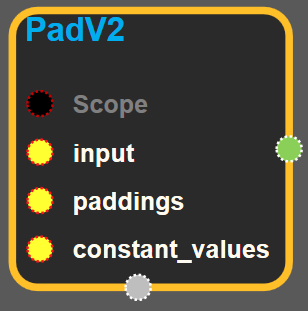
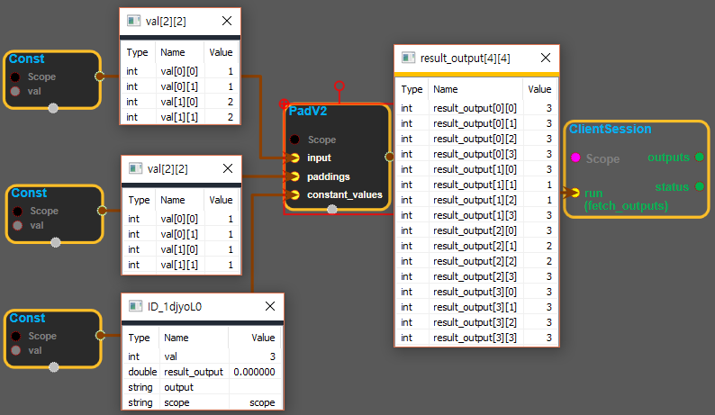

--- 
layout: default 
title: PadV2 
parent: array_ops 
grand_parent: enuSpace-Tensorflow API 
last_modified_date: now 
--- 

# PadV2 {#abs}

---

## tensorflow C++ API {#tensorflow-c-api}

[tensorflow::ops::PadV2](https://www.tensorflow.org/api_docs/cc/class/tensorflow/ops/pad-v2.html)

Pads a tensor.

---

## Summary {#summary}

This operation pads a`input`with zeros according to the`paddings`you specify.`paddings`is an integer tensor with shape`[Dn, 2]`, where n is the rank of`input`. For each dimension D of`input`,`paddings[D, 0]`indicates how many zeros to add before the contents of`input`in that dimension, and`paddings[D, 1]`indicates how many zeros to add after the contents of`input`in that dimension.

The padded size of each dimension D of the output is:

`paddings(D, 0) + input.dim_size(D) + paddings(D, 1)`

For example:

\`\`\` 't' is \[\[1, 1\], \[2, 2\]\]

'paddings' is \[\[1, 1\], \[2, 2\]\]

rank of 't' is 2

###### \`\`\`\`pad\(t, paddings\) ==&gt; \[\[0, 0, 0, 0, 0, 0\]\[0, 0, 1, 1, 0, 0\]\[0, 0, 2, 2, 0, 0\] \[0, 0, 0, 0, 0, 0\]\] \`\`\`\`\`\`\`

Arguments:

* scope: A [Scope](https://www.tensorflow.org/api_docs/cc/class/tensorflow/scope.html#classtensorflow_1_1_scope) object

Returns:

* [`Output`](https://www.tensorflow.org/api_docs/cc/class/tensorflow/output.html#classtensorflow_1_1_output) : The output tensor.

---

## PadV2 block {#abs-block}

Source link :[https://github.com/EXPNUNI/enuSpaceTensorflow/blob/master/enuSpaceTensorflow/tf\_array\_ops.cpp](https://github.com/EXPNUNI/enuSpaceTensorflow/blob/master/enuSpaceTensorflow/tf_math.cpp)

Argument:

* Scope scope : A Scope object \(A scope is generated automatically each page. A scope is not connected.\)
* Input `input`: A tensor.
* Input `paddings`: is an integer tensor with shape `[Dn, 2]`, where n is the rank of `input`
* Input `constant_values`: scalar value. The value to enter the padding area.

Output:

* Output y: Output object of PadV2 class object.

Result:

* std::vector\(Tensor\) `result_output`\_: \_A Tensor . Pads a tensor fill with`constant_values`.

---

## Using Method

