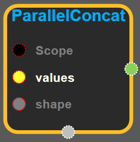

--- 
layout: default 
title: ParallelConcat 
parent: array_ops 
grand_parent: enuSpace-Tensorflow API 
last_modified_date: now 
--- 

# ParallelConcat {#abs}

---

## tensorflow C++ API {#tensorflow-c-api}

[tensorflow::ops::ParallelConcat](https://www.tensorflow.org/api_docs/cc/class/tensorflow/ops/parallel-concat.html)

Concatenates a list of `N` tensors along the first dimension.

---

## Summary {#summary}

The input tensors are all required to have size 1 in the first dimension.

For example:

\`\`\` 'x' is \[\[1, 4\]\]

'y' is \[\[2, 5\]\]

'z' is \[\[3, 6\]\]

parallel\_concat\(\[x, y, z\]\) =&gt; \[\[1, 4\], \[2, 5\], \[3, 6\]\] \# Pack along first dim. \`\`\`

The difference between concat and parallel\_concat is that concat requires all of the inputs be computed before the operation will begin but doesn't require that the input shapes be known during graph construction. Parallel concat will copy pieces of the input into the output as they become available, in some situations this can provide a performance benefit.

Arguments:

* scope: A [Scope](https://www.tensorflow.org/api_docs/cc/class/tensorflow/scope.html#classtensorflow_1_1_scope) object
* values: Tensors to be concatenated. [All](https://www.tensorflow.org/api_docs/cc/class/tensorflow/ops/all.html#classtensorflow_1_1ops_1_1_all) must have size 1 in the first dimension and same shape.
* shape: the final shape of the result; should be equal to the shapes of any input but with the number of input values in the first dimension.

Returns:

* [`Output`](https://www.tensorflow.org/api_docs/cc/class/tensorflow/output.html#classtensorflow_1_1_output): The concatenated tensor.

---

## ParallelConcat block {#abs-block}

Source link :[https://github.com/EXPNUNI/enuSpaceTensorflow/blob/master/enuSpaceTensorflow/tf\_array\_ops.cpp](https://github.com/EXPNUNI/enuSpaceTensorflow/blob/master/enuSpaceTensorflow/tf_math.cpp)

Argument:

* Scope scope : A Scope object \(A scope is generated automatically each page. A scope is not connected.\)
* InputList `values`: Tensors to be concatenated. All must have size 1 in the first dimension and same shape.
* Input `shape`: the final shape of the result; should be equal to the shapes of any input but with the number of input values in the first dimension.

Output:

* Output y: Output object of ParallelConcat class object.

Result:

* std::vector\(Tensor\) `result_output`: The concatenated tensor.

---

## Using Method

  
※ values로 들어온 inputlist의 값을 모두 합치는 기능을 한다. inputlist의 input들은 shape가 모두 같아야하고, 1차원의 크기가 1이어야 한다. shape는 values의 input들과 shape가 같지만 1차원의 크기는 바꿔서 지정할 수 있다. 이때 들어오는 inputlist의 갯수보다 1차원의 크기가 크다면 나머지는 모두 0으로 채워진다. 

