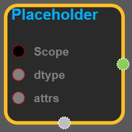
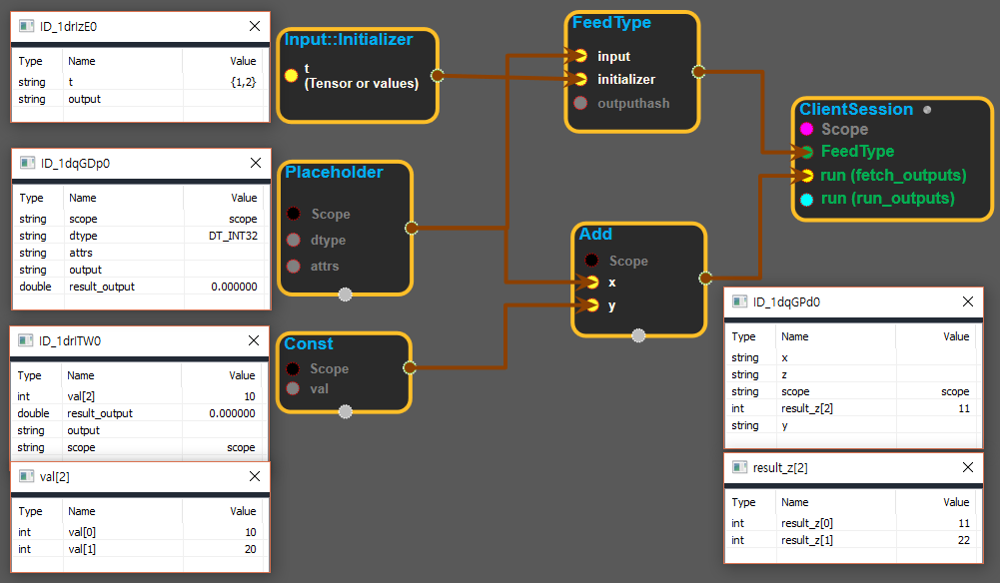
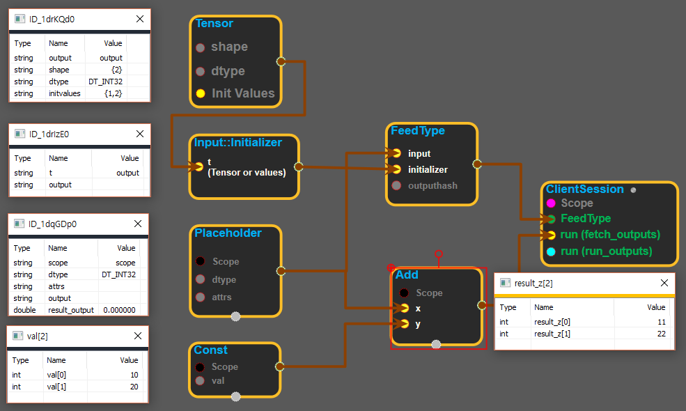

--- 
layout: default 
title: Placeholder 
parent: array_ops 
grand_parent: enuSpace-Tensorflow API 
last_modified_date: now 
--- 

# Placeholder {#abs}

---

## tensorflow C++ API {#tensorflow-c-api}

[tensorflow::ops::Placeholder](https://www.tensorflow.org/api_docs/cc/class/tensorflow/ops/placeholder.html)

A placeholder op for a value that will be fed into the computation.

---

## Summary {#summary}

N.B. This operation will fail with an error if it is executed. It is intended as a way to represent a value that will always be fed, and to provide attrs that enable the fed value to be checked at runtime.

Arguments:

* scope: A [Scope](https://www.tensorflow.org/api_docs/cc/class/tensorflow/scope.html#classtensorflow_1_1_scope) object
* dtype: The type of elements in the tensor.

Optional attributes \(see[`Attrs`](https://www.tensorflow.org/api_docs/cc/struct/tensorflow/ops/placeholder/attrs.html#structtensorflow_1_1ops_1_1_placeholder_1_1_attrs)\):

* shape: \(Optional\) The shape of the tensor. If the shape has 0 dimensions, the shape is unconstrained.

Returns:

* [`Output`](https://www.tensorflow.org/api_docs/cc/class/tensorflow/output.html#classtensorflow_1_1_output): A placeholder tensor that must be replaced using the feed mechanism.

---

## Placeholder block {#abs-block}

Source link :[https://github.com/EXPNUNI/enuSpaceTensorflow/blob/master/enuSpaceTensorflow/tf\_array\_ops.cpp](https://github.com/EXPNUNI/enuSpaceTensorflow/blob/master/enuSpaceTensorflow/tf_math.cpp)

Argument:

* Scope scope : A Scope object \(A scope is generated automatically each page. A scope is not connected.\)
* Input `dtype`: The type of elements in the tensor.
* Placeholder::Attrs attrs
  * shape\_: \(Optional\) The shape of the tensor. If the shape has 0 dimensions, the shape is unconstrained.

Output:

* Output y: Output object of Placeholder class object.

Result:

* std::vector\(Tensor\) `result_output`: A placeholder tensor that must be replaced using the feed mechanism.

---

## Using Method

※input\_initializer에서 tensor를 직접 생성하여 placeholder를 사용하는 경우

※tensor 블록을 이용하여 placeholder를 사용하는 경우

