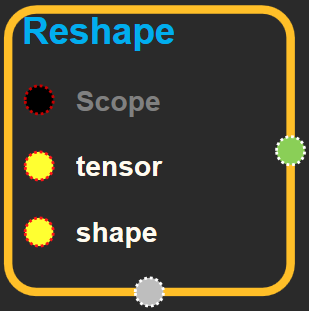
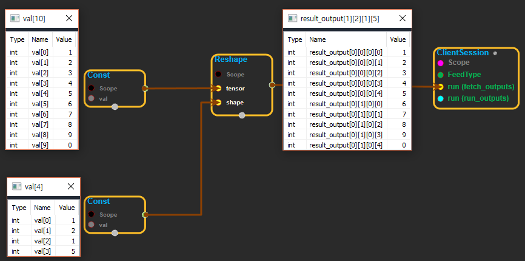

--- 
layout: default 
title: Reshape 
parent: array_ops 
grand_parent: enuSpace-Tensorflow API 
last_modified_date: now 
--- 

# Reshape {#abs}

---

## tensorflow C++ API {#tensorflow-c-api}

[tensorflow::ops::Reshape](https://www.tensorflow.org/api_docs/cc/class/tensorflow/ops/reshape.html)

Reshapes a tensor.

---

## Summary {#summary}

Given`tensor`, this operation returns a tensor that has the same values as`tensor`with shape`shape`.

If one component of`shape`is the special value -1, the size of that dimension is computed so that the total size remains constant. In particular, a`shape`of`[-1]`flattens into 1-D. At most one component of`shape`can be -1.

If`shape`is 1-D or higher, then the operation returns a tensor with shape`shape`filled with the values of`tensor`. In this case, the number of elements implied by`shape`must be the same as the number of elements in`tensor`.

For example:

\`\`\` tensor 't' is \[1, 2, 3, 4, 5, 6, 7, 8, 9\]

tensor 't' has shape \[9\]

reshape\(t, \[3, 3\]\) ==&gt; \[\[1, 2, 3\], \[4, 5, 6\], \[7, 8, 9\]\]

tensor 't' is \[\[\[1, 1\], \[2, 2\]\],

\[\[3, 3\], \[4, 4\]\]\]

tensor 't' has shape \[2, 2, 2\]

reshape\(t, \[2, 4\]\) ==&gt; \[\[1, 1, 2, 2\], \[3, 3, 4, 4\]\]

tensor 't' is \[\[\[1, 1, 1\],

\[2, 2, 2\]\],

\[\[3, 3, 3\],

\[4, 4, 4\]\],

\[\[5, 5, 5\],

\[6, 6, 6\]\]\]

tensor 't' has shape \[3, 2, 3\]

pass '\[-1\]' to flatten 't'

reshape\(t, \[-1\]\) ==&gt; \[1, 1, 1, 2, 2, 2, 3, 3, 3, 4, 4, 4, 5, 5, 5, 6, 6, 6\]

-1 can also be used to infer the shape

-1 is inferred to be 9:

reshape\(t, \[2, -1\]\) ==&gt; \[\[1, 1, 1, 2, 2, 2, 3, 3, 3\], \[4, 4, 4, 5, 5, 5, 6, 6, 6\]\] -1 is inferred to be 2:

reshape\(t, \[-1, 9\]\) ==&gt; \[\[1, 1, 1, 2, 2, 2, 3, 3, 3\], \[4, 4, 4, 5, 5, 5, 6, 6, 6\]\] -1 is inferred to be 3:

reshape\(t, \[ 2, -1, 3\]\) ==&gt; \[\[\[1, 1, 1\], \[2, 2, 2\], \[3, 3, 3\]\], \[\[4, 4, 4\], \[5, 5, 5\], \[6, 6, 6\]\]\]

tensor 't' is \[7\]

shape`[]`reshapes to a scalar

reshape\(t, \[\]\) ==&gt; 7 \`\`\`

Arguments:

* scope: A [Scope](https://www.tensorflow.org/api_docs/cc/class/tensorflow/scope.html#classtensorflow_1_1_scope) object
* shape: Defines the shape of the output tensor.

Returns:

* [`Output`](https://www.tensorflow.org/api_docs/cc/class/tensorflow/output.html#classtensorflow_1_1_output): The output tensor.

---

## Reshape block {#abs-block}

Source link :[https://github.com/EXPNUNI/enuSpaceTensorflow/blob/master/enuSpaceTensorflow/tf\_array\_ops.cpp](https://github.com/EXPNUNI/enuSpaceTensorflow/blob/master/enuSpaceTensorflow/tf_math.cpp)

Argument:

* Scope scope : A Scope object \(A scope is generated automatically each page. A scope is not connected.\)
* Input `input`: any tensor.
* Input `shape`: The 1-D tensor is of type int32, int64.

Output:

* Output `output` : Output object of Reshape class object.

Result:

* std::vector\(Tensor\) `result_output`: Returns the rank of a tensor.

---

## Using Method

※ tensor의 벡터 데이터를 shape에 넣어주는 기능을 한다.  
※ tensor 핀으로 들어오는 input tensor의 value갯수와 shape로 들어오는 공간의 갯수가 일치해야 결과값이 나온다.

