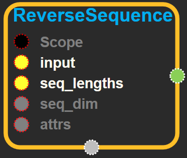

--- 
layout: default 
title: ReverseSequence 
parent: array_ops 
grand_parent: enuSpace-Tensorflow API 
last_modified_date: now 
--- 

# ReverseSequence

---

## tensorflowC++API

[tensorflow::ops::ReverseSequence](https://www.tensorflow.org/api_docs/cc/class/tensorflow/ops/reverse-sequence.html)

Reversesvariablelengthslices.

---

## Summary

This op first slices`input`along the dimension`batch_dim`, and for each slice`i`, reverses the first`seq_lengths[i]`elements along the dimension`seq_dim`.

The elements of`seq_lengths`must obey`seq_lengths[i] <= input.dims[seq_dim]`, and`seq_lengths`must be a vector of length`input.dims[batch_dim]`.

The output slice`i`along dimension`batch_dim`is then given by input slice`i`, with the first`seq_lengths[i]`slices along dimension`seq_dim`reversed.

Forexample:

\`\`\`Giventhis:

batch\_dim=0seq\_dim=1input.dims=\(4,8,...\)seq\_lengths=\[7,2,3,5\]

thenslicesofinputarereversedonseq\_dim,butonlyuptoseq\_lengths:

output\[0,0:7,:,...\]=input\[0,7:0:-1,:,...\]output\[1,0:2,:,...\]=input\[1,2:0:-1,:,...\]output\[2,0:3,:,...\]=input\[2,3:0:-1,:,...\]output\[3,0:5,:,...\]=input\[3,5:0:-1,:,...\]

whileentriespastseq\_lensarecopiedthrough:

output\[0,7:,:,...\]=input\[0,7:,:,...\]output\[1,2:,:,...\]=input\[1,2:,:,...\]output\[2,3:,:,...\]=input\[2,3:,:,...\]output\[3,2:,:,...\]=input\[3,2:,:,...\]\`\`\`

Incontrast,if:

\`\`\`Giventhis:

batch\_dim=2seq\_dim=0input.dims=\(8,?,4,...\)seq\_lengths=\[7,2,3,5\]

thenslicesofinputarereversedonseq\_dim,butonlyuptoseq\_lengths:

output\[0:7,:,0,:,...\]=input\[7:0:-1,:,0,:,...\]output\[0:2,:,1,:,...\]=input\[2:0:-1,:,1,:,...\]output\[0:3,:,2,:,...\]=input\[3:0:-1,:,2,:,...\]output\[0:5,:,3,:,...\]=input\[5:0:-1,:,3,:,...\]

whileentriespastseq\_lensarecopiedthrough:

output\[7:,:,0,:,...\]=input\[7:,:,0,:,...\]output\[2:,:,1,:,...\]=input\[2:,:,1,:,...\]output\[3:,:,2,:,...\]=input\[3:,:,2,:,...\]output\[2:,:,3,:,...\]=input\[2:,:,3,:,...\]\`\`\`

Arguments:

* scope: A [Scope](https://www.tensorflow.org/api_docs/cc/class/tensorflow/scope.html#classtensorflow_1_1_scope) object
* input: The input to reverse.
* seq\_lengths: 1-D with length `input.dims(batch_dim)` and `max(seq_lengths) <= input.dims(seq_dim)`
* seq\_dim: The dimension which is partially reversed.

Optional attributes \(see[`Attrs`](https://www.tensorflow.org/api_docs/cc/struct/tensorflow/ops/reverse-sequence/attrs.html#structtensorflow_1_1ops_1_1_reverse_sequence_1_1_attrs)\):

* batch\_dim: The dimension along which reversal is performed.

Returns:

* [`Output`](https://www.tensorflow.org/api_docs/cc/class/tensorflow/output.html#classtensorflow_1_1_output): The partially reversed input. It has the same shape as `input`

---

## ReverseSequenceblock

Source link :[https://github.com/EXPNUNI/enuSpaceTensorflow/blob/master/enuSpaceTensorflow/tf\_array\_ops.cpp](https://github.com/EXPNUNI/enuSpaceTensorflow/blob/master/enuSpaceTensorflow/tf_math.cpp)

Argument:

* Scope scope : A Scope object \(A scope is generated automatically each page. A scope is not connected.\)
* Input `input`: The input to reverse.
* Input `seq_lengths`: 1-D with length `input.dims(batch_dim)` and `max(seq_lengths) <= input.dims(seq_dim)`
* Int64 `seq_dim`: The dimension which is partially reversed.

Output:

* Output `output`: Output object of ReverseSequence class object.

Result:

* std::vector\(Tensor\) `result_output`: The same shape as`tensor`.

---

## UsingMethod

※seq\_dim:대당하는차원에대해부분적으로반전을시킨다.\(ex:input이이고,seq\_dim=1,seq\_lengths={1,2}라면결과값은이된다.\)

※attr의batch\_dim:반전을시키는차원을지정한다.1이면1차원,0이면영향을주지않는다.\(0일경우오직seq\_dim에의해영향을받음

