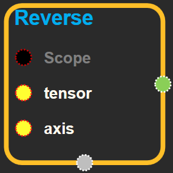
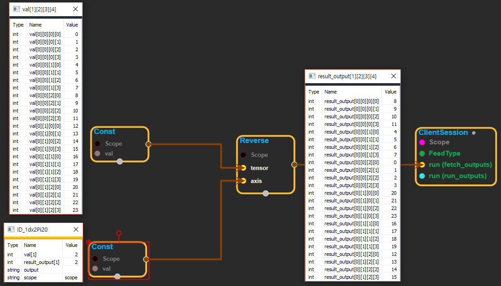

--- 
layout: default 
title: Reverse 
parent: array_ops 
grand_parent: enuSpace-Tensorflow API 
last_modified_date: now 
--- 

# Reverse {#abs}

---

## tensorflow C++ API {#tensorflow-c-api}

[tensorflow::ops::Reverse](https://www.tensorflow.org/api_docs/cc/class/tensorflow/ops/reverse.html)

Reverses specific dimensions of a tensor.

---

## Summary {#summary}

NOTE`tf.reverse`has now changed behavior in preparation for 1.0.`tf.reverse_v2`is currently an alias that will be deprecated before TF 1.0.

Given a`tensor`, and a`int32`tensor`axis`representing the set of dimensions of`tensor`to reverse. This operation reverses each dimension`i`for which there exists`j`s.t.`axis[j] == i`.

`tensor`can have up to 8 dimensions. The number of dimensions specified in`axis`may be 0 or more entries. If an index is specified more than once, a InvalidArgument error is raised.

For example:

\`\`\` tensor 't' is \[\[\[\[ 0, 1, 2, 3\],

\[ 4, 5, 6, 7\],

\[ 8, 9, 10, 11\]\],

\[\[12, 13, 14, 15\],

\[16, 17, 18, 19\],

\[20, 21, 22, 23\]\]\]\]

tensor 't' shape is \[1, 2, 3, 4\]

'dims' is \[3\] or 'dims' is -1

reverse\(t, dims\) ==&gt; \[\[\[\[ 3, 2, 1, 0\], \[ 7, 6, 5, 4\], \[ 11, 10, 9, 8\]\], \[\[15, 14, 13, 12\], \[19, 18, 17, 16\], \[23, 22, 21, 20\]\]\]\]

'dims' is '\[1\]' \(or 'dims' is '\[-3\]'\)

reverse\(t, dims\) ==&gt; \[\[\[\[12, 13, 14, 15\], \[16, 17, 18, 19\], \[20, 21, 22, 23\] \[\[ 0, 1, 2, 3\], \[ 4, 5, 6, 7\], \[ 8, 9, 10, 11\]\]\]\]

'dims' is '\[2\]' \(or 'dims' is '\[-2\]'\)

reverse\(t, dims\) ==&gt; \[\[\[\[8, 9, 10, 11\], \[4, 5, 6, 7\], \[0, 1, 2, 3\]\] \[\[20, 21, 22, 23\], \[16, 17, 18, 19\], \[12, 13, 14, 15\]\]\]\] \`\`\`

Arguments:

* scope: A [Scope](https://www.tensorflow.org/api_docs/cc/class/tensorflow/scope.html#classtensorflow_1_1_scope) object
* tensor: Up to 8-D.
* axis: 1-D. The indices of the dimensions to reverse.

Returns:

* [`Output`](https://www.tensorflow.org/api_docs/cc/class/tensorflow/output.html#classtensorflow_1_1_output): The same shape as `tensor` .

---

## Reverse block {#abs-block}

Source link :[https://github.com/EXPNUNI/enuSpaceTensorflow/blob/master/enuSpaceTensorflow/tf\_array\_ops.cpp](https://github.com/EXPNUNI/enuSpaceTensorflow/blob/master/enuSpaceTensorflow/tf_math.cpp)

Argument:

* Scope scope : A Scope object \(A scope is generated automatically each page. A scope is not connected.\)
* Input `tensor`: Up to 8-D.
* Input `axis`: 1-D. The indices of the dimensions to reverse.

Output:

* Output `output` : Output object of Reverse class object.

Result:

* std::vector\(Tensor\) `result_output`: The same shape as `tensor` .

---

## Using Method

※ reverse에서 axis핀은 1-D tensor이고, 몇번째 차원을 뒤집을 것인지 선택하는 역할이다. 따라서 0차원은 scalar값 이므로  0이라는 값은 axis에 들어갈 수 없다.

