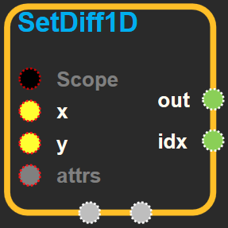
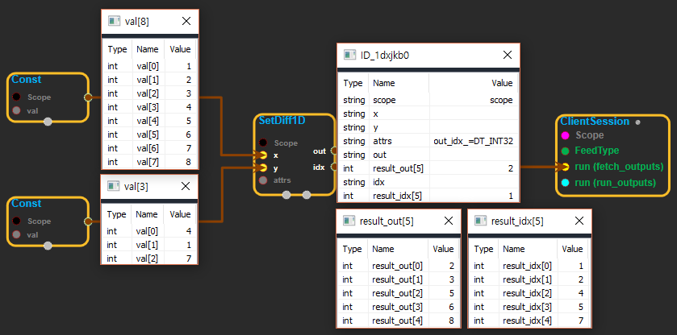

--- 
layout: default 
title: SetDiff1D 
parent: array_ops 
grand_parent: enuSpace-Tensorflow API 
last_modified_date: now 
--- 

# SetDiff1D {#abs}

---

## tensorflow C++ API {#tensorflow-c-api}

[tensorflow::ops::SetDiff1D](https://www.tensorflow.org/api_docs/cc/class/tensorflow/ops/set-diff1-d.html)

Computes the difference between two lists of numbers or strings.

---

## Summary {#summary}

Given a list`x`and a list`y`, this operation returns a list`out`that represents all values that are in`x`but not in`y`. The returned list`out`is sorted in the same order that the numbers appear in`x`\(duplicates are preserved\). This operation also returns a list`idx`that represents the position of each`out`element in`x`. In other words:

`out[i] = x[idx[i]] for i in [0, 1, ..., len(out) - 1]`

For example, given this input:

\`\`\` x = \[1, 2, 3, 4, 5, 6\] y = \[1, 3, 5\] \`\`\`

This operation would return:

\`\`\` out ==&gt; \[2, 4, 6\] idx ==&gt; \[1, 3, 5\] \`\`\`

Arguments:

* scope: A [Scope](https://www.tensorflow.org/api_docs/cc/class/tensorflow/scope.html#classtensorflow_1_1_scope) object
* x: 1-D. Values to keep.
* y: 1-D. Values to remove.

Returns:

* [`Output`](https://www.tensorflow.org/api_docs/cc/class/tensorflow/output.html#classtensorflow_1_1_output)out: 1-D. Values present in `x` but not in `y`.
* [`Output`](https://www.tensorflow.org/api_docs/cc/class/tensorflow/output.html#classtensorflow_1_1_output)idx: 1-D. Positions of `x` values preserved in `out`.

---

## SetDiff1D block {#abs-block}

Source link :[https://github.com/EXPNUNI/enuSpaceTensorflow/blob/master/enuSpaceTensorflow/tf\_array\_ops.cpp](https://github.com/EXPNUNI/enuSpaceTensorflow/blob/master/enuSpaceTensorflow/tf_math.cpp)

Argument:

* Scope scope : A Scope object \(A scope is generated automatically each page. A scope is not connected.\)
* Input x: 1-D. Values to keep.
* Input y: 1-D. Values to remove.
* SetDiff1D::Attrs attrs
  * out\_idx : The type of idx tensor.\(DT\_INT32, DT\_INT64, DT\_FLOAT, DT\_DOUBLE..... etc\)

Output:

* Output out: Output object of SetDiff1D class object.
* Output idx: Output object of SetDiff1D class object.

Result:

* std::vector\(Tensor\) `result_out`: 1-D. Values present in `x` but not in `y`.
* std::vector\(Tensor\) `result_idx`: 1-D. Positions of `x` values preserved in `out`.

---

## Using Method

  
※ x의 value에서 y에 있는 value와 같은 값을 지워버린다. out은 y에 해당하는 값을 지우고 남은 x이고,  idx는 남아있는 x값이 y에 의해 지워지기 전의 index값을 나열한 것이다.

