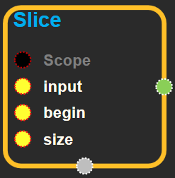
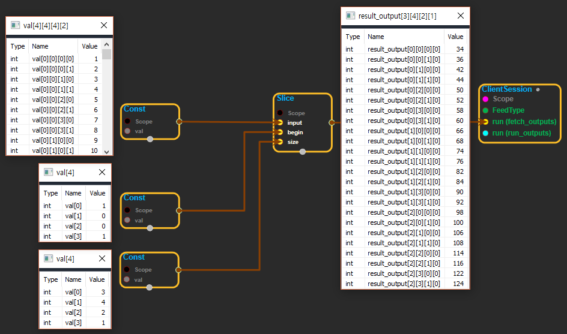

--- 
layout: default 
title: Slice 
parent: array_ops 
grand_parent: enuSpace-Tensorflow API 
last_modified_date: now 
--- 

## Slice

---

## tensorflow C++ API {#tensorflow-c-api}

[tensorflow::ops::Slice](https://www.tensorflow.org/api_docs/cc/class/tensorflow/ops/slice.html)

Return a slice from 'input'.

---

## Summary {#summary}

The output tensor is a tensor with dimensions described by 'size' whose values are extracted from 'input' starting at the offsets in 'begin'.

Requirements: 0 &lt;= begin\[i\] &lt;= begin\[i\] + size\[i\] &lt;= Di for i in \[0, n\)

Arguments:

* scope: A [Scope](https://www.tensorflow.org/api_docs/cc/class/tensorflow/scope.html#classtensorflow_1_1_scope) object
* begin: begin\[i\] specifies the offset into the 'i'th dimension of 'input' to slice from.
* size: size\[i\] specifies the number of elements of the 'i'th dimension of 'input' to slice. If size\[i\] is -1, all remaining elements in dimension i are included in the slice \(i.e. this is equivalent to setting size\[i\] = input.dim\_size\(i\) - begin\[i\]\).

Returns:

* [`Output`](https://www.tensorflow.org/api_docs/cc/class/tensorflow/output.html#classtensorflow_1_1_output): The output tensor.

---

## Slice block {#abs-block}

Source link :[https://github.com/EXPNUNI/enuSpaceTensorflow/blob/master/enuSpaceTensorflow/tf\_array\_ops.cpp](https://github.com/EXPNUNI/enuSpaceTensorflow/blob/master/enuSpaceTensorflow/tf_math.cpp)

Argument:

* Scope scope : A Scope object \(A scope is generated automatically each page. A scope is not connected.\)
* Input input: Any tensor.
* Input begin: begin\[i\] specifies the offset into the 'i'th dimension of 'input' to slice from.
* Input size: size\[i\] specifies the number of elements of the 'i'th dimension of 'input' to slice. If size\[i\] is -1, all remaining elements in dimension i are included in the slice \(i.e. this is equivalent to setting size\[i\] = input.dim\_size\(i\) - begin\[i\]\).

Output:

* Output output: Output object of Slice class object.

Result:

* std::vector\(Tensor\) `result_output`: The number of values in input.

---

## Using Method

※ input으로 들어온 tensor를 자르는 기능을 하는 블럭이다.  
※ begin과 size는 input의 rank만큼의 1-D tensor이다.  
※ begin은 input각 rank의 시작 지점을 정한다.  
※ size는 begin으로 부터 얼마만큼 자를 것인가를 정하는 값이다. \(begin\[1\].value + size\[1\].value &lt;= input\[ 1-rank \].size\)

