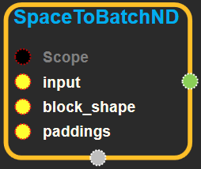
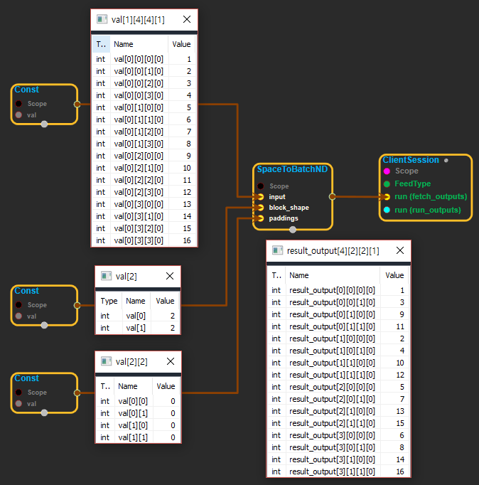

--- 
layout: default 
title: SpaceToBatchNd 
parent: array_ops 
grand_parent: enuSpace-Tensorflow API 
last_modified_date: now 
--- 

# SpaceToBatchND

---

## tensorflow C++ API {#tensorflow-c-api}

[ensorflow::ops::SpaceToBatchND](https://www.tensorflow.org/api_docs/cc/class/tensorflow/ops/space-to-batch-n-d.html)

[SpaceToBatch](https://www.tensorflow.org/api_docs/cc/class/tensorflow/ops/space-to-batch.html#classtensorflow_1_1ops_1_1_space_to_batch) for N-D tensors of type T.

---

## Summary {#summary}

This operation divides "spatial" dimensions`[1, ..., M]`of the input into a grid of blocks of shape`block_shape`, and interleaves these blocks with the "batch" dimension \(0\) such that in the output, the spatial dimensions`[1, ..., M]`correspond to the position within the grid, and the batch dimension combines both the position within a spatial block and the original batch position. Prior to division into blocks, the spatial dimensions of the input are optionally zero padded according to`paddings`. See below for a precise description.

Arguments:

* scope: A [Scope](https://www.tensorflow.org/versions/r1.4/api_docs/cc/class/tensorflow/scope.html#classtensorflow_1_1_scope) object
* input: N-D with shape `input_shape = [batch] + spatial_shape + remaining_shape`, where spatial\_shape has `M` dimensions.
* block\_shape: 1-D with shape `[M]`, all values must be &gt;= 1.
* paddings: 2-D with shape `[M, 2]`, all values must be &gt;= 0. `paddings[i] = [pad_start, pad_end]` specifies the padding for input dimension `i + 1`, which corresponds to spatial dimension`i`. It is required that `block_shape[i]` divides `input_shape[i + 1] + pad_start + pad_end`.

This operation is equivalent to the following steps:

1. Zero-pad the start and end of dimensions `[1, ..., M]` of the input according to `paddings` to produce `padded` of shape `padded_shape`.
2. [Reshape](https://www.tensorflow.org/versions/r1.4/api_docs/cc/class/tensorflow/ops/reshape.html#classtensorflow_1_1ops_1_1_reshape) `padded` to `reshaped_padded` of shape:\[batch\] + \[padded\_shape\[1\] / block\_shape\[0\], block\_shape\[0\], ..., padded\_shape\[M\] / block\_shape\[M-1\], block\_shape\[M-1\]\] + remaining\_shape
3. Permute dimensions of `reshaped_padded` to produce `permuted_reshaped_padded` of shape:block\_shape + \[batch\] + \[padded\_shape\[1\] / block\_shape\[0\], ..., padded\_shape\[M\] / block\_shape\[M-1\]\] + remaining\_shape
4. [Reshape](https://www.tensorflow.org/versions/r1.4/api_docs/cc/class/tensorflow/ops/reshape.html#classtensorflow_1_1ops_1_1_reshape) `permuted_reshaped_padded` to flatten `block_shape` into the batch dimension, producing an output tensor of shape:\[batch \* prod\(block\_shape\)\] + \[padded\_shape\[1\] / block\_shape\[0\], ..., padded\_shape\[M\] / block\_shape\[M-1\]\] + remaining\_shape

Some examples:

\(1\) For the following input of shape`[1, 2, 2, 1]`,`block_shape = [2, 2]`, and`paddings = [[0, 0], [0, 0]]`:

\`\`\` x = \[\[\[\[1\], \[2\]\], \[\[3\], \[4\]\]\]\] \`\`\`

The output tensor has shape`[4, 1, 1, 1]`and value:

\`\`\` \[\[\[\[1\]\]\], \[\[\[2\]\]\], \[\[\[3\]\]\], \[\[\[4\]\]\]\] \`\`\`

\(2\) For the following input of shape`[1, 2, 2, 3]`,`block_shape = [2, 2]`, and`paddings = [[0, 0], [0, 0]]`:

\`\`\` x = \[\[\[\[1, 2, 3\], \[4, 5, 6\]\], \[\[7, 8, 9\], \[10, 11, 12\]\]\]\] \`\`\`

The output tensor has shape`[4, 1, 1, 3]`and value:

\`\`\` \[\[\[1, 2, 3\]\], \[\[4, 5, 6\]\], \[\[7, 8, 9\]\], \[\[10, 11, 12\]\]\] \`\`\`

\(3\) For the following input of shape`[1, 4, 4, 1]`,`block_shape = [2, 2]`, and`paddings = [[0, 0], [0, 0]]`:

\`\`\` x = \[\[\[\[1\], \[2\], \[3\], \[4\]\], \[\[5\], \[6\], \[7\], \[8\]\], \[\[9\], \[10\], \[11\], \[12\]\], \[\[13\], \[14\], \[15\], \[16\]\]\]\] \`\`\`

The output tensor has shape`[4, 2, 2, 1]`and value:

\`\`\` x = \[\[\[\[1\], \[3\]\], \[\[9\], \[11\]\]\], \[\[\[2\], \[4\]\], \[\[10\], \[12\]\]\], \[\[\[5\], \[7\]\], \[\[13\], \[15\]\]\], \[\[\[6\], \[8\]\], \[\[14\], \[16\]\]\]\] \`\`\`

\(4\) For the following input of shape`[2, 2, 4, 1]`, block\_shape =`[2, 2]`, and paddings =`[[0, 0], [2, 0]]`:

\`\`\` x = \[\[\[\[1\], \[2\], \[3\], \[4\]\], \[\[5\], \[6\], \[7\], \[8\]\]\], \[\[\[9\], \[10\], \[11\], \[12\]\], \[\[13\], \[14\], \[15\], \[16\]\]\]\] \`\`\`

The output tensor has shape`[8, 1, 3, 1]`and value:

\`\`\` x = \[\[\[\[0\], \[1\], \[3\]\]\], \[\[\[0\], \[9\], \[11\]\]\], \[\[\[0\], \[2\], \[4\]\]\], \[\[\[0\], \[10\], \[12\]\]\], \[\[\[0\], \[5\], \[7\]\]\], \[\[\[0\], \[13\], \[15\]\]\], \[\[\[0\], \[6\], \[8\]\]\], \[\[\[0\], \[14\], \[16\]\]\]\] \`\`\`

Among others, this operation is useful for reducing atrous convolution into regular convolution.

Returns:

* [`Output`](https://www.tensorflow.org/versions/r1.4/api_docs/cc/class/tensorflow/output.html#classtensorflow_1_1_output) : The output tensor.

---

## SpaceToBatchND block {#abs-block}

Source link :[https://github.com/EXPNUNI/enuSpaceTensorflow/blob/master/enuSpaceTensorflow/tf\_array\_ops.cpp](https://github.com/EXPNUNI/enuSpaceTensorflow/blob/master/enuSpaceTensorflow/tf_math.cpp)

Argument:

* Scope scope : A Scope object \(A scope is generated automatically each page. A scope is not connected.\)
* Input `input`: N-D with shape `input_shape = [batch] + spatial_shape + remaining_shape`, where spatial\_shape has `M`dimensions.
* Input `block_shape`: 1-D with shape `[M]`, all values must be &gt;= 1.
* Input `paddings`: 2-D tensor of non-negative integers with shape `[M, 2]` 

Output:

* Output output: Output object of SpaceToBatchND class object.

Result:

* std::vector\(Tensor\) `result_output`: The output tensor.

---

## Using Method

  
※ N차원의 input 을 재배치하는 기능을 한다. summary의 공식대로 진행된다.

