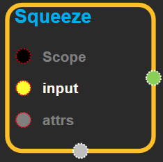
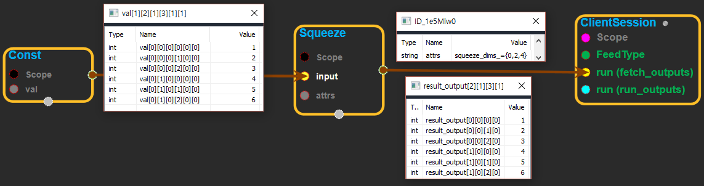
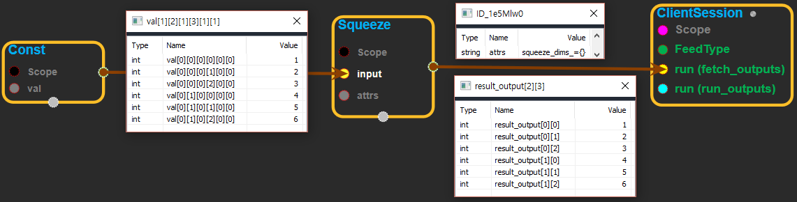

--- 
layout: default 
title: Squeeze 
parent: array_ops 
grand_parent: enuSpace-Tensorflow API 
last_modified_date: now 
--- 

# Squeeze

---

## tensorflow C++ API {#tensorflow-c-api}

[tensorflow::ops::Squeeze](https://www.tensorflow.org/api_docs/cc/class/tensorflow/ops/squeeze.html)

Removes dimensions of size 1 from the shape of a tensor.

---

## Summary {#summary}

Given a tensor`input`, this operation returns a tensor of the same type with all dimensions of size 1 removed. If you don't want to remove all size 1 dimensions, you can remove specific size 1 dimensions by specifying`squeeze_dims`.

For example:

\`\`\` 't' is a tensor of shape \[1, 2, 1, 3, 1, 1\]

shape\(squeeze\(t\)\) ==&gt; \[2, 3\] \`\`\`

Or, to remove specific size 1 dimensions:

\`\`\` 't' is a tensor of shape \[1, 2, 1, 3, 1, 1\]

shape\(squeeze\(t, \[2, 4\]\)\) ==&gt; \[1, 2, 3, 1\] \`\`\`

Arguments:

* scope: A [Scope](https://www.tensorflow.org/versions/r1.4/api_docs/cc/class/tensorflow/scope.html#classtensorflow_1_1_scope) object
* input: The `input` to squeeze.

Optional attributes \(see[`Attrs`](https://www.tensorflow.org/versions/r1.4/api_docs/cc/struct/tensorflow/ops/squeeze/attrs.html#structtensorflow_1_1ops_1_1_squeeze_1_1_attrs)\):

* squeeze\_dims: If specified, only squeezes the dimensions listed. The dimension index starts at 0. It is an error to squeeze a dimension that is not 1. Must be in the range `[-rank(input), rank(input))`.

Returns:

* [`Output`](https://www.tensorflow.org/versions/r1.4/api_docs/cc/class/tensorflow/output.html#classtensorflow_1_1_output): Contains the same data as `input`, but has one or more dimensions of size 1 removed.

---

## Squeeze block {#abs-block}

Source link :[https://github.com/EXPNUNI/enuSpaceTensorflow/blob/master/enuSpaceTensorflow/tf\_array\_ops.cpp](https://github.com/EXPNUNI/enuSpaceTensorflow/blob/master/enuSpaceTensorflow/tf_math.cpp)

Argument:

* Scope scope : A Scope object \(A scope is generated automatically each page. A scope is not connected.\)
* Input input: The `input` to squeeze.
* Squeeze::Attrs attrs: 
  * squeeze\_dims: If specified, only squeezes the dimensions listed. The dimension index starts at 0. It is an error to squeeze a dimension that is not 1. Must be in the range `[-rank(input), rank(input))`.

Output:

* Output output: Output object of Squeeze class object.

Result:

* std::vector\(Tensor\) `result_output`: The output tensor.

---

## Using Method

※ input에 들어온 tensor의 shape중에서 각 차원의 사이즈가 1인 것들을 제거하는 기능을 한다. attrs의 squeeze\_dims는 size가 1인 차원을 선택해서 제거할 수 있도록 해준다. \( squeeze\_dims에 들어가는 값은 index 값이다. ex: 1-D를 선택 하려면 0, 4-D를 선택하려면 3을 입력하면 된다.\)

