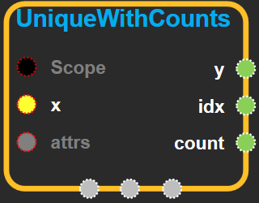
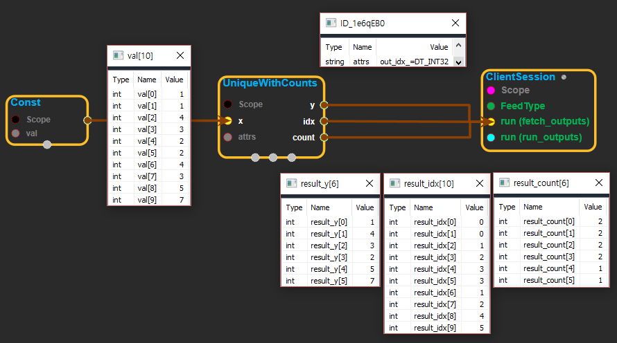

--- 
layout: default 
title: UniqueWithCounts 
parent: array_ops 
grand_parent: enuSpace-Tensorflow API 
last_modified_date: now 
--- 

# UniqueWithCounts

---

## tensorflow C++ API {#tensorflow-c-api}

[tensorflow::ops::UniqueWithCounts](https://www.tensorflow.org/api_docs/cc/class/tensorflow/ops/unique-with-counts.html)

Finds unique elements in a 1-D tensor.

---

## Summary {#summary}

This operation returns a tensor`y`containing all of the unique elements of`x`sorted in the same order that they occur in`x`. This operation also returns a tensor`idx`the same size as`x`that contains the index of each value of`x`in the unique output`y`. Finally, it returns a third tensor`count`that contains the count of each element of`y`in`x`. In other words:

`y[idx[i]] = x[i] for i in [0, 1,...,rank(x) - 1]`

For example:

\`\`\` tensor 'x' is \[1, 1, 2, 4, 4, 4, 7, 8, 8\]

y, idx, count = unique\_with\_counts\(x\) y ==&gt; \[1, 2, 4, 7, 8\] idx ==&gt; \[0, 0, 1, 2, 2, 2, 3, 4, 4\] count ==&gt; \[2, 1, 3, 1, 2\] \`\`\`

Arguments:

* scope: A [Scope](https://www.tensorflow.org/api_docs/cc/class/tensorflow/scope.html#classtensorflow_1_1_scope) object
* x: 1-D.

Returns:

* [`Output`](https://www.tensorflow.org/api_docs/cc/class/tensorflow/output.html#classtensorflow_1_1_output) y: 1-D.
* [`Output`](https://www.tensorflow.org/api_docs/cc/class/tensorflow/output.html#classtensorflow_1_1_output) idx: 1-D.
* [`Output`](https://www.tensorflow.org/api_docs/cc/class/tensorflow/output.html#classtensorflow_1_1_output) count: 1-D.

---

## UniqueWithCounts block {#abs-block}

Source link :[https://github.com/EXPNUNI/enuSpaceTensorflow/blob/master/enuSpaceTensorflow/tf\_array\_ops.cpp](https://github.com/EXPNUNI/enuSpaceTensorflow/blob/master/enuSpaceTensorflow/tf_math.cpp)

Argument:

* Scope scope : A Scope object \(A scope is generated automatically each page. A scope is not connected.\)
* Input x: A 1-D `Tensor`.
* Unique::Attrs attrs:
  * out\_idx: An optional. Specifies the type of idx. from: `DT_INT32, DT_INT64`. Defaults to `DT_INT32`.

Output:

* Output y: Output object of UniqueWithCounts class object.
* Output idx: Output object of UniqueWithCounts class object.
* Output count: Output object of UniqueWithCounts class object.

Result:

* std::vector\(Tensor\) `result_y`: A `Tensor` . Has the same type as `x`. 1-D.
* std::vector\(Tensor\) `result_idx`: A `Tensor` of type `out_idx`. 1-D.
* std::vector\(Tensor\) `result_count`: A 1-D `Tensor`. Check for duplicate values.

---

## Using Method

  
※ [Unique](https://www.tensorflow.org/api_docs/cc/class/tensorflow/ops/unique.html)와 동일한 기능을 하고, 중복된 값이 각각 몇번 중복되었는지 count하는 기능이 추가되었다. 결과값 y는 유니크한 값을 모아놓은 tensor이고, idx는 x에서 각각의 해당하는 값이 y에서 몇 번째 index인지 알려주는 역할을 한다. attrs의 out\_idx는 idx의 데이터 타입을 지정한다.

