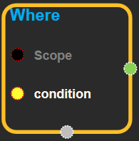
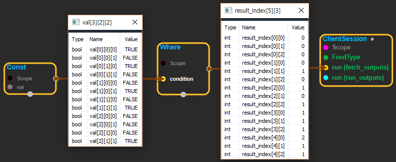

--- 
layout: default 
title: Where 
parent: array_ops 
grand_parent: enuSpace-Tensorflow API 
last_modified_date: now 
--- 

# Where

---

## tensorflow C++ API {#tensorflow-c-api}

[tensorflow::ops::Where](https://www.tensorflow.org/api_docs/cc/class/tensorflow/ops/where.html)

Returns locations of true values in a boolean tensor.

---

## Summary {#summary}

This operation returns the coordinates of true elements in`condition`. The coordinates are returned in a 2-D tensor where the first dimension \(rows\) represents the number of true elements, and the second dimension \(columns\) represents the coordinates of the true elements. Keep in mind, the shape of the output tensor can vary depending on how many true values there are in`condition`. Indices are output in row-major order.

For example:

\`\`\` 'input' tensor is \[\[True, False\]

\[True, False\]\]

'input' has two true values, so output has two coordinates.

'input' has rank of 2, so coordinates have two indices.

where\(input\) ==&gt; \[\[0, 0\], \[1, 0\]\]

`condition`tensor is \[\[\[True, False\]

\[True, False\]\]

\[\[False, True\]

\[False, True\]\]

\[\[False, False\]

\[False, True\]\]\]

'input' has 5 true values, so output has 5 coordinates.

'input' has rank of 3, so coordinates have three indices.

where\(input\) ==&gt; \[\[0, 0, 0\], \[0, 1, 0\], \[1, 0, 1\], \[1, 1, 1\], \[2, 1, 1\]\] \`\`\`

Arguments:

* scope: A [Scope](https://www.tensorflow.org/api_docs/cc/class/tensorflow/scope.html#classtensorflow_1_1_scope) object

Returns:

* [`Output`](https://www.tensorflow.org/api_docs/cc/class/tensorflow/output.html#classtensorflow_1_1_output): The index tensor.

---

## Where block {#abs-block}

Source link :[https://github.com/EXPNUNI/enuSpaceTensorflow/blob/master/enuSpaceTensorflow/tf\_array\_ops.cpp](https://github.com/EXPNUNI/enuSpaceTensorflow/blob/master/enuSpaceTensorflow/tf_math.cpp)

Argument:

* Scope scope : A Scope object \(A scope is generated automatically each page. A scope is not connected.\)
* Input condition: A boolean type of `Tensor`.

Output:

* Output index: Output object of Where class object.

Result:

* std::vector\(Tensor\) `result_index`: Indicates the index where the value is true in the condition

---

## Using Method

  
※ condition에서 값이 참인 곳을 찾아서 index로 내보낸다. 위 그림에서 condition의 값이 참인 경우가 5개 이고 3-RANK tensor이므로 결과의 shape는 {5, 3}이 되고, 각각의 위치를 나타낸다.

