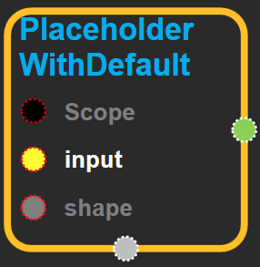
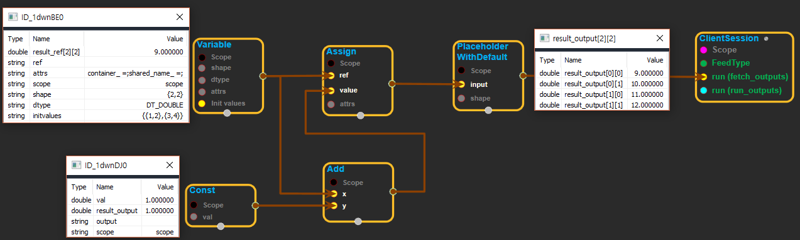

--- 
layout: default 
title: PlaceholderWithDefault 
parent: array_ops 
grand_parent: enuSpace-Tensorflow API 
last_modified_date: now 
--- 

# PlaceholderWithDefault {#abs}

---

## tensorflow C++ API {#tensorflow-c-api}

[tensorflow::ops::PlaceholderWithDefault](https://www.tensorflow.org/api_docs/cc/class/tensorflow/ops/placeholder-with-default.html)

A placeholder op that passes through `input` when its output is not fed.

---

## Summary {#summary}

Arguments:

* scope: A [Scope](https://www.tensorflow.org/api_docs/cc/class/tensorflow/scope.html#classtensorflow_1_1_scope) object
* input: The default value to produce when `output` is not fed.
* shape: The \(possibly partial\) shape of the tensor.

Returns:

* [`Output`](https://www.tensorflow.org/api_docs/cc/class/tensorflow/output.html#classtensorflow_1_1_output): A placeholder tensor that defaults to `input` if it is not fed.

---

## PlaceholderWithDefault block {#abs-block}

Source link :[https://github.com/EXPNUNI/enuSpaceTensorflow/blob/master/enuSpaceTensorflow/tf\_array\_ops.cpp](https://github.com/EXPNUNI/enuSpaceTensorflow/blob/master/enuSpaceTensorflow/tf_math.cpp)

Argument:

* Scope scope : A Scope object \(A scope is generated automatically each page. A scope is not connected.\)
* Input `input`: The default value to produce when `output` is not fed.
* PartialTensorShape `shape`: The \(possibly partial\) shape of the tensor.

Output:

* Output `output` : Output object of PlaceholderWithDefault class object.

Result:

* std::vector\(Tensor\) `result_output`: A placeholder tensor that defaults to `input` if it is not fed.

---

## Using Method

※ placeholder에 input값을 넣어서 feedtype블럭을 사용하지 않고도 초기화를 할 수 있다. 다른 연산에서 나온 output값을 input에 연결하여 다른 블럭들에 사용 할 수 있다.

