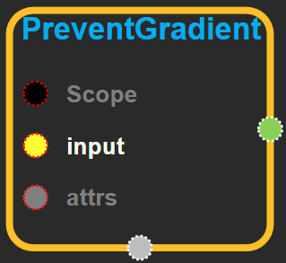
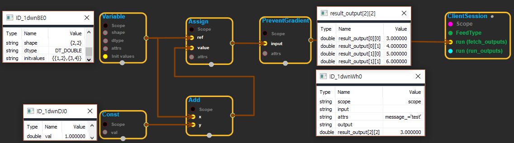

--- 
layout: default 
title: PreventGradient 
parent: array_ops 
grand_parent: enuSpace-Tensorflow API 
last_modified_date: now 
--- 

# PreventGradient {#abs}

---

## tensorflow C++ API {#tensorflow-c-api}

[tensorflow::ops::PreventGradient](https://www.tensorflow.org/api_docs/cc/class/tensorflow/ops/prevent-gradient.html)

An identity op that triggers an error if a gradient is requested.

---

## Summary {#summary}

When executed in a graph, this op outputs its input tensor as-is.

When building ops to compute gradients, the TensorFlow gradient system will return an error when trying to lookup the gradient of this op, because no gradient must ever be registered for this function. This op exists to prevent subtle bugs from silently returning unimplemented gradients in some corner cases.

Arguments:

* scope: A [Scope](https://www.tensorflow.org/api_docs/cc/class/tensorflow/scope.html#classtensorflow_1_1_scope) object
* input: any tensor.

Optional attributes \(see[`Attrs`](https://www.tensorflow.org/api_docs/cc/struct/tensorflow/ops/prevent-gradient/attrs.html#structtensorflow_1_1ops_1_1_prevent_gradient_1_1_attrs)\):

* message: Will be printed in the error when anyone tries to differentiate this operation.

Returns:

* [`Output`](https://www.tensorflow.org/api_docs/cc/class/tensorflow/output.html#classtensorflow_1_1_output): the same input tensor.

---

## PreventGradient block {#abs-block}

Source link :[https://github.com/EXPNUNI/enuSpaceTensorflow/blob/master/enuSpaceTensorflow/tf\_array\_ops.cpp](https://github.com/EXPNUNI/enuSpaceTensorflow/blob/master/enuSpaceTensorflow/tf_math.cpp)

Argument:

* Scope scope : A Scope object \(A scope is generated automatically each page. A scope is not connected.\)
* Input `input`: any tensor.
* PreventGradient::Attrs attrs
  * message\_: Will be printed in the error when anyone tries to differentiate this operation.

Output:

* Output `output` : Output object of PreventGradient class object.

Result:

* std::vector\(Tensor\) `result_output`: the same input tensor.

---

## Using Method

※ Gradient기능을 사용하기 전에 버그를 검출하는 역할을 한다.

