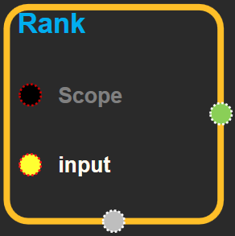
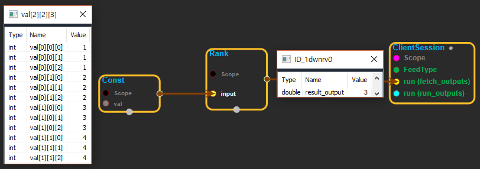
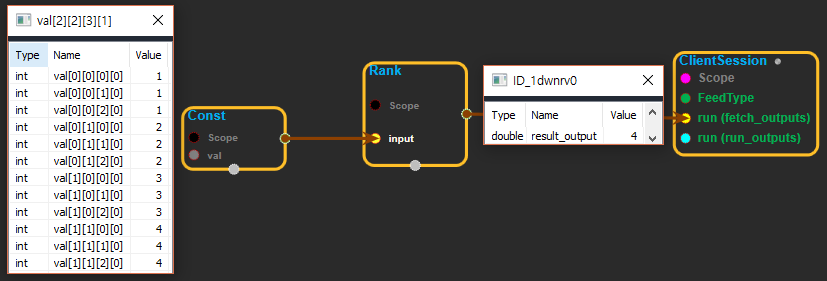

--- 
layout: default 
title: Rank 
parent: array_ops 
grand_parent: enuSpace-Tensorflow API 
last_modified_date: now 
--- 

# Rank {#abs}

---

## tensorflow C++ API {#tensorflow-c-api}

[tensorflow::ops::Rank](https://www.tensorflow.org/api_docs/cc/class/tensorflow/ops/rank.html)

Returns the rank of a tensor.

---

## Summary {#summary}

This operation returns an integer representing the rank of`input`.

For example:

\`\`\` 't' is \[\[\[1, 1, 1\], \[2, 2, 2\]\], \[\[3, 3, 3\], \[4, 4, 4\]\]\]

shape of tensor 't' is \[2, 2, 3\]

rank\(t\) ==&gt; 3 \`\`\`

**Note**: The rank of a tensor is not the same as the rank of a matrix. The rank of a tensor is the number of indices required to uniquely select each element of the tensor. [Rank](https://www.tensorflow.org/api_docs/cc/class/tensorflow/ops/rank.html#classtensorflow_1_1ops_1_1_rank) is also known as "order", "degree", or "ndims."

Arguments:

* scope: A [Scope](https://www.tensorflow.org/api_docs/cc/class/tensorflow/scope.html#classtensorflow_1_1_scope) object

Returns:

* [`Output`](https://www.tensorflow.org/api_docs/cc/class/tensorflow/output.html#classtensorflow_1_1_output): The output tensor.

---

## Rank block {#abs-block}

Source link :[https://github.com/EXPNUNI/enuSpaceTensorflow/blob/master/enuSpaceTensorflow/tf\_array\_ops.cpp](https://github.com/EXPNUNI/enuSpaceTensorflow/blob/master/enuSpaceTensorflow/tf_math.cpp)

Argument:

* Scope scope : A Scope object \(A scope is generated automatically each page. A scope is not connected.\)
* Input `input`: any tensor.

Output:

* Output `output` : Output object of Rank class object.

Result:

* std::vector\(Tensor\) `result_output`: Returns the rank of a tensor.

---

## Using Method

※input으로 들어온 tensor의 rank를 계산한다.

