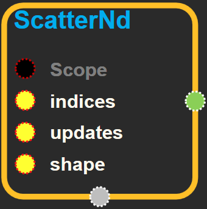
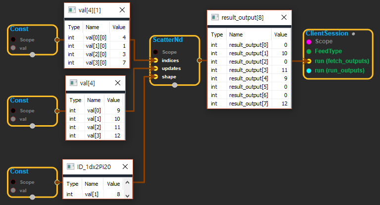

--- 
layout: default 
title: ScatterNd 
parent: array_ops 
grand_parent: enuSpace-Tensorflow API 
last_modified_date: now 
--- 

# ScatterNd {#abs}

---

## tensorflow C++ API {#tensorflow-c-api}

[tensorflow::ops::ScatterNd](https://www.tensorflow.org/api_docs/cc/class/tensorflow/ops/scatter-nd.html)

Scatter `updates` into a new \(initially zero\) tensor according to `indices` .

---

## Summary {#summary}

Creates a new tensor by applying sparse`updates`to individual values or slices within a zero tensor of the given`shape`according to indices. This operator is the inverse of the tf.gather\_nd operator which extracts values or slices from a given tensor.

**WARNING**: The order in which updates are applied is nondeterministic, so the output will be nondeterministic if`indices`contains duplicates.

`indices`is an integer tensor containing indices into a new tensor of shape`shape`. The last dimension of`indices`can be at most the rank of`shape`:

```
indices.shape[-1]<= shape.rank
```

The last dimension of`indices`corresponds to indices into elements \(if`indices.shape[-1] = shape.rank`\) or slices \(if`indices.shape[-1] < shape.rank`\) along dimension`indices.shape[-1]`of`shape`.`updates`is a tensor with shape

```
indices.shape[:-1]+ shape[indices.shape[-1]:]
```

The simplest form of scatter is to insert individual elements in a tensor by index. For example, say we want to insert 4 scattered elements in a rank-1 tensor with 8 elements.

In Python, this scatter operation would look like this:

\`\`\`python indices = tf.constant\(\[\[4\], \[3\], \[1\], \[7\]\]\) updates = tf.constant\(\[9, 10, 11, 12\]\) shape = tf.constant\(\[8\]\) scatter = tf.scatter\_nd\(indices, updates, shape\) with tf.Session\(\) as sess: print\(sess.run\(scatter\)\) \`\`\`

The resulting tensor would look like this:

```
[0,11,0,10,9,0,0,12]
```

We can also, insert entire slices of a higher rank tensor all at once. For example, if we wanted to insert two slices in the first dimension of a rank-3 tensor with two matrices of new values.

In Python, this scatter operation would look like this:

\`\`\`python indices = tf.constant\(\[\[0\], \[2\]\]\) updates = tf.constant\(\[\[\[5, 5, 5, 5\], \[6, 6, 6, 6\], \[7, 7, 7, 7\], \[8, 8, 8, 8\]\], \[\[5, 5, 5, 5\], \[6, 6, 6, 6\], \[7, 7, 7, 7\], \[8, 8, 8, 8\]\]\]\) shape = tf.constant\(\[4, 4, 4\]\) scatter = tf.scatter\_nd\(indices, updates, shape\) with tf.Session\(\) as sess: print\(sess.run\(scatter\)\) \`\`\`

The resulting tensor would look like this:

```
[[[5,5,5,5],[6,6,6,6],[7,7,7,7],[8,8,8,8]],
 [[0,0,0,0],[0,0,0,0],[0,0,0,0],[0,0,0,0]],
 [[5,5,5,5],[6,6,6,6],[7,7,7,7],[8,8,8,8]],
 [[0,0,0,0],[0,0,0,0],[0,0,0,0],[0,0,0,0]]]
```

Arguments:

* scope: A [Scope](https://www.tensorflow.org/api_docs/cc/class/tensorflow/scope.html#classtensorflow_1_1_scope) object
* indices: Index tensor.
* updates: Updates to scatter into output.
* shape: 1-D. The shape of the resulting tensor.

Returns:

* [`Output`](https://www.tensorflow.org/api_docs/cc/class/tensorflow/output.html#classtensorflow_1_1_output): A new tensor with the given shape and updates applied according to the indices.

---

## ScatterNd block {#abs-block}

Source link :[https://github.com/EXPNUNI/enuSpaceTensorflow/blob/master/enuSpaceTensorflow/tf\_array\_ops.cpp](https://github.com/EXPNUNI/enuSpaceTensorflow/blob/master/enuSpaceTensorflow/tf_math.cpp)



Argument:

* Scope scope : A Scope object \(A scope is generated automatically each page. A scope is not connected.\)
* Input `indices`: Index tensor.
* Input `updates`: Updates to scatter into output.
* Input `shape`: 1-D. The shape of the resulting tensor.

Output:

* Output `output` : Output object of ScatterNd class object.

Result:

* std::vector\(Tensor\) `result_output`: A new tensor with the given shape and updates applied according to the indices.

---

## Using Method

  
※ update의 데이터를 indices에 있는 인덱스 순서대로 shape입력 값의 모양으로 된 텐서에 입력한다. 이때 빈칸은 0으로 채운다.

※ shape 입력 값은 indices의 shape에서 -1 rank한 값과 update의 shape값을 랭크 별로 더한 값이다. \(ex: indice의 shape는 \[2,1\]이고, update의 shape가 \[2,4,4\]라면 -&gt; \[2\] + \[2,4,4\] = \[4,4,4\] \)

