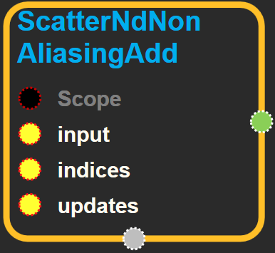
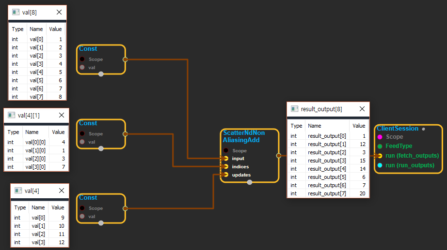

--- 
layout: default 
title: ScatterNdNonAliasingAdd 
parent: array_ops 
grand_parent: enuSpace-Tensorflow API 
last_modified_date: now 
--- 

# ScatterNdNonAliasingAdd {#abs}

---

## tensorflow C++ API {#tensorflow-c-api}

[tensorflow::ops::ScatterNdNonAliasingAdd](https://www.tensorflow.org/api_docs/cc/class/tensorflow/ops/scatter-nd-non-aliasing-add.html)

Applies sparse addition to `input` using individual values or slices.

---

## Summary {#summary}

from`updates`according to indices`indices`. The updates are non-aliasing:`input`is only modified in-place if no other operations will use it. Otherwise, a copy of`input`is made. This operation has a gradient with respect to both`input`and`updates`.

`input`is a[`Tensor`](https://www.tensorflow.org/api_docs/cc/class/tensorflow/tensor.html#classtensorflow_1_1_tensor)with rank`P`and`indices`is a[`Tensor`](https://www.tensorflow.org/api_docs/cc/class/tensorflow/tensor.html#classtensorflow_1_1_tensor)of rank`Q`.

`indices`must be integer tensor, containing indices into`input`. It must be shape`[d_0, ..., d_{Q-2}, K]`where`0 < K <= P`.

The innermost dimension of`indices`\(with length`K`\) corresponds to indices into elements \(if`K = P`\) or`(P-K)`-dimensional slices \(if`K < P`\) along the`K`th dimension of`input`.

`updates`is[`Tensor`](https://www.tensorflow.org/api_docs/cc/class/tensorflow/tensor.html#classtensorflow_1_1_tensor)of rank`Q-1+P-K`with shape:

\`\`\` \[d\_0, ..., d\_{Q-2}, input.shape\[K\], ..., input.shape\[P-1\]\]. \`\`\`

For example, say we want to add 4 scattered elements to a rank-1 tensor to 8 elements. In Python, that addition would look like this:

```
input = tf.constant([1,2,3,4,5,6,7,8])
indices = tf.constant([[4],[3],[1],[7]])
updates = tf.constant([9,10,11,12])
output = tf.scatter_nd_non_aliasing_add(input, indices, updates)
with tf.Session()as sess:
    print(sess.run(output))
```

The resulting value`output`would look like this:

```
[1, 13, 3, 14, 14, 6, 7, 20]
```

See tf.scatter\_nd for more details about how to make updates to slices.

Arguments:

* scope: A [Scope](https://www.tensorflow.org/api_docs/cc/class/tensorflow/scope.html#classtensorflow_1_1_scope) object
* input: A [Tensor](https://www.tensorflow.org/api_docs/cc/class/tensorflow/tensor.html#classtensorflow_1_1_tensor).
* indices: A [Tensor](https://www.tensorflow.org/api_docs/cc/class/tensorflow/tensor.html#classtensorflow_1_1_tensor) . Must be one of the following types:`int32`,`int64`. A tensor of indices into `input`.
* updates: A [Tensor](https://www.tensorflow.org/api_docs/cc/class/tensorflow/tensor.html#classtensorflow_1_1_tensor). Must have the same type as ref. A tensor of updated values to add to `input`.

Returns:

* [`Output`](https://www.tensorflow.org/api_docs/cc/class/tensorflow/output.html#classtensorflow_1_1_output): A [`Tensor`](https://www.tensorflow.org/api_docs/cc/class/tensorflow/tensor.html#classtensorflow_1_1_tensor)with the same shape as `input`, containing values of `input`updated with `updates`.

---

## ScatterNdNonAliasingAdd block {#abs-block}

Source link :[https://github.com/EXPNUNI/enuSpaceTensorflow/blob/master/enuSpaceTensorflow/tf\_array\_ops.cpp](https://github.com/EXPNUNI/enuSpaceTensorflow/blob/master/enuSpaceTensorflow/tf_math.cpp)



Argument:

* Scope scope : A Scope object \(A scope is generated automatically each page. A scope is not connected.\)
* Input input: A [Tensor](https://www.tensorflow.org/api_docs/cc/class/tensorflow/tensor.html#classtensorflow_1_1_tensor).
* Input indices: A [Tensor](https://www.tensorflow.org/api_docs/cc/class/tensorflow/tensor.html#classtensorflow_1_1_tensor) . Must be one of the following types:`int32`,`int64`. A tensor of indices into `input`.
* Input updates: A [Tensor](https://www.tensorflow.org/api_docs/cc/class/tensorflow/tensor.html#classtensorflow_1_1_tensor). Must have the same type as ref. A tensor of updated values to add to `input`.

Output:

* Output `output` : Output object of ScatterNdNonAliasingAdd class object.

Result:

* std::vector\(Tensor\) `result_output`: A [`Tensor`](https://www.tensorflow.org/api_docs/cc/class/tensorflow/tensor.html#classtensorflow_1_1_tensor)with the same shape as `input`, containing values of `input`updated with `updates`.

---

## Using Method

  
※ update의 데이터를 indices에 있는 인덱스 순서대로 input tensor에 있는 값에 더한다.  
※ input의 shape는 indices의 shape에서 -1 rank한 값과 update의 shape값을 랭크 별로 더한 shape이다. \(ex: indice의 shape는 \[2,1\]이고, update의 shape가 \[2,4,4\]라면 -&gt; \[2\] + \[2,4,4\] = \[4,4,4\] \)

