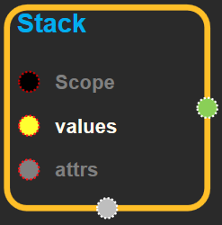
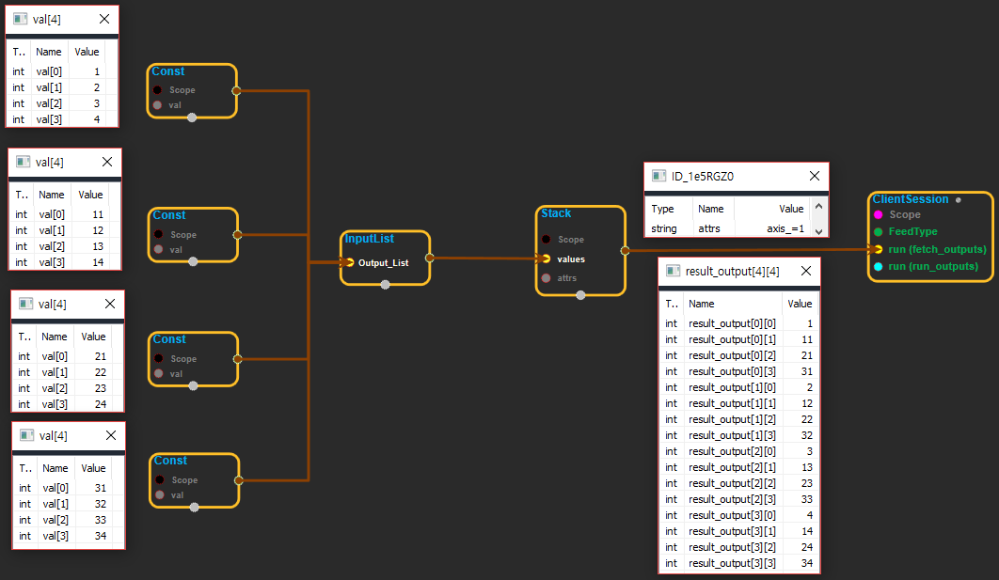

--- 
layout: default 
title: Stack 
parent: array_ops 
grand_parent: enuSpace-Tensorflow API 
last_modified_date: now 
--- 

# Stack

---

## tensorflow C++ API {#tensorflow-c-api}

[tensorflow::ops::Stack](https://www.tensorflow.org/api_docs/cc/class/tensorflow/ops/stack.html)

Packs a list of `N` rank-`R` tensors into one rank-`(R+1)` tensor.

---

## Summary {#summary}

Packs the`N`tensors in`values`into a tensor with rank one higher than each tensor in`values`, by packing them along the`axis`dimension. Given a list of tensors of shape`(A, B, C)`;

if`axis == 0`then the`output`tensor will have the shape`(N, A, B, C)`. if`axis == 1`then the`output`tensor will have the shape`(A, N, B, C)`. Etc.

For example:

\`\`\` 'x' is \[1, 4\]

'y' is \[2, 5\]

'z' is \[3, 6\]

pack\(\[x, y, z\]\) =&gt; \[\[1, 4\], \[2, 5\], \[3, 6\]\] \# Pack along first dim. pack\(\[x, y, z\], axis=1\) =&gt; \[\[1, 2, 3\], \[4, 5, 6\]\] \`\`\`

This is the opposite of`unpack`.

Arguments:

* scope: A [Scope](https://www.tensorflow.org/versions/r1.4/api_docs/cc/class/tensorflow/scope.html#classtensorflow_1_1_scope) object
* values: Must be of same shape and type.

Optional attributes \(see[`Attrs`](https://www.tensorflow.org/versions/r1.4/api_docs/cc/struct/tensorflow/ops/stack/attrs.html#structtensorflow_1_1ops_1_1_stack_1_1_attrs)\):

* axis: Dimension along which to pack. Negative values wrap around, so the valid range is `[-(R+1), R+1)`.

Returns:

* [`Output`](https://www.tensorflow.org/versions/r1.4/api_docs/cc/class/tensorflow/output.html#classtensorflow_1_1_output): The packed tensor.

---

## Stack block {#abs-block}

Source link :[https://github.com/EXPNUNI/enuSpaceTensorflow/blob/master/enuSpaceTensorflow/tf\_array\_ops.cpp](https://github.com/EXPNUNI/enuSpaceTensorflow/blob/master/enuSpaceTensorflow/tf_math.cpp)

Argument:

* Scope scope : A Scope object \(A scope is generated automatically each page. A scope is not connected.\)
* InputList values: Must be of same shape and type.
* Squeeze::Attrs attrs: 
  * axis: Dimension along which to pack. Negative values wrap around, so the valid range is `[-(R+1), R+1)`.

Output:

* Output output: Output object of Stack class object.

Result:

* std::vector\(Tensor\) `result_output`: The output tensor.

---

## Using Method

※ list로 들어오는 tensor를 합쳐주는 기능을 한다. axis는 합칠 차원을 선택하는 역할을 한다.

