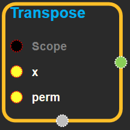
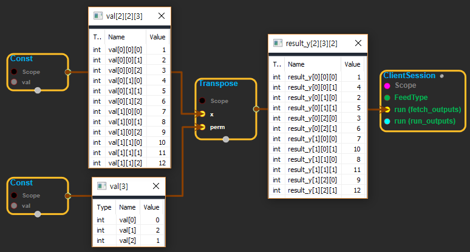

--- 
layout: default 
title: Transpose 
parent: array_ops 
grand_parent: enuSpace-Tensorflow API 
last_modified_date: now 
--- 

# Transpose

---

## tensorflow C++ API {#tensorflow-c-api}

[tensorflow::ops::Transpose](https://www.tensorflow.org/api_docs/cc/class/tensorflow/ops/transpose.html)

Shuffle dimensions of x according to a permutation.

---

## Summary {#summary}

The output`y`has the same rank as`x`. The shapes of`x`and`y`satisfy:`y.shape[i] == x.shape[perm[i]] for i in [0, 1, ..., rank(x) - 1]`

For example:

```
# 'x' is [[1 2 3]
#         [4 5 6]]
# Equivalently
tf.transpose(x, perm=[1,0])==>[[1 4]
                               [2 5]
                               [3 6]]
# 'perm' is more useful for n-dimensional tensors, for n > 2
# 'x' is   [[[1  2  3]
#            [4  5  6]]
#           [[7  8  9]
#            [10 11 12]]]
# Take the transpose of the matrices in dimension-0
tf.transpose(x, perm=[0,2,1])==>[[[1 4]
                                  [2 5]
                                  [3 6]]
                                 [[7 10]
                                  [8 11]
                                  [9 12]]]
```

Arguments:

* scope: A [Scope](https://www.tensorflow.org/api_docs/cc/class/tensorflow/scope.html#classtensorflow_1_1_scope) object
* `x`: A `Tensor`.
* **`perm`**: A permutation of the dimensions of `x`.

Returns:

* [`Output`](https://www.tensorflow.org/api_docs/cc/class/tensorflow/output.html#classtensorflow_1_1_output): A transposed `Tensor`.

---

## Transpose block {#abs-block}

Source link :[https://github.com/EXPNUNI/enuSpaceTensorflow/blob/master/enuSpaceTensorflow/tf\_array\_ops.cpp](https://github.com/EXPNUNI/enuSpaceTensorflow/blob/master/enuSpaceTensorflow/tf_math.cpp)



Argument:

* Scope scope : A Scope object \(A scope is generated automatically each page. A scope is not connected.\)
* Input x: A `Tensor`.
* Input perm: A permutation of the dimensions of `x`.

Output:

* Output y: Output object of Transpose class object.

Result:

* std::vector\(Tensor\) `result_y`: A transposed `Tensor`.

---

## Using Method

  
※ 차원을 바꾸는 역할을 한다. 파이썬에서 쓰는것과 달리 `perm`에 아무것도 없으면 에러가 난다. x는 차원을 바꿀 tensor를 넣으면 되고, perm은 바꿀 차원의 순서를 index로 넣으면 된다.

