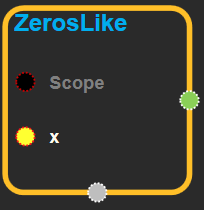
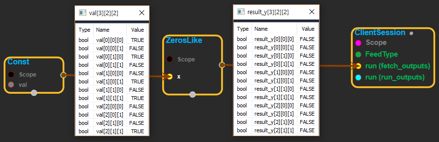

--- 
layout: default 
title: ZerosLike 
parent: array_ops 
grand_parent: enuSpace-Tensorflow API 
last_modified_date: now 
--- 

# ZerosLike

---

## tensorflow C++ API {#tensorflow-c-api}

[tensorflow::ops::ZerosLike](https://www.tensorflow.org/api_docs/cc/class/tensorflow/ops/zeros-like.html)

Returns a tensor of zeros with the same shape and type as x.

---

## Summary {#summary}

For example:

```
# 'tensor' is [[1, 2, 3], [4, 5, 6]]
tf.zeros_like(tensor)==>[[0,0,0],[0,0,0]]
```

Arguments:

* scope: A [Scope](https://www.tensorflow.org/api_docs/cc/class/tensorflow/scope.html#classtensorflow_1_1_scope) object
* x: a tensor of type T.

Returns:

* [`Output`](https://www.tensorflow.org/api_docs/cc/class/tensorflow/output.html#classtensorflow_1_1_output): a tensor of the same shape and type as x but filled with zeros.

---

## ZerosLike block {#abs-block}

Source link :[https://github.com/EXPNUNI/enuSpaceTensorflow/blob/master/enuSpaceTensorflow/tf\_array\_ops.cpp](https://github.com/EXPNUNI/enuSpaceTensorflow/blob/master/enuSpaceTensorflow/tf_math.cpp)



Argument:

* Scope scope : A Scope object \(A scope is generated automatically each page. A scope is not connected.\)
* Input x: A `Tensor`.

Output:

* Output y: Output object of ZerosLike class object.

Result:

* std::vector\(Tensor\) `result_y`: A `Tensor` with all elements set to zero.

---

## Using Method

  
※ x로 들어온 모든 값을 0으로 만든다. 위 그림에서는 들어온 tensor의 type이 boolean타입이므로 모든 값이 false로 바뀐다.

