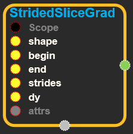
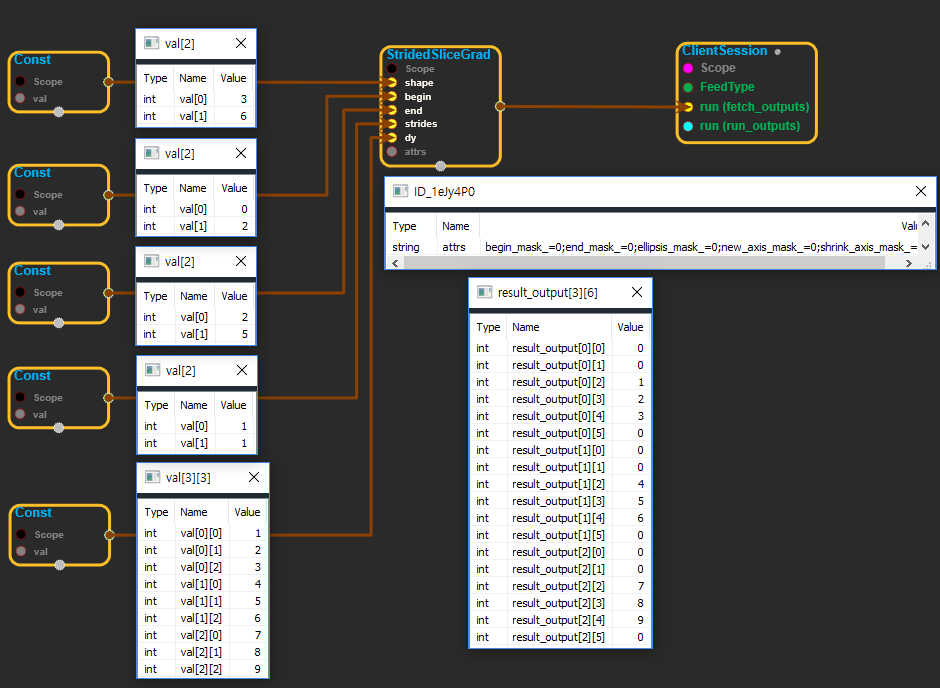

--- 
layout: default 
title: StridedSliceGrad 
parent: array_ops 
grand_parent: enuSpace-Tensorflow API 
last_modified_date: now 
--- 

# StridedSliceGrad

---

## tensorflow C++ API {#tensorflow-c-api}

[tensorflow::ops::StridedSliceGrad](https://www.tensorflow.org/api_docs/cc/class/tensorflow/ops/strided-slice-grad.html)

Returns the gradient of [`StridedSlice`](https://www.tensorflow.org/api_docs/cc/class/tensorflow/ops/strided-slice.html#classtensorflow_1_1ops_1_1_strided_slice).

---

## Summary {#summary}

Since [`StridedSlice`](https://www.tensorflow.org/api_docs/cc/class/tensorflow/ops/strided-slice.html#classtensorflow_1_1ops_1_1_strided_slice) cuts out pieces of its `input` which is size `shape`, its gradient will have the same shape \(which is passed here as `shape`\). The gradient will be zero in any element that the slice does not select.

Arguments are the same as [StridedSliceGrad](https://www.tensorflow.org/api_docs/cc/class/tensorflow/ops/strided-slice-grad.html#classtensorflow_1_1ops_1_1_strided_slice_grad) with the exception that `dy` is the input gradient to be propagated and `shape` is the shape of [`StridedSlice`](https://www.tensorflow.org/api_docs/cc/class/tensorflow/ops/strided-slice.html#classtensorflow_1_1ops_1_1_strided_slice)'s `input`.

Arguments:

* scope: A [Scope](https://www.tensorflow.org/api_docs/cc/class/tensorflow/scope.html#classtensorflow_1_1_scope) object

Returns:

* [`Output`](https://www.tensorflow.org/api_docs/cc/class/tensorflow/output.html#classtensorflow_1_1_output): The output tensor.

---

## StridedSliceGrad block {#abs-block}

Source link :[https://github.com/EXPNUNI/enuSpaceTensorflow/blob/master/enuSpaceTensorflow/tf\_array\_ops.cpp](https://github.com/EXPNUNI/enuSpaceTensorflow/blob/master/enuSpaceTensorflow/tf_math.cpp)

Argument:

* Scope scope : A Scope object \(A scope is generated automatically each page. A scope is not connected.\)
* Input shape: A vector `Tensor`. Determine the shape.
* Input begin: An `int32` or `int64 Tensor`. \`begin\[k\]\` specifies the offset into the \`k\`th range specification. The exact dimension this corresponds to will be determined by context. Out-of-bounds values will be silently clamped. If the \`k\`th bit of \`begin\_mask\` then \`begin\[k\]\` is ignored and the full range of the appropriate dimension is used instead. Negative values causes indexing to start from the highest element e.g. If \`foo==\[1,2,3\]\` then \`foo\[-1\]==3\`.
* Input end: An `int32` or `int64 Tensor`. \`end\[i\]\` is like \`begin\` with the exception that \`end\_mask\` is used to determine full ranges.
* Input strides: An `int32` or `int64 Tensor`. \`strides\[i\]\` specifies the increment in the \`i\`th specification after extracting a given element. Negative indices will reverse the original order. Out or range values are clamped to \`\[0,dim\[i\]\) if slice\[i\]&gt;0 `or` \[-1,dim\[i\]-1\] if slice\[i\] &lt; 0\`
* Input dy: A `Tensor`.
* StridedSlice::Attrs attrs:
  * begin\_mask: a bitmask where a bit i being 1 means to ignore the begin value and instead use the largest interval possible. At runtime begin\[i\] will be replaced with `[0, n-1) if` stride\[i\] &gt; 0 `or`\[-1, n-1\] `if` stride\[i\] &lt; 0
  * end\_mask: analogous to begin\_mask
  * shrink\_axis\_mask: a bitmask where bit i implies that the i th specification should shrink the dimensionality. begin and end must imply a slice of size 1 in the dimension. For example in python one might do foo\[:, 3, :\] which would result in shrink\_axis\_mask being 2.
  * ellipsis\_mask: a bitmask where bit i being 1 means the i\`th position is actually an ellipsis. One bit at most can be 1. If ellipsis\_mask == 0, then an implicit ellipsis mask of 1 &lt;&lt; \(m+1\) is provided. This means that foo\[3:5\] == foo\[3:5, ...\]. An ellipsis implicitly creates as many range specifications as necessary to fully specify the sliced range for every dimension. For example for a 4-dimensional tensor foo the slice foo\[2, ..., 5:8\] implies foo\[2, :, :, 5:8\].
  * new\_axis\_mask: a bitmask where bit i being 1 means the i th specification creates a new shape 1 dimension. For example foo\[:4, tf.newaxis, :2\] would produce a shape \(4, 1, 2\) tensor.

Output:

* Output output: Output object of StridedSliceGrad class object.

Result:

* std::vector\(Tensor\) `result_output`: A `Tensor` the same type as `input`.

---

## Using Method

※ dy로 들어온 tensor를 잘라서 shape에 들어온 값의 모양으로 만들어진 tensor에 집어 넣는다. end에서 begin을 뺀 값은 dy의 shape와 같아햐하며\(예를 들어 dy의 shape가 \[4, 3\] 이라면 begin의 shape는 \[2\]이고 값은 \[0, 1\] end의 shape는 \[2\] 값은 \[4, 4\]가 되어야 한다.\) shape 핀에 들어온 값은 이보다 크거나 같아야한다.

