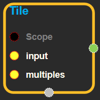
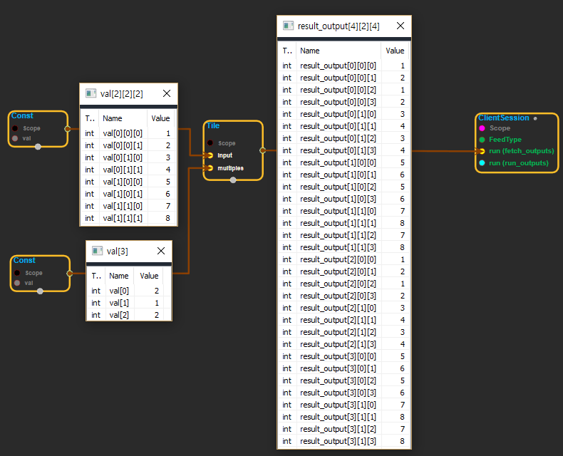

--- 
layout: default 
title: Tile 
parent: array_ops 
grand_parent: enuSpace-Tensorflow API 
last_modified_date: now 
--- 

# Tile

---

## tensorflow C++ API {#tensorflow-c-api}

[tensorflow::ops::Tile](https://www.tensorflow.org/api_docs/cc/class/tensorflow/ops/tile.html)

Constructs a tensor by tiling a given tensor.

---

## Summary {#summary}

This operation creates a new tensor by replicating`inputmultiples`times. The output tensor's i'th dimension has`input.dims(i) * multiples[i]`elements, and the values of`input`are replicated`multiples[i]`times along the 'i'th dimension. For example, tiling`[a b c d]`by`[2]`produces`[a b c d a b c d]`.

Arguments:

* scope: A [Scope](https://www.tensorflow.org/versions/r1.4/api_docs/cc/class/tensorflow/scope.html#classtensorflow_1_1_scope) object
* input: 1-D or higher.
* multiples: 1-D. Length must be the same as the number of dimensions in `input`

Returns:

* [`Output`](https://www.tensorflow.org/versions/r1.4/api_docs/cc/class/tensorflow/output.html#classtensorflow_1_1_output): The output tensor.

---

## Tile block {#abs-block}

Source link :[https://github.com/EXPNUNI/enuSpaceTensorflow/blob/master/enuSpaceTensorflow/tf\_array\_ops.cpp](https://github.com/EXPNUNI/enuSpaceTensorflow/blob/master/enuSpaceTensorflow/tf_math.cpp)

Argument:

* Scope scope : A Scope object \(A scope is generated automatically each page. A scope is not connected.\)
* Input input: A `Tensor`.
* Input multiples: 1-D. Length must be the same as the number of dimensions in `input`

Output:

* Output output: Output object of Tile class object.

Result:

* std::vector\(Tensor\) `result_output`: A `Tensor` the same type as `input`.

---

## Using Method

※ input을 화장실 타일 깔듯이 여러개 셋팅하는 기능이다. multiples로 각 차원에 몇번 셋팅 할 것인지 정한다.

