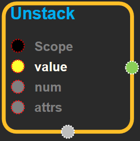
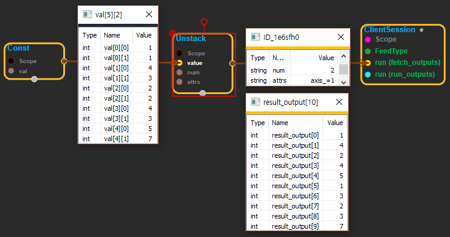
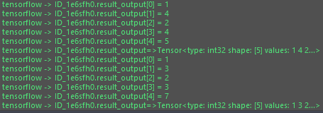
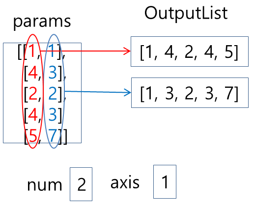

--- 
layout: default 
title: Unstack 
parent: array_ops 
grand_parent: enuSpace-Tensorflow API 
last_modified_date: now 
--- 

# Unstack

---

## tensorflow C++ API {#tensorflow-c-api}

[tensorflow::ops::Unstack](https://www.tensorflow.org/api_docs/cc/class/tensorflow/ops/unstack.html)

Unpacks a given dimension of a rank-`R` tensor into `num` rank-`(R-1)` tensors.

---

## Summary {#summary}

Unpacks`num`tensors from`value`by chipping it along the`axis`dimension. For example, given a tensor of shape`(A, B, C, D)`;

If`axis == 0`then the i'th tensor in`output`is the slice`value[i, :, :, :]`and each tensor in`output`will have shape`(B, C, D)`. \(Note that the dimension unpacked along is gone, unlike`split`\).

If`axis == 1`then the i'th tensor in`output`is the slice`value[:, i, :, :]`and each tensor in`output`will have shape`(A, C, D)`. Etc.

This is the opposite of`pack`.

Arguments:

* scope: A [Scope](https://www.tensorflow.org/api_docs/cc/class/tensorflow/scope.html#classtensorflow_1_1_scope) object
* value: 1-D or higher, with `axis` dimension size equal to `num`.

Optional attributes \(see[`Attrs`](https://www.tensorflow.org/api_docs/cc/struct/tensorflow/ops/unstack/attrs.html#structtensorflow_1_1ops_1_1_unstack_1_1_attrs)\):

* axis: Dimension along which to unpack. Negative values wrap around, so the valid range is `[-R, R)`.

Returns:

* `OutputList`: The list of tensors unpacked from `value`.

---

## Unstack block {#abs-block}

Source link :[https://github.com/EXPNUNI/enuSpaceTensorflow/blob/master/enuSpaceTensorflow/tf\_array\_ops.cpp](https://github.com/EXPNUNI/enuSpaceTensorflow/blob/master/enuSpaceTensorflow/tf_math.cpp)

Argument:

* Scope scope : A Scope object \(A scope is generated automatically each page. A scope is not connected.\)
* Input value: 1-D or higher, with `axis` dimension size equal to `num`.
* Int64 num: size of the selected dimension.
* Unstack::Attrs attr:
  * axis: index value and select the dimension.

Output:

* Output output: Output object of Unstack class object.

Result:

* std::vector\(Tensor\) `result_output`: The list of tensors unpacked from `value`.

---

## Using Method

  
  
  
※ stack과 반대의 기능을 한다. value에서 axis에 해당하는 차원을 빼내는 것이다. num의 값은 axis에 해당하는 차원의 size를 입력한다. num의 값이 size와 다르면 에러가 난다.

