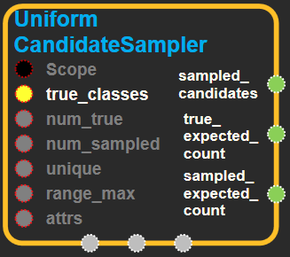

--- 
layout: default 
title: UniformCandidateSampler 
parent: candidate_sampling_ops 
grand_parent: enuSpace-Tensorflow API 
last_modified_date: now 
--- 

# UniformCandidateSampler

---

## tensorflow C++ API {#tensorflow-c-api}

[ensorflow::ops::UniformCandidateSampler](https://www.tensorflow.org/api_docs/cc/class/tensorflow/ops/uniform-candidate-sampler.html)

Generates labels for candidate sampling with a uniform distribution.

---

## Summary {#summary}

See explanations of candidate sampling and the data formats at go/candidate-sampling.

For each batch, this op picks a single set of sampled candidate labels.

The advantages of sampling candidates per-batch are simplicity and the possibility of efficient dense matrix multiplication. The disadvantage is that the sampled candidates must be chosen independently of the context and of the true labels.

Arguments:

* scope: A [Scope](https://www.tensorflow.org/versions/r1.4/api_docs/cc/class/tensorflow/scope.html#classtensorflow_1_1_scope) object
* true\_classes: A batch\_size \* num\_true matrix, in which each row contains the IDs of the num\_true target\_classes in the corresponding original label.
* num\_true: Number of true labels per context.
* num\_sampled: Number of candidates to randomly sample.
* unique: If unique is true, we sample with rejection, so that all sampled candidates in a batch are unique. This requires some approximation to estimate the post-rejection sampling probabilities.
* range\_max: The sampler will sample integers from the interval \[0, range\_max\).

Optional attributes \(see[`Attrs`](https://www.tensorflow.org/versions/r1.4/api_docs/cc/struct/tensorflow/ops/uniform-candidate-sampler/attrs.html#structtensorflow_1_1ops_1_1_uniform_candidate_sampler_1_1_attrs)\):

* seed: If either seed or seed2 are set to be non-zero, the random number generator is seeded by the given seed. Otherwise, it is seeded by a random seed.
* seed2: An second seed to avoid seed collision.

Returns:

* [`Output`](https://www.tensorflow.org/versions/r1.4/api_docs/cc/class/tensorflow/output.html#classtensorflow_1_1_output) sampled\_candidates: A vector of length num\_sampled, in which each element is the ID of a sampled candidate.
* [`Output`](https://www.tensorflow.org/versions/r1.4/api_docs/cc/class/tensorflow/output.html#classtensorflow_1_1_output) true\_expected\_count: A batch\_size \* num\_true matrix, representing the number of times each candidate is expected to occur in a batch of sampled candidates. If unique=true, then this is a probability.
* [`Output`](https://www.tensorflow.org/versions/r1.4/api_docs/cc/class/tensorflow/output.html#classtensorflow_1_1_output) sampled\_expected\_count: A vector of length num\_sampled, for each sampled candidate representing the number of times the candidate is expected to occur in a batch of sampled candidates. If unique=true, then this is a probability.

---

## UniformCandidateSampler block {#abs-block}

Source link : [https://github.com/EXPNUNI/enuSpaceTensorflow/blob/master/enuSpaceTensorflow/tf\_candidate\_sampling\_ops.cpp](https://github.com/EXPNUNI/enuSpace-Tensorflow/blob/master/enuSpaceTensorflow/tf_candidate_sampling_ops.cpp)

Argument:

* Scope scope : A Scope object \(A scope is generated automatically each page. A scope is not connected.\)
* Input true\_classes: A batch\_size \* num\_true matrix, in which each row contains the IDs of the num\_true target\_classes in the corresponding original label.
* Int64 num\_true: Number of true labels per context.
* Int64 num\_sampled: Number of candidates to randomly sample.
* bool unique: If unique is true, we sample with rejection, so that all sampled candidates in a batch are unique. This requires some approximation to estimate the post-rejection sampling probabilities.
* Int64 range\_max: The sampler will sample integers from the interval \[0, range\_max\].
* LearnedUnigramCandidateSampler::Attrs attrs:
  * seed: If either seed or seed2 are set to be non-zero, the random number generator is seeded by the given seed. Otherwise, it is seeded by a random seed.
  * seed2: An second seed to avoid seed collision.

Return:

* Output `sampled_candidates`: Output object of UniformCandidateSampler class object. 
* Output `true_expected_count`: Output object of UniformCandidateSampler class object. 
* Output `sampled_expected_count`: Output object of UniformCandidateSampler class object. 

Result:

* std::vector\(Tensor\) `result_sampled_candidates`:A vector of length num\_sampled, in which each element is the ID of a sampled candidate.
* std::vector\(Tensor\) `result_true_expected_count`: A batch\_size \* num\_true matrix, representing the number of times each candidate is expected to occur in a batch of sampled candidates. If unique=true, then this is a probability.
* std::vector\(Tensor\) `result_sampled_expected_count`: A vector of length num\_sampled, for each sampled candidate representing the number of times the candidate is expected to occur in a batch of sampled candidates. If unique=true, then this is a probability.

---

## Using Method {#using-method}

※

