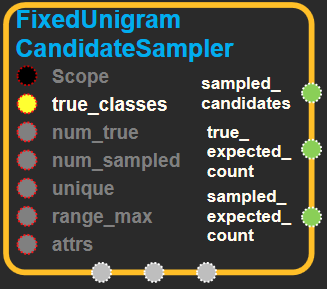

--- 
layout: default 
title: FixedUnigramCandidateSampler 
parent: candidate_sampling_ops 
grand_parent: enuSpace-Tensorflow API 
last_modified_date: now 
--- 

# FixedUnigramCandidateSampler

---

## tensorflow C++ API {#tensorflow-c-api}

[tensorflow::ops::ComputeAccidentalHits](https://www.tensorflow.org/api_docs/cc/class/tensorflow/ops/compute-accidental-hits.html)

Generates labels for candidate sampling with a learned unigram distribution.

---

## Summary {#summary}

A unigram sampler could use a fixed unigram distribution read from a file or passed in as an in-memory array instead of building up the distribution from data on the fly. There is also an option to skew the distribution by applying a distortion power to the weights.

The vocabulary file should be in CSV-like format, with the last field being the weight associated with the word.

For each batch, this op picks a single set of sampled candidate labels.

The advantages of sampling candidates per-batch are simplicity and the possibility of efficient dense matrix multiplication. The disadvantage is that the sampled candidates must be chosen independently of the context and of the true labels.

Arguments:

* scope: A [Scope](https://www.tensorflow.org/versions/r1.4/api_docs/cc/class/tensorflow/scope.html#classtensorflow_1_1_scope) object
* true\_classes: A batch\_size \* num\_true matrix, in which each row contains the IDs of the num\_true target\_classes in the corresponding original label.
* num\_true: Number of true labels per context.
* num\_sampled: Number of candidates to randomly sample.
* unique: If unique is true, we sample with rejection, so that all sampled candidates in a batch are unique. This requires some approximation to estimate the post-rejection sampling probabilities.
* range\_max: The sampler will sample integers from the interval \[0, range\_max\).

Optional attributes \(see[`Attrs`](https://www.tensorflow.org/versions/r1.4/api_docs/cc/struct/tensorflow/ops/fixed-unigram-candidate-sampler/attrs.html#structtensorflow_1_1ops_1_1_fixed_unigram_candidate_sampler_1_1_attrs)\):

* vocab\_file: Each valid line in this file \(which should have a CSV-like format\) corresponds to a valid word ID. IDs are in sequential order, starting from num\_reserved\_ids. The last entry in each line is expected to be a value corresponding to the count or relative probability. Exactly one of vocab\_file and unigrams needs to be passed to this op.
* distortion: The distortion is used to skew the unigram probability distribution. Each weight is first raised to the distortion's power before adding to the internal unigram distribution. As a result, distortion = 1.0 gives regular unigram sampling \(as defined by the vocab file\), and distortion = 0.0 gives a uniform distribution.
* num\_reserved\_ids: Optionally some reserved IDs can be added in the range \[0, ..., num\_reserved\_ids\) by the users. One use case is that a special unknown word token is used as ID 0. These IDs will have a sampling probability of 0.
* num\_shards: A sampler can be used to sample from a subset of the original range in order to speed up the whole computation through parallelism. This parameter \(together with 'shard'\) indicates the number of partitions that are being used in the overall computation.
* shard: A sampler can be used to sample from a subset of the original range in order to speed up the whole computation through parallelism. This parameter \(together with 'num\_shards'\) indicates the particular partition number of a sampler op, when partitioning is being used.
* unigrams: A list of unigram counts or probabilities, one per ID in sequential order. Exactly one of vocab\_file and unigrams should be passed to this op.
* seed: If either seed or seed2 are set to be non-zero, the random number generator is seeded by the given seed. Otherwise, it is seeded by a random seed.
* seed2: An second seed to avoid seed collision.

Returns:

* [`Output`](https://www.tensorflow.org/versions/r1.4/api_docs/cc/class/tensorflow/output.html#classtensorflow_1_1_output) sampled\_candidates: A vector of length num\_sampled, in which each element is the ID of a sampled candidate.
* [`Output`](https://www.tensorflow.org/versions/r1.4/api_docs/cc/class/tensorflow/output.html#classtensorflow_1_1_output) true\_expected\_count: A batch\_size \* num\_true matrix, representing the number of times each candidate is expected to occur in a batch of sampled candidates. If unique=true, then this is a probability.
* [`Output`](https://www.tensorflow.org/versions/r1.4/api_docs/cc/class/tensorflow/output.html#classtensorflow_1_1_output) sampled\_expected\_count: A vector of length num\_sampled, for each sampled candidate representing the number of times the candidate is expected to occur in a batch of sampled candidates. If unique=true, then this is a probability.

---

## FixedUnigramCandidateSampler block {#abs-block}

Source link : [https://github.com/EXPNUNI/enuSpaceTensorflow/blob/master/enuSpaceTensorflow/tf\_candidate\_sampling\_ops.cpp](https://github.com/EXPNUNI/enuSpace-Tensorflow/blob/master/enuSpaceTensorflow/tf_candidate_sampling_ops.cpp)

Argument:

* Scope scope : A Scope object \(A scope is generated automatically each page. A scope is not connected.\)
* Input true\_classes: A batch\_size \* num\_true matrix, in which each row contains the IDs of the num\_true target\_classes in the corresponding original label.
* Int64 num\_true: Number of true labels per context.
* Int64 range\_max: The sampler will sample integers from the interval \[0, range\_max\).
* Int64 num\_sampled: Number of candidates to randomly sample.
* bool unique: If unique is true, we sample with rejection, so that all sampled candidates in a batch are unique. This requires some approximation to estimate the post-rejection sampling probabilities.
* Int64 range\_max: The sampler will sample integers from the interval \[0, range\_max\].
* FixedUnigramCandidateSampler::Attrs attrs:
  * vocab\_file: Each valid line in this file \(which should have a CSV-like format\) corresponds to a valid word ID. IDs are in sequential order, starting from num\_reserved\_ids. The last entry in each line is expected to be a value corresponding to the count or relative probability. Exactly one of vocab\_file and unigrams needs to be passed to this op.
  * distortion: The distortion is used to skew the unigram probability distribution. Each weight is first raised to the distortion's power before adding to the internal unigram distribution. As a result, distortion = 1.0 gives regular unigram sampling \(as defined by the vocab file\), and distortion = 0.0 gives a uniform distribution.
  * num\_reserved\_ids: Optionally some reserved IDs can be added in the range \[0, ..., num\_reserved\_ids\) by the users. One use case is that a special unknown word token is used as ID 0. These IDs will have a sampling probability of 0.
  * num\_shards: A sampler can be used to sample from a subset of the original range in order to speed up the whole computation through parallelism. This parameter \(together with 'shard'\) indicates the number of partitions that are being used in the overall computation.
  * shard: A sampler can be used to sample from a subset of the original range in order to speed up the whole computation through parallelism. This parameter \(together with 'num\_shards'\) indicates the particular partition number of a sampler op, when partitioning is being used.
  * unigrams: A list of unigram counts or probabilities, one per ID in sequential order. Exactly one of vocab\_file and unigrams should be passed to this op.
  * seed: If either seed or seed2 are set to be non-zero, the random number generator is seeded by the given seed. Otherwise, it is seeded by a random seed.
  * seed2: An second seed to avoid seed collision.

Return:

* Output `sampled_candidates`: Output object of FixedUnigramCandidateSampler class object. 
* Output `true_expected_count`: Output object of FixedUnigramCandidateSampler class object. 
* Output `sampled_expected_count`: Output object of FixedUnigramCandidateSampler class object. 

Result:

* std::vector\(Tensor\) `result_sampled_candidates`: A vector of length num\_sampled, in which each element is the ID of a sampled candidate.
* std::vector\(Tensor\) `result_true_expected_count`: A batch\_size \* num\_true matrix, representing the number of times each candidate is expected to occur in a batch of sampled candidates. If unique=true, then this is a probability.
* std::vector\(Tensor\) `result_sampled_expected_count`: A vector of length num\_sampled, for each sampled candidate representing the number of times the candidate is expected to occur in a batch of sampled candidates. If unique=true, then this is a probability.

---

## Using Method {#using-method}

※

